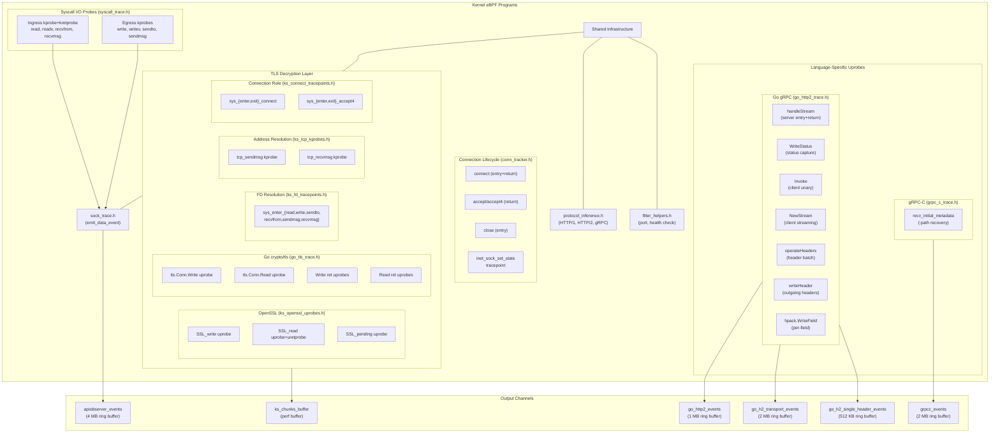
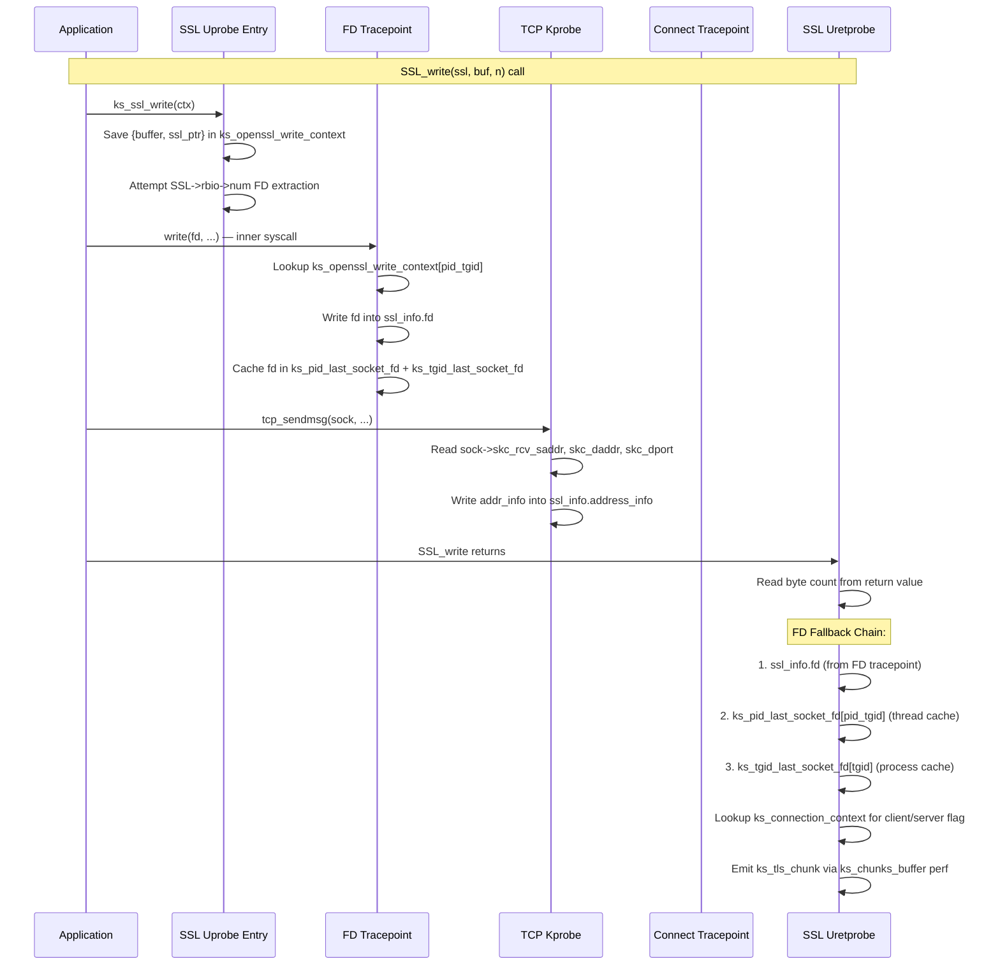

# BPF API Observer

The `BPF/apiobserver/` directory contains all eBPF C headers that implement kernel-side network data capture for KubeArmor's API Observer. These programs attach as kprobes, tracepoints, and uprobes to intercept plaintext network payloads at the POSIX syscall boundary, perform lightweight protocol classification, and emit structured events to userspace via ring buffers and perf buffers.

---

## Architecture Overview



---

## Design Rationale

### Why Syscall-Level Tracing

Traditional kernel network tracing hooks into `tcp_sendmsg` / `tcp_recvmsg`. This has two fundamental problems:

1. **No process context** — TCP-internal functions lose the FD and PID association, making multi-tenant correlation impossible.
2. **Encrypted payloads** — TLS encrypts data before it reaches TCP functions, so only ciphertext is visible.

This implementation solves both by probing at the POSIX syscall boundary, where process context is intact and applications have already prepared plaintext buffers.

### Dual TLS Capture Strategy

Two independent TLS capture pipelines coexist:

| Pipeline | Target | FD Resolution | Address Resolution | Output |
|----------|--------|--------------|-------------------|--------|
| **Syscall kprobes** (`openssl_trace.h`) | OpenSSL `SSL->rbio->num` FD walk | Direct struct traversal | From `conn_info` map | `apiobserver_events` ring buffer |
| **Kubeshark-style** (`ks_openssl_uprobes.h` + helpers) | OpenSSL, Go crypto/tls | Nested syscall FD capture + fallback caches | `tcp_sendmsg`/`tcp_recvmsg` kprobes reading `struct sock` | `ks_chunks_buffer` perf buffer |

The kubeshark pipeline is the primary path for production TLS capture. It handles edge cases (Memory BIO, async I/O, Go goroutine scheduling) that the simpler syscall pipeline cannot.

---

## File Layout

| File | Lines | Purpose |
|------|-------|---------|
| **common/macros.h** | 98 | Compile-time constants: directions, protocols, HTTP method signatures, frame types, limits |
| **common/structs.h** | 247 | All shared struct definitions: `data_event`, `conn_info`, `ks_tls_chunk`, `go_h2_transport_event`, `grpcc_symaddrs`, etc. |
| **common/maps.h** | 282 | All BPF map definitions: ring buffers, LRU hashes, per-CPU arrays, perf buffers |
| **conn_tracker.h** | 328 | FD→sock resolution (CO-RE fdtable walk), `connect`/`accept`/`close` handlers, `inet_sock_set_state` handler |
| **sock_trace.h** | 138 | `emit_data_event()` — shared emit core: filter cache, protocol detection, ring buffer submission, stats |
| **syscall_trace.h** | 369 | All 8 syscall I/O handlers with shared `egress_submit()` / `ingress_entry()` / `ingress_return()` helpers |
| **protocol_inference.h** | 113 | In-kernel protocol classification: HTTP/1 prefix matching, HTTP/2 preface + frame validation, gRPC heuristic |
| **filter_helpers.h** | 79 | `is_http_traffic()`, `is_health_check()`, `should_trace_port()` — early BPF-side traffic filtering |
| **openssl_trace.h** | 402 | Standalone `SSL_write`/`SSL_read` uprobe handlers with direct `SSL->rbio->num` FD extraction |
| **ks_ssl_common.h** | 165 | Kubeshark-style SSL helpers: `ks_new_ssl_info()`, `ks_lookup_ssl_info()`, `ks_output_ssl_chunk()`, chunk assembly |
| **ks_openssl_uprobes.h** | 189 | OpenSSL/BoringSSL uprobe entry/return handlers, Memory BIO FD fallback chain, `ssl_read_ex`/`ssl_write_ex` support |
| **ks_fd_tracepoints.h** | 174 | Syscall tracepoints for SSL FD resolution: captures FD from nested `read`/`write`/`sendto`/`recvfrom`/`sendmsg`/`recvmsg` |
| **ks_tcp_kprobes.h** | 133 | `tcp_sendmsg`/`tcp_recvmsg` kprobes for SSL address resolution from `struct sock` |
| **ks_connect_tracepoints.h** | 143 | `connect`/`accept4` tracepoints for client/server role determination |
| **go_tls_trace.h** | 273 | Go `crypto/tls.(*Conn)` Read/Write uprobes with ret-instruction scanning (no uretprobe) |
| **go_http2_trace.h** | 851 | Go gRPC/HTTP2 header uprobes: `handleStream`, `Invoke`, `NewStream`, `WriteStatus`, `operateHeaders`, `loopyWriter.writeHeader`, `hpack.WriteField` |
| **go_http2_symaddrs.h** | 106 | Go struct offset table (BPF map + accessor macros) |
| **go_types.h** | 20 | Go type definitions for BPF (goroutine struct, interface layout) |
| **grpc_c_trace.h** | 202 | gRPC-C `:path` recovery uprobe: reads `grpc_chttp2_stream.method` (grpc_slice) from `libgrpc.so` |

---

## Probe Attachment Summary

### Syscall I/O Probes (13 total)

| Direction | Syscall | Probe Type | Why |
|-----------|---------|-----------|-----|
| Egress | `write` | kprobe | Standard socket write |
| Egress | `writev` | kprobe | Vectored write (Go, Node.js HTTP clients) |
| Egress | `sendto` | kprobe | Explicit destination socket write |
| Egress | `sendmsg` | kprobe | Sendmsg with `msghdr` (gRPC, HTTP/2) |
| Ingress | `read` | kprobe + kretprobe | Buffer populated on return |
| Ingress | `readv` | kprobe + kretprobe | Vectored read |
| Ingress | `recvfrom` | kprobe + kretprobe | Explicit source socket read |
| Ingress | `recvmsg` | kprobe + kretprobe | Recvmsg with `msghdr` |
| Lifecycle | `connect` | kprobe + kretprobe | Client-side FD→sock mapping |
| Lifecycle | `accept` / `accept4` | kretprobe | Server-side FD→sock mapping |
| Lifecycle | `close` | kprobe | FD cleanup |

### Tracepoint (1)

- `sock/inet_sock_set_state` — tracks TCP state transitions (`TCP_ESTABLISHED` → populate `connections` map; `TCP_CLOSE` → cleanup all maps)

### TLS Probes (Kubeshark Pipeline)

| Probe | Type | Function | Purpose |
|-------|------|----------|---------|
| `ks_ssl_write` | uprobe | `SSL_write` | Save plaintext buffer + attempt rbio FD extraction |
| `ks_ssl_ret_write` | uretprobe | `SSL_write` return | Read byte count, resolve FD via fallback chain, emit chunk |
| `ks_ssl_read` | uprobe | `SSL_read` | Save plaintext buffer pointer |
| `ks_ssl_ret_read` | uretprobe | `SSL_read` return | Read byte count, emit chunk with IS_READ flag |
| `ks_ssl_write_ex` | uprobe | `SSL_write_ex` | Same as `SSL_write` but with `*written` len pointer |
| `ks_ssl_ret_write_ex` | uretprobe | `SSL_write_ex` return | Read byte count from `*written` pointer |
| `ks_ssl_read_ex` | uprobe | `SSL_read_ex` | Same as `SSL_read` but with `*readbytes` len pointer |
| `ks_ssl_ret_read_ex` | uretprobe | `SSL_read_ex` return | Read byte count from `*readbytes` pointer |
| `ks_ssl_pending` | uprobe | `SSL_pending` | Pre-populate context for double-read pattern |
| `ks_sys_enter_{read,write,...}` | tracepoint | 6 syscalls | Capture FD from nested syscall during SSL operation |
| `ks_sys_exit_{read,write}` | tracepoint | 2 syscalls | Clean up Go kernel FD context |
| `ks_tcp_sendmsg` | kprobe | `tcp_sendmsg` | Read source/dest from `struct sock` for OpenSSL/Go contexts |
| `ks_tcp_recvmsg` | kprobe | `tcp_recvmsg` | Read source/dest from `struct sock` for OpenSSL/Go contexts |
| `ks_sys_enter_connect` | tracepoint | `connect` | Mark FD as client-side in `ks_connection_context` |
| `ks_sys_exit_connect` | tracepoint | `connect` return | Finalize client-side entry |
| `ks_sys_enter_accept4` | tracepoint | `accept4` | Save accept args |
| `ks_sys_exit_accept4` | tracepoint | `accept4` return | Mark FD as server-side with new FD from return value |

### Go TLS Probes (4)

| Probe | Type | Function | Purpose |
|-------|------|----------|---------|
| `go_tls_write` | uprobe | `crypto/tls.(*Conn).Write` | Save buffer + extract FD from tls.Conn.conn interface |
| `go_tls_write_ex` | uprobe at ret | Write return instructions | Read `n` from R1, resolve address, emit chunk |
| `go_tls_read` | uprobe | `crypto/tls.(*Conn).Read` | Save buffer pointer |
| `go_tls_read_ex` | uprobe at ret | Read return instructions | Read `n` from R1, emit chunk with IS_READ flag |

> **Note:** Go programs cannot use `uretprobe` because goroutine stack relocation corrupts the trampoline return address. Instead, the userspace scanner (`goprobe/go_tls_offsets.go`) disassembles the function body to find all `ret` instructions and attaches regular uprobes at each offset.

### Go gRPC/HTTP2 Probes (11)

| Probe | SEC Name | Function | Output |
|-------|----------|----------|--------|
| `server_handleStream` | uprobe | `grpc.(*Server).handleStream` | `go_http2_events` |
| `server_handleStream` | uretprobe | handleStream return | `go_http2_events` |
| `transport_writeStatus` | uprobe | `(*http2Server).WriteStatus` | `ongoing_grpc_request_status` map |
| `ClientConn_Invoke` | uprobe | `(*ClientConn).Invoke` | `ongoing_grpc_client_requests` map |
| `ClientConn_Invoke` | uretprobe | Invoke return | `go_http2_events` |
| `ClientConn_NewStream` | uprobe | `(*ClientConn).NewStream` | `ongoing_grpc_client_requests` map |
| `clientStream_RecvMsg` | uretprobe | `(*clientStream).RecvMsg` return | `go_http2_events` |
| `operate_headers_server` | uprobe | `(*http2Server).operateHeaders` | `go_h2_transport_events` |
| `operate_headers_client` | uprobe | `(*http2Client).operateHeaders` | `go_h2_transport_events` |
| `loopy_writer_write_header` | uprobe | `(*loopyWriter).writeHeader` | `go_h2_single_header_events` |
| `hpack_write_field` | uprobe | `hpack.(*Encoder).WriteField` | `go_h2_single_header_events` |

### gRPC-C Probe (1)

| Probe | Type | Function | Output |
|-------|------|----------|--------|
| `grpc_c_recv_initial_metadata` | uprobe | `grpc_chttp2_maybe_complete_recv_initial_metadata` | `grpcc_events` ring buffer |

**Total: ~43 probe attachment points** across syscall kprobes, tracepoints, and uprobes.

---

## BPF Maps

### Core Maps

| Map | Type | Key | Value | Max Entries | Purpose |
|-----|------|-----|-------|-------------|---------|
| `apiobserver_events` | Ring Buffer | — | `data_event` | 4 MB | Main event transport to userspace |
| `connections` | LRU Hash | `sock_ptr` (u64) | `conn_info` | 64K | Per-connection state (IPs, ports, protocol, SSL flag) |
| `connection_filter_cache` | LRU Hash | `sock_ptr` (u64) | `u8` | 64K | Cached filter decision (0=drop, 1=allow) |
| `pid_fd_to_sock` | LRU Hash | `conn_id {tgid, fd}` | `u64` (sock_ptr) | 64K | Forward map: process FD → kernel sock |
| `sock_to_conn_id` | LRU Hash | `u64` (sock_ptr) | `conn_id {tgid, fd}` | 64K | Reverse map: kernel sock → process FD |
| `event_scratch` | Per-CPU Array | `u32` | `data_event` | 1 | Scratch space (avoids 8 KB BPF stack allocation) |
| `stats_map` | Per-CPU Array | `u32` | `stats` | 1 | Per-CPU packet counters |
| `port_exclusion_map` | Hash | `u16` (port) | `u8` | 64 | Runtime-configurable port exclusion |
| `protocol_config_map` | Array | `u32` | `protocol_config` | 3 | Per-protocol capture size limits |

### Syscall In-Flight State Maps

| Map | Type | Key | Value | Max Entries | Purpose |
|-----|------|-----|-------|-------------|---------|
| `active_data_args` | Hash | `pid_tgid` (u64) | `data_args {fd, buf}` | 64K | In-flight ingress syscall state |
| `active_connect_args` | Hash | `pid_tgid` (u64) | `connect_args {fd}` | 4K | In-flight `connect()` state |
| `active_accept_args` | Hash | `pid_tgid` (u64) | `accept_args {addr}` | 4K | In-flight `accept()` state |

### OpenSSL / TLS Maps

| Map | Type | Key | Value | Max Entries | Purpose |
|-----|------|-----|-------|-------------|---------|
| `active_ssl_read_args` | Hash | `pid_tgid` | `ssl_read_args` | 64K | In-flight `SSL_read` state |
| `active_ssl_write_args` | Hash | `pid_tgid` | `ssl_write_args` | 64K | In-flight `SSL_write` state |
| `ssl_user_space_call_map` | Hash | `pid_tgid` | `nested_syscall_fd_t` | 64K | Nested syscall FD capture (standalone pipeline) |
| `ssl_symaddrs` | Hash | `tgid` (u32) | `ssl_symaddrs` | 4K | Per-process OpenSSL struct offsets |

### Kubeshark SSL Maps

| Map | Type | Key | Value | Max Entries | Purpose |
|-----|------|-----|-------|-------------|---------|
| `ks_openssl_write_context` | LRU Hash | `pid_tgid` | `ks_ssl_info` | 16K | OpenSSL write operation context |
| `ks_openssl_read_context` | LRU Hash | `pid_tgid` | `ks_ssl_info` | 16K | OpenSSL read operation context |
| `ks_go_write_context` | LRU Hash | `pid<<32\|goroutine_id` | `ks_ssl_info` | 16K | Go TLS write context |
| `ks_go_read_context` | LRU Hash | `pid<<32\|goroutine_id` | `ks_ssl_info` | 16K | Go TLS read context |
| `ks_go_kernel_write_context` | LRU Hash | `pid_tgid` | `u32` (fd) | 16K | FD captured by nested write syscall |
| `ks_go_kernel_read_context` | LRU Hash | `pid_tgid` | `u32` (fd) | 16K | FD captured by nested read syscall |
| `ks_go_user_kernel_write_context` | LRU Hash | `pid<<32\|fd` | `ks_address_info` | 16K | Address from tcp_sendmsg for Go writes |
| `ks_go_user_kernel_read_context` | LRU Hash | `pid<<32\|fd` | `ks_address_info` | 16K | Address from tcp_recvmsg for Go reads |
| `ks_connection_context` | LRU Hash | `pid<<32\|fd` | `ks_conn_flags` | 16K | Client/server role (from connect/accept) |
| `ks_pid_last_socket_fd` | LRU Hash | `pid_tgid` | `u32` (fd) | 8K | Per-thread last socket FD cache |
| `ks_tgid_last_socket_fd` | LRU Hash | `tgid` (u32) | `u32` (fd) | 4K | Per-process last socket FD cache |
| `ks_heap` | Per-CPU Array | `int` | `ks_tls_chunk` | 1 | Scratch for TLS chunk assembly |
| `ks_chunks_buffer` | Perf Event Array | `int` | `u32` | 1024 | TLS chunk output to Go |

### Go gRPC/HTTP2 Maps

| Map | Type | Key | Value | Max Entries | Purpose |
|-----|------|-----|-------|-------------|---------|
| `go_http2_events` | Ring Buffer | — | `go_grpc_request_event` | 1 MB | gRPC request events (path, status, latency) |
| `go_h2_transport_events` | Ring Buffer | — | `go_h2_transport_event` | 2 MB | Batch header events from operateHeaders |
| `go_h2_single_header_events` | Ring Buffer | — | `go_h2_single_header_event` | 512 KB | Per-field header events from hpack.WriteField |
| `go_h2_transport_scratch` | Per-CPU Array | `u32` | `go_h2_transport_event` | 1 | Scratch for batch header assembly |
| `go_h2_single_header_scratch` | Per-CPU Array | `u32` | `go_h2_single_header_event` | 1 | Scratch for single header assembly |
| `ongoing_grpc_server_requests` | LRU Hash | `go_addr_key` | `go_grpc_server_invocation` | 8K | Server handleStream context |
| `ongoing_grpc_client_requests` | LRU Hash | `go_addr_key` | `go_grpc_client_invocation` | 8K | Client Invoke/NewStream context |
| `ongoing_grpc_request_status` | LRU Hash | `go_addr_key` | `u16` | 8K | gRPC status from WriteStatus |
| `go_h2_active_encoder_map` | LRU Hash | `u64` (encoder ptr) | `go_h2_encoder_ctx` | 4K | hpack Encoder→stream correlation |
| `go_offset_table` | Array | `u32` | `go_offset_table` | 1 | Configurable Go struct field offsets |

### gRPC-C Maps

| Map | Type | Key | Value | Max Entries | Purpose |
|-----|------|-----|-------|-------------|---------|
| `grpcc_events` | Ring Buffer | — | `grpcc_header_event` | 2 MB | gRPC-C :path events |
| `grpcc_symaddrs_map` | Array | `u32` | `grpcc_symaddrs` | 1 | gRPC-C struct offsets |

---

## Data Flow: TLS Capture (Kubeshark Pipeline)

The kubeshark-style TLS pipeline involves coordination between 5 independent probe types:



### FD Resolution Fallback Chain

Memory BIO applications (Node.js, Python asyncio, Java/Netty) don't make syscalls during SSL operations, so the FD tracepoint never fires. Three fallback levels ensure FD resolution:

| Priority | Map | Key | Populated By | Precision |
|----------|-----|-----|-------------|-----------|
| 1 | `ssl_info.fd` | in-struct | FD tracepoint or SSL->rbio->num walk | Exact |
| 2 | `ks_pid_last_socket_fd` | `pid_tgid` | Any socket syscall on this thread | Thread-level (correct for single-connection threads) |
| 3 | `ks_tgid_last_socket_fd` | `tgid` | Any socket syscall in this process | Process-level (may mismatch for multi-connection processes) |

---

## Protocol Detection Pipeline

### Stage 1: In-Kernel (BPF) — `protocol_inference.h`

Runs on every packet inside `emit_data_event()`:

1. **HTTP/2 preface check** — matches the 24-byte magic string `PRI * HTTP/2.0\r\n\r\nSM\r\n\r\n`. Sets the sticky `http2_detected` flag.
2. **HTTP/2 frame validation** — validates 9-byte frame header (length ≤ 16 MB, type ≤ 0x09, stream-ID sanity checks per frame type).
3. **gRPC heuristic** — if a valid HTTP/2 HEADERS frame contains `grpc` in its first 128 bytes, classify as gRPC.
4. **HTTP/1.x prefix** — matches first 4 bytes against LE-encoded HTTP method signatures: `GET `, `POST`, `PUT `, `DELE`, `HEAD`, `PATC`, `OPTI`, `HTTP` (response).
5. **Sticky classification** — if current packet is `PROTO_UNKNOWN`, falls back to last-known protocol. Packets remaining `PROTO_UNKNOWN` with no prior classification are dropped.

### Stage 2: Userspace (Go) — `protocols/`

Full protocol parsing with header extraction, body reassembly, and stream multiplexing runs in userspace parsers.

---

## In-Kernel Filtering

Traffic is filtered at three levels before reaching userspace:

1. **Port filter** (`should_trace_port()`) — map-based lookup in `port_exclusion_map`. Default exclusions: `6443`, `2379-2380`, `10250`, `10255-10256`, `9091`, `9099-9100`. Cached per-connection in `connection_filter_cache`.

2. **Health-check suppression** (`is_health_check()`) — drops egress HTTP/1 `GET` requests to known health endpoints: `/health*`, `/readyz`, `/livez`, `/metrics`, `/debug*`, `/ping`.

3. **SSL deduplication** — when `conn_info.is_ssl` is set (by SSL uprobes), syscall kprobes skip that connection, preventing duplicate events.

---

## FD→Sock Resolution (`conn_tracker.h`)

Two-tier strategy:

### Fast Path
`pid_fd_to_sock` map lookup using `{tgid, fd}` key. Populated by `connect`/`accept`/`close` kprobe handlers.

### Slow Path (CO-RE fdtable walk)
For connections established before probes attached:
```
task->files->fdt->fd[n]->private_data->sk
```
Requires kernel ≥ 5.8 (BTF). Lazily populates both forward (`pid_fd_to_sock`) and reverse (`sock_to_conn_id`) maps, and generates `conn_info` from socket structural state (`skc_rcv_saddr`, `skc_daddr`, `skc_dport`, `skc_num`).

---

## Syscall Wrapper Handling (x86_64)

On kernels with `CONFIG_ARCH_HAS_SYSCALL_WRAPPER=y`, `__x64_sys_*()` functions take a single `pt_regs*` argument. Real syscall arguments are at `regs->di` (arg1), `regs->si` (arg2), `regs->dx` (arg3), `regs->r10` (arg4). All handlers use `get_syscall_regs()` + `syscall_arg{1..4}()` helpers.

Attachment tries `__x64_sys_*` first, then falls back to the unwrapped name (e.g., `ksys_write`, `sys_sendto`).

---

## gRPC-C: grpc_slice Memory Layout

The `grpc_c_trace.h` probe reads `grpc_chttp2_stream.method` which is a `grpc_slice`:

```
+0x00  void  *refcount   — NULL → inlined data; non-NULL → heap pointer
+0x08  union {
           struct { void *bytes; size_t length; }       // heap path (>15 bytes)
           struct { uint8_t length; uint8_t bytes[15]; } // inlined path (≤15 bytes)
       }
```

Real gRPC service paths (e.g., `/hipstershop.CurrencyService/GetSupportedCurrencies` = 51 bytes) always use the heap path. Both paths are implemented in `read_grpc_slice()`.

---

## Per-CPU Statistics

The `stats_map` (per-CPU array) tracks:

| Counter | Description |
|---------|-------------|
| `total_packets` | All packets processed by emit_data_event |
| `http1_packets` | Classified as HTTP/1.x |
| `http2_packets` | Classified as HTTP/2 |
| `grpc_packets` | Classified as gRPC |
| `filtered_packets` | Dropped by port/health/SSL filter |
| `dropped_packets` | Ring buffer full (backpressure) |
| `parse_errors` | Protocol inference failures |

Aggregated in userspace for observability dashboards.

---

## Limitations

| Limitation | Detail |
|------------|--------|
| **Payload cap** | `MAX_DATA_SIZE = 8192` bytes per event. Larger payloads truncated with `FLAG_TRUNCATED`. |
| **Vectored I/O** | Only `iov[0]` (first scatter-gather segment) captured. Sufficient for HTTP headers. |
| **IPv6** | IPv4-mapped IPv6 (`::ffff:x.x.x.x`) supported; pure IPv6 connections silently ignored. |
| **MSG_PEEK** | `recvfrom`/`recvmsg` handlers skip calls with `MSG_PEEK` to avoid double-capture. |
| **BPF stack** | 512-byte stack limit requires per-CPU scratch maps for large structs (`data_event`: ~8 KB, `ks_tls_chunk`: ~4 KB). |
| **Go uretprobe** | Cannot be used — goroutine stack relocation corrupts trampoline. Ret-instruction scanning used instead. |
| **Architecture** | Go gRPC probes assume amd64 register ABI. Go TLS probes support both amd64 and arm64. Syscall probes handle x86_64 syscall wrappers. |
| **Memory BIO precision** | Process-level FD cache (`ks_tgid_last_socket_fd`) may correlate wrong FD for multi-connection processes. |

---

## Testing Scenarios

| Scenario | What It Validates |
|----------|-------------------|
| **Multi-language HTTP** (Go, Node.js, Python Flask) | Different runtimes use different syscalls; all must be captured |
| **HTTP/1.1 pipelining** | Multiple requests on single connection FIFO-matched to responses |
| **HTTP/2 multiplexing** | Concurrent streams independently matched by stream ID |
| **gRPC unary + streaming** | In-kernel gRPC heuristic + userspace parser |
| **HTTPS via OpenSSL** | SSL uprobes intercept plaintext, mark connection SSL, suppress kprobe duplicates |
| **HTTPS via Go crypto/tls** | Ret-instruction uprobes capture decrypted Go TLS data |
| **gRPC-C (Python, C++)** | `:path` recovery via grpc_slice read from `libgrpc.so` |
| **Pre-existing connections** | CO-RE fdtable walk resolves connections established before probes |
| **Memory BIO applications** (Node.js, Java) | FD fallback chain (thread + process cache) captures FD |
| **High-throughput stress** | Ring buffer backpressure: `dropped_packets` incremented, kernel not blocked |
| **Connection churn** | LRU eviction handles rapid connect/close without stale references |
| **Architecture** | Validated on amd64 and arm64 |

---

## Current Coverage

- **Syscall coverage**: 8 I/O probes + 5 lifecycle probes + 1 tracepoint = 14 syscall-level attachment points
- **TLS coverage**: 9 OpenSSL uprobe entry points + 4 Go TLS uprobe entry points + 8 FD resolution tracepoints + 2 TCP kprobes + 4 connection tracepoints = 27 TLS-related probes
- **Go gRPC coverage**: 11 uprobe attachment points covering server, client (unary + streaming), status, and header capture
- **gRPC-C coverage**: 1 uprobe for `:path` recovery from `libgrpc.so`
- **Protocol coverage**: HTTP/1.x (all standard methods), HTTP/2 (preface + frame validation), gRPC (heuristic in-kernel, full parsing in userspace)
