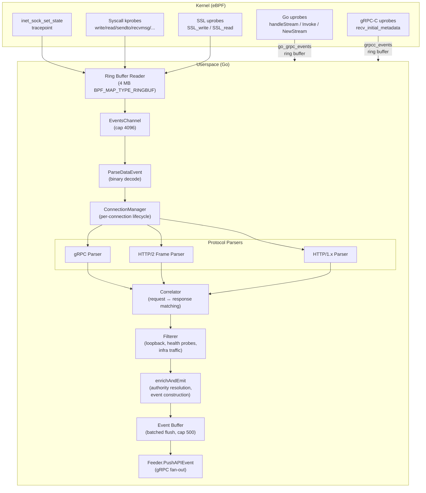

# API Observer

The `apiObserver` package is the userspace half of KubeArmor's API-level observability pipeline. It consumes raw network data events emitted by eBPF probes, reassembles them into protocol-level messages, correlates requests with responses, enriches them with Kubernetes metadata, and pushes structured `pb.APIEvent` records to external consumers via gRPC.

## Architecture Overview



## Data Flow

1. **BPF ring buffer** — eBPF probes emit `data_event` structs via `bpf_ringbuf_reserve()` / `bpf_ringbuf_submit()` into a 4 MB ring buffer shared between kernel and userspace.

2. **TraceEvents goroutine** — drains raw ring buffer samples into `EventsChannel` (capacity 4096). This channel acts as a backpressure absorber; if processing falls behind, events are dropped via the `default` case in the select. Worst-case memory is ~32 MB (4096 × ~8 KB per `MAX_DATA_SIZE`).

3. **ParseDataEvent** — binary decode of the 48-byte fixed header + variable payload into a `DataEvent` struct.

4. **ConnectionManager.Route()** — per-connection lifecycle management + protocol parser dispatch. Creates a `ConnectionTracker` per unique `{PID, FD, SockPtr}` tuple.

5. **Protocol parsers** — HTTP/1.x (FIFO), HTTP/2 (frame + HPACK), gRPC (LPM + protobuf decode). Each returns `PendingRequest` or response data to the correlator.

6. **Correlator** — matches requests ↔ responses. HTTP/1.x uses FIFO queue (pipelining). HTTP/2/gRPC uses per-stream-ID map (multiplexing).

7. **Filterer** — multi-layer filtering: loopback, health probes, infrastructure gRPC services, blocked authorities.

8. **enrichAndEmit** — resolves `:authority` header (K8s service name resolution), constructs `pb.APIEvent`, buffers for batched flush.

9. **Feeder.PushAPIEvent** — gRPC fan-out to all subscribed `APIObserverService` clients.

## Package Layout

```
apiObserver/
├── apiObserver.go              # Core: BPF loading, probe attachment, event loop
├── apiobserver_x86_bpfel.go    # Generated: compiled BPF objects (x86_64)
├── apiobserver_arm64_bpfel.go  # Generated: compiled BPF objects (arm64)
├── docs/                       # Design documents
│   └── configurable-port-filter.md
├── events/                     # Event parsing, types, and correlation
│   ├── events.go               # DataEvent parsing from BPF ring buffer
│   ├── types.go                # PendingRequest, CorrelatedTrace, stream state
│   ├── correlator.go           # Request ↔ response stitching (HTTP/1 + HTTP/2)
│   ├── go_header_event.go      # Go gRPC uprobe event decoding
│   ├── go_http2_transport_event.go  # Go HTTP/2 transport header event decoding
│   ├── grpcc_header_event.go   # gRPC-C uprobe event decoding
│   ├── tls_chunk_event.go      # TLS chunk event decoding (SSL uprobes)
│   └── conn/                   # Per-connection lifecycle management
│       ├── tracker.go          # ConnectionTracker + ConnectionManager
│       └── data_stream_buffer.go  # Per-direction byte buffer with skip support
├── protocols/                  # Protocol-specific parsers
│   ├── http1/                  # HTTP/1.x request/response parser
│   ├── http2/                  # HTTP/2 frame parser + HPACK decoder
│   │   └── bhpack/             # Tolerant HPACK decoder (OpenTelemetry-derived)
│   └── grpc/                   # gRPC LPM framing + protobuf decode
├── filter/                     # Event filtering and deduplication
│   ├── filterer.go             # Multi-layer filter chain
│   └── dedup.go                # Time-based deduplication cache
├── ssl/                        # OpenSSL/BoringSSL library discovery
│   ├── procmaps.go             # /proc/<pid>/maps scanner
│   └── symaddrs.go             # Symbol offset resolution
├── goprobe/                    # Go binary discovery and uprobe target resolution
│   ├── scanner.go              # /proc scanner for Go gRPC/HTTP2 binaries
│   ├── offsets.go              # Struct field offset tables
│   └── go_tls_offsets.go       # Go TLS ret-instruction offset discovery
└── grpcc/                      # gRPC-C (libgrpc.so) discovery
    ├── scanner.go              # /proc scanner for libgrpc.so
    └── symaddrs.go             # gRPC-C struct offset tables
```

## Key Components

### `APIObserver` (`apiObserver.go`)

The central orchestrator. Initialization (`NewAPIObserver`) performs the following in order:

1. **Tracepoint** — attaches `inet_sock_set_state` for TCP connection lifecycle tracking.
2. **Kprobes** — attaches syscall probes:
   - **Egress** (kprobe only): `write`, `writev`, `sendto`, `sendmsg`
   - **Ingress** (kprobe + kretprobe pairs): `read`, `readv`, `recvfrom`, `recvmsg`
   - **FD lifecycle**: `connect` (entry+return), `accept`/`accept4` (return), `close` (entry)
3. **Ring buffer reader** — creates a `ringbuf.Reader` on the `apiobserver_events` ring buffer (4 MB `BPF_MAP_TYPE_RINGBUF`).
4. **Processing pipeline** — initializes `Filterer`, `Correlator` (30-second timeout), and `ConnectionManager`, then starts the `TraceEvents` event loop.
5. **SSL uprobe scanner** — background goroutine that periodically scans `/proc/*/maps` for `libssl.so` variants, resolves symbol offsets, and attaches `SSL_write`/`SSL_read` uprobes for TLS decryption.
6. **Go uprobe scanner** — background goroutine that periodically scans `/proc` for Go binaries with gRPC/HTTP2 symbols, resolves struct offsets, and attaches uprobes on `handleStream`, `Invoke`, `NewStream`, `WriteStatus`, and Go TLS read/write functions.
7. **gRPC-C uprobe scanner** — background goroutine that scans for `libgrpc.so` and attaches uprobes on `grpc_chttp2_maybe_complete_recv_initial_metadata`.
8. **Event buffer** — batched flush mechanism (cap 500) with a 5-second periodic flush timer to avoid per-event gRPC overhead.

Shutdown (`DestroyAPIObserver`) cancels the context, closes all ring buffers, waits for goroutines (10-second timeout), detaches all probe links, and closes BPF objects.

### Correlator (`events/correlator.go`)

Implements two independent stitching algorithms:

- **HTTP/1.x (FIFO queue)** — sequential protocol; responses arrive in request order. Per-connection queue with 256-entry cap. `AddHTTP1Request` → `MatchHTTP1Response`.

- **HTTP/2 / gRPC (stream-ID map)** — multiplexed protocol; responses arrive in arbitrary order. Per-connection `map[streamID]PendingRequest`. `AddHTTP2Request` → `MatchHTTP2Response`.

Additional integration points for uprobe data:
- `InjectGoHTTP2Headers` — merges Go uprobe headers into pending HTTP/2 requests.
- `InjectGoGRPCEvent` — creates synthetic `CorrelatedTrace` from standalone Go gRPC uprobe events.

A background cleanup goroutine (10-second tick) evicts stale requests, pending HTTP/2 stream entries, and orphaned transport header entries beyond the 30-second timeout.

### Filterer (`filter/filterer.go`)

Multi-layer filtering applied in `enrichAndEmit`:

| Layer | Function | Description |
|-------|----------|-------------|
| Loopback | `IsLoopbackTraffic` | Drops `127.0.0.0/8` ↔ `127.0.0.0/8` |
| Non-routable | `isNonRoutable` | Drops multicast (224–239.x), link-local (169.254.x), broadcast |
| Health probes | `IsHealthProbe` | Suppresses `/healthz`, `/readyz`, `/livez`, kube-probe UA |
| Request-level | `ShouldTraceRequest` | Pass-all (TODO: configurable path exclusions) |
| Infrastructure | `IsInfrastructureTraffic` | Drops SPIRE, Envoy xDS, agents-operator based on `:authority` and gRPC service name |
| Deduplication | `IsDuplicate` | Time-based dedup (100ms window) keying on `{clientIP, ephemeralPort, method, path, status}` |
| Port exclusion | BPF-level | Kernel-side port filter via `port_exclusion_map` (see `docs/configurable-port-filter.md`) |

### ConnectionManager (`events/conn/tracker.go`)

Population-level connection tracker with:
- Thread-safe `map[ConnectionKey]*ConnectionTracker`
- Double-checked locking for connection creation
- Background stale connection eviction (60-second tick)
- Per-connection `ConnectionTracker` owns per-direction byte buffers, protocol parser instances, and routes complete messages to the correlator

### Event Buffer and Flush

Events are buffered in a `[]*pb.APIEvent` slice (cap 500) protected by a mutex. Flushed either when:
- Buffer reaches capacity (500 events), or
- 5-second periodic timer fires

This batching reduces per-event gRPC overhead and mutex contention.

## Configuration

| Parameter | CLI Flag | Default | Description |
|-----------|----------|---------|-------------|
| Enable | `--enableAPIObserver` | `false` | Master switch for the API Observer |
| Excluded ports | `--apiObserverExcludedPorts` | K8s infra ports | Comma-separated port list for BPF-level filtering |
| Untracked namespaces | ConfigMap `untrackedNs` | `kube-system, kubearmor, agents` | Namespaces excluded from tracing |
| Blocked authorities | ConfigMap `apiBlockedAuthorities` | (none) | Additional `:authority` prefixes to filter |
| Procfs mount | `--procfsMount` | `/proc` | Host procfs path for container environments |

See [Configurable Port Filter](docs/configurable-port-filter.md) for detailed port filtering documentation.

## Output Format

Events are emitted as `pb.APIEvent` messages using the [SentryFlow](https://github.com/accuknox/SentryFlow) protobuf schema:

| Field | Type | Description |
|-------|------|-------------|
| `Metadata` | `pb.Metadata` | Timestamp, node name, receiver ("KubeArmor") |
| `Source` | `pb.Workload` | Source IP, port |
| `Destination` | `pb.Workload` | Destination IP, port |
| `Request` | `pb.Request` | Method, path, headers, body, authority |
| `Response` | `pb.Response` | Status code, headers, body |
| `Protocol` | `string` | `HTTP`, `HTTP2`, or `gRPC` |
| `LatencyMs` | `float64` | Request-response duration in milliseconds |
| `Encrypted` | `bool` | Whether the connection was TLS-encrypted |

## Known Limitations

1. **No IP-to-namespace resolution** — Workload `Name` and `Namespace` fields are currently empty. The `ShouldTraceConnection` namespace filter is a no-op pending workload resolution implementation.

2. **Mid-stream HPACK** — When BPF attaches after a connection's HPACK dynamic table is already populated, some HTTP/2 headers decode as `BAD INDEX`. Critical pseudo-headers (`:method`, `:path`, `:status`) are usually recoverable via static table or Go uprobes.

3. **Go-only uprobes** — Goroutine-based uprobes benefit only Go gRPC/HTTP2 binaries. Non-Go services rely on HTTP/2 frame parsing alone.

4. **Body truncation** — HTTP/1.x bodies capped at 124 KB, gRPC bodies at 512 bytes. Binary bodies replaced with `[binary, N bytes]` placeholder.

5. **Heuristic gRPC detection** — BPF scans first 128 bytes of HEADERS frames for `"grpc"`. Exotic servers pushing the content-type beyond that window may be misclassified.

6. **Single-node observation** — Events from both sides of a TCP connection (client write + server read) on the same node produce duplicates. The `DedupCache` (100ms window) mitigates this but is imperfect for high-throughput scenarios.

## Testing

The API Observer has been validated against the following test scenarios:

| Test Suite | Coverage |
|------------|----------|
| **httpstest** suite | End-to-end validation: Go HTTP/HTTPS server, Node.js HTTPS, Python Flask, curl-based clients |
| **Google Online Boutique** | Multi-service gRPC mesh (Go, Java, C#, Python) — validates cross-service correlation and gRPC method extraction |
| **Manual validation** | HTTP/1.1 keep-alive, HTTP/1.1 chunked transfer encoding, HTTP/2 multiplexed streams, gRPC unary + server-streaming |
| **Architecture** | Validated on both `amd64` and `arm64` |

Build verification:
```bash
go build ./apiObserver/...   # Compilation check
go vet ./apiObserver/...     # Static analysis — clean
```
