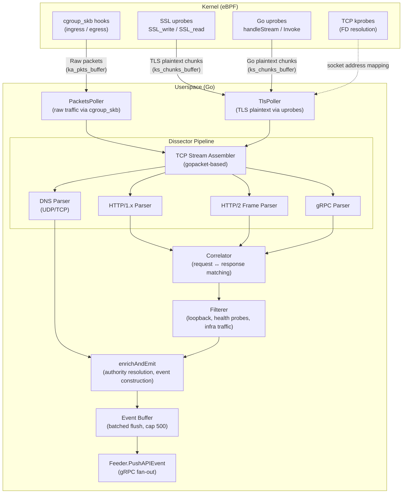

# API Observer

The `apiObserver` package is the userspace half of KubeArmor's API-level observability pipeline. It utilizes a Kubeshark inspired dual-path packet capture architecture. It captures plain network traffic via eBPF `cgroup_skb` hooks and TLS-encrypted traffic via OpenSSL/Go uprobes. These streams are fed into a TCP stream assembler and protocol dissector, which reconstructs HTTP/1.x, HTTP/2, gRPC, and DNS messages, correlates requests with responses, enriches them with Kubernetes metadata, and pushes structured `pb.APIEvent` records to external consumers via gRPC.

## Architecture Overview


```mermaid
flowchart TD
    subgraph Kernel["Kernel (eBPF)"]
        SKB["cgroup_skb hooks\n(ingress / egress)"]
        SSL["SSL uprobes\nSSL_write / SSL_read"]
        GoUP["Go uprobes\nhandleStream / Invoke"]
        TCP["TCP kprobes\n(FD resolution)"]
    end

    subgraph Userspace["Userspace (Go)"]
        PP["PacketsPoller\n(raw traffic via cgroup_skb)"]
        TP["TlsPoller\n(TLS plaintext via uprobes)"]
        
        subgraph Dissector["Dissector Pipeline\n(Architecture)"]
            ASM["TCP Stream Assembler\n(gopacket-based)"]
            H1["HTTP/1.x Parser"]
            H2["HTTP/2 Frame Parser"]
            GRPC["gRPC Parser"]
            DNS["DNS Parser\n(UDP/TCP)"]
        end

        COR["Correlator\n(request ↔ response matching)"]
        FLT["Filterer\n(loopback, health probes, infra traffic)"]
        ENR["enrichAndEmit\n(authority resolution, event construction)"]
        BUF["Event Buffer\n(batched flush, cap 500)"]
        FD["Feeder.PushAPIEvent\n(gRPC fan-out)"]
    end

    SKB -->|"Raw packets\n(ka_pkts_buffer)"| PP
    SSL -->|"TLS plaintext chunks\n(ks_chunks_buffer)"| TP
    GoUP -->|"Go plaintext chunks\n(ks_chunks_buffer)"| TP
    TCP -.->|"socket address mapping"| TP
    
    PP --> ASM
    TP --> ASM
    
    ASM --> H1
    ASM --> H2
    ASM --> GRPC
    ASM --> DNS
    
    H1 --> COR
    H2 --> COR
    GRPC --> COR
    DNS --> ENR
    
    COR --> FLT --> ENR --> BUF --> FD
```

## Data Flow

1. **Dual-Path Capture** — Traffic is intercepted via two mechanisms:
   - **Path A (Plain Traffic):** `cgroup_skb` (ingress/egress) hooks capture all raw packets across the node's cgroups and emit them to the `ka_pkts_buffer`.
   - **Path B (TLS Traffic):** eBPF uprobes on OpenSSL (`SSL_read`/`SSL_write`) and Go binaries intercept plaintext chunks before encryption or after decryption, emitting them to the `ks_chunks_buffer`. TCP kprobes provide FD-to-address resolution.

2. **Pollers** — The `PacketsPoller` and `TlsPoller` drain their respective ring buffers and feed the network events into the dissector.

3. **Dissector Pipeline** — The `dissector` package reassembles TCP streams and parses application-layer protocols:
   - **HTTP/1.x, HTTP/2, gRPC**: Parsed and passed to the Correlator.
   - **DNS**: Supports parsing DNS queries and responses over both UDP and TCP.

4. **Correlator** — Matches HTTP and gRPC requests with their corresponding responses, maintaining state per connection (FIFO queue for HTTP/1.x, stream-ID map for HTTP/2 and gRPC).

5. **Filterer** — Applies multi-layer filtering (e.g., dropping loopback, health probes, infrastructure traffic, and applying deduplication).

6. **enrichAndEmit** — Resolves Kubernetes metadata (e.g., service names from the `:authority` header), constructs the final `pb.APIEvent`, and buffers it for batched flush.

7. **Feeder.PushAPIEvent** — gRPC fan-out to all subscribed `APIObserverService` clients.

## Package Layout

```text
apiObserver/
├── apiObserver.go              # Core orchestrator: BPF loading, probe attachment, poller initialization
├── apiobserver_x86_bpfel.go    # Generated: compiled BPF objects (x86_64)
├── apiobserver_arm64_bpfel.go  # Generated: compiled BPF objects (arm64)
├── dissector/                  # TCP stream reassembly and protocol parsing (HTTP, DNS, etc.)
├── poller/                     # Pollers for draining BPF ring buffers (PacketsPoller, TlsPoller)
├── events/                     # Shared types, correlator, and uprobe event decoders
├── filter/                     # Event filtering and deduplication logic
├── ssl/                        # OpenSSL/BoringSSL discovery and struct offset resolution
├── goprobe/                    # Go binary discovery and uprobe target resolution
├── grpcc/                      # gRPC-C (libgrpc.so) discovery and struct offset resolution
├── proc_cache.go               # Caching mechanism for /proc filesystem lookups
└── exec_watcher.go             # Monitors for new processes to attach uprobes
```

## Key Components

### `APIObserver` (`apiObserver.go`)

The central orchestrator that initializes the entire observability pipeline. Its primary tasks include:

1. **BPF Program Loading & Attachment** — Loads the eBPF objects and attaches `cgroup_skb` hooks to the host's root cgroup for comprehensive plain traffic capture. It also attaches TCP kprobes for socket file descriptor resolution, which is essential for mapping TLS chunks to network connections.
2. **Uprobe Scanners** — Background goroutines periodically scan `/proc` (and listen for `execve` events) to discover OpenSSL, Go, and gRPC-C libraries. It resolves symbol offsets dynamically and attaches uprobes to intercept TLS plaintext.
3. **Poller Initialization** — Starts the `PacketsPoller` (draining `ka_pkts_buffer` for plain traffic) and the `TlsPoller` (draining `ks_chunks_buffer` for TLS traffic).
4. **Dissector Setup** — Initializes the stream reassembler and protocol dissectors (HTTP, gRPC, DNS) and wires them to the filter-and-emit pipeline.
5. **Cgroup Management** — Interacts with KubeArmor's core to map Kubernetes containers to their respective cgroups, allowing precise traffic filtering and capture via `cgroup_skb`.

### Dissector (`dissector/`)

This package handles the heavy lifting of network packet processing:
- **TCP Stream Assembler**: Leverages `gopacket` to reconstruct fragmented TCP streams from both raw packets (Path A) and TLS chunks (Path B).
- **Protocol Parsers**: Dissects the reassembled payloads into HTTP/1.x, HTTP/2, gRPC, and DNS structures. 
- **DNS Observability**: Processes DNS traffic over UDP and TCP, generating complete `DnsRequest` and `DnsResponse` events within the `APIEvent` wrapper.

### Correlator (`events/correlator.go`)

Matches requests ↔ responses utilizing two independent algorithms:
- **HTTP/1.x (FIFO queue)** — Maintains request order as per HTTP/1.1 pipelining rules.
- **HTTP/2 / gRPC (stream-ID map)** — Uses per-connection `map[streamID]PendingRequest` to handle multiplexed, out-of-order responses.
Additionally, it merges Go uprobe transport headers into pending HTTP/2 stream entries to enrich the captured data.

### Filterer (`filter/filterer.go`)

Provides multi-layer filtering before events are emitted:
- Drops loopback and non-routable (multicast, link-local) traffic.
- Suppresses common Kubernetes health probes (`/healthz`, `/readyz`, etc.).
- Excludes infrastructure traffic (e.g., SPIRE, Envoy xDS) based on namespace and authority.
- Applies time-based deduplication (100ms window) for events captured redundantly on both ends of a local connection.

## Configuration

| Parameter | CLI Flag | Default | Runtime Configurable | Description |
|-----------|----------|---------|---------------------|-------------|
| Enable | `--enableAPIObserver` | `false` | restart required | Master switch for the API Observer |
| Excluded ports | `--apiExcludedPorts` | (none) | Yes | Comma-separated port list for BPF-level filtering |
| Blocked authorities | `--apiBlockedAuthorities` | (none) | Yes | Additional `:authority` prefixes to filter |
| Untracked namespaces | ConfigMap `untrackedNs` | `kube-system, kubearmor, agents` | Yes | Namespaces excluded from tracing |
| Procfs mount | `--procfsMount` | `/proc` | restart required | Host procfs path for container environments |

## Output Format

Events are emitted as `pb.APIEvent` messages using the [SentryFlow](https://github.com/accuknox/SentryFlow) protobuf schema, extended to support DNS events:

| Field | Type | Description |
|-------|------|-------------|
| `Metadata` | `pb.Metadata` | Timestamp, node name, receiver ("KubeArmor") |
| `Source` | `pb.Workload` | Source IP, port |
| `Destination` | `pb.Workload` | Destination IP, port |
| `Protocol` | `string` | `HTTP`, `HTTP2`, `gRPC`, `DNS/UDP`, or `DNS/TCP` |
| `Request` | `pb.Request` | (HTTP/gRPC) Method, path, headers, body, authority |
| `Response` | `pb.Response` | (HTTP/gRPC) Status code, headers, body |
| `DnsRequest` | `pb.DNSRequest` | (DNS) Query name and type |
| `DnsResponse` | `pb.DNSResponse` | (DNS) Response code |
| `LatencyMs` | `float64` | Request-response duration in milliseconds |
| `Encrypted` | `bool` | Whether the connection was TLS-encrypted |

## Known Limitations

1. **Mid-stream Capture** — If the observer attaches to a long-lived HTTP/2 connection after its HPACK dynamic table is already populated, some headers may decode incorrectly until the table state synchronizes.
2. **Go-only Uprobes (Extended Metadata)** — Deep inspection uprobes (like capturing standalone Go gRPC metadata before network dispatch) are Go-specific. Other languages rely on `libssl` or `libgrpc` uprobes, or plain stream dissection.
3. **Single-node Observation** — Events from both sides of a local TCP connection might produce duplicates despite the 100ms deduplication window in high-throughput scenarios.
