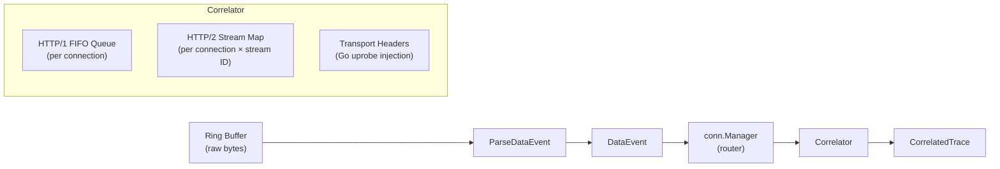

# events — Event Parsing, Types, and Correlation

This package defines the core data types that flow through the API Observer pipeline and implements the request–response correlation engine.

## Responsibilities

1. **Binary event parsing** — decode raw BPF ring buffer samples into typed Go structs
2. **Type definitions** — shared types used across the pipeline (`DataEvent`, `PendingRequest`, `CorrelatedTrace`, `ConnectionKey`)
3. **Request–response correlation** — match HTTP requests to their responses with correct semantics for HTTP/1.x and HTTP/2

## Data Flow

## Files

| File | Purpose |
|------|---------|
| `events.go` | `DataEvent` struct + `ParseDataEvent()` binary decoder. 48-byte fixed header matching BPF `struct data_event`. IP string results cached to avoid repeated `net.IP` allocation. |
| `types.go` | `PendingRequest`, `CorrelatedTrace`, `RequestQueue`, `HTTP2StreamRequests`, stream state enums, cleanup reason enums |
| `correlator.go` | `Correlator` interface + `defaultCorrelator` implementation. FIFO queue (HTTP/1.x) and stream-ID map (HTTP/2/gRPC) correlation. Background cleanup goroutine (10s tick, 30s timeout). Transport header injection for Go uprobe enrichment. |
| `go_header_event.go` | `GoGRPCRequestEvent` — decodes Go gRPC uprobe ring buffer events (path, status, latency, PID) |
| `go_http2_transport_event.go` | `GoH2TransportEvent` + `GoH2SingleHeaderEvent` — decodes Go HTTP/2 transport header capture events (up to 20 header fields per event) |
| `grpcc_header_event.go` | `GRPCCHeaderEvent` — decodes gRPC-C uprobe ring buffer events (PID, FD, stream ID, method path) |
| `tls_chunk_event.go` | `TlsChunkEvent` — decodes TLS chunk events from SSL uprobes. Handles IPv6-mapped-to-IPv4 address conversion. |

## Correlator Design

### HTTP/1.x — FIFO Queue

HTTP/1.1 is a sequential protocol: even with pipelining, responses **must** arrive in the same order as requests (RFC 7230 §6.3.2).

- **On request** (`AddHTTP1Request`): push to back of per-connection queue. If queue exceeds 256 entries, evict oldest.
- **On response** (`MatchHTTP1Response`): pop head (oldest unmatched request), pair with response, compute latency.

### HTTP/2 / gRPC — Stream-ID Map

HTTP/2 multiplexes independent streams on a single TCP connection. Responses arrive in arbitrary order.

- **On request** (`AddHTTP2Request`): store in `map[streamID]PendingRequest` under the connection key.
- **On response** (`MatchHTTP2Response`): look up by `(ConnectionKey, streamID)`, remove entry, construct `CorrelatedTrace`.

### Go Uprobe Integration

Two injection points allow Go-specific metadata to enrich or create correlation entries:

1. **`InjectGoHTTP2Headers`** — merges headers from Go HTTP/2 transport uprobes into existing stream entries. Creates placeholder entries when no request exists yet.
2. **`InjectGoGRPCEvent`** — handles standalone Go gRPC events (complete path, status, latency) that bypass the kprobe pipeline entirely. Emitted as synthetic `CorrelatedTrace`.

### Cleanup

A background goroutine ticks every 10 seconds and evicts:
- HTTP/1.x requests older than the timeout (default 30s)
- HTTP/2 stream entries older than the timeout
- Orphaned transport header entries (Go uprobe injection)

Statistics tracked: `TotalRequests`, `MatchedPairs`, `UnmatchedResponses`, `PipelinedRequests`, `HTTP2Streams`, and per-reason eviction counts (`Timeout`, `ConnectionClose`, `BufferFull`).

## Binary Parsing Performance

All event parsers use manual `binary.LittleEndian` field extraction rather than `binary.Read` with reflection. This eliminates `bytes.NewReader` allocation and reflection overhead on the hot path (~thousands of events/second per node).

## Limitations

- `DataEvent.SrcIP`/`DstIP` are stored as host-byte-order `uint32` (little-endian on x86/arm64). The `uint32ToIP` helper handles this.
- TLS chunk events use IPv6 address fields; `ipv6MappedToIPv4` converts `::ffff:a.b.c.d` to `uint32` in matching byte order.
- Correlator timeout is fixed at 30 seconds. Long-running streaming RPCs may see request entries evicted before the response arrives.
