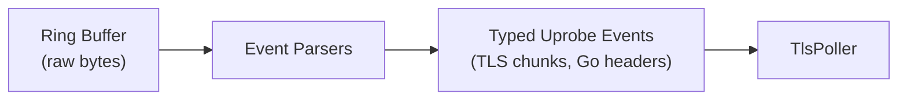

# events — Event Parsing and Types

This package defines the core data types that flow through the API Observer uprobe pipeline.

## Responsibilities

1. **Binary event parsing** — decode raw BPF ring buffer samples from uprobes into typed Go structs.
2. **Type definitions** — shared types used across the pipeline for Go, gRPC-C, and TLS uprobe events.

## Data Flow

```mermaid
flowchart LR
    RB["Ring Buffer\n(raw bytes)"] --> PDE["Event Parsers"]
    PDE --> TPE["Typed Uprobe Events\n(TLS chunks, Go headers)"]
    TPE --> TP["TlsPoller"]
```

## Files

| File | Purpose |
|------|---------|
| `events.go` | `DataEvent` struct + binary decoders. Handles IPv6-mapped-to-IPv4 address conversion. |
| `types.go` | Event structs and shared types for uprobes. |
| `go_header_event.go` | `GoGRPCRequestEvent` — decodes Go gRPC uprobe ring buffer events (path, status, latency, PID) |
| `go_http2_transport_event.go` | `GoH2TransportEvent` + `GoH2SingleHeaderEvent` — decodes Go HTTP/2 transport header capture events (up to 20 header fields per event) |
| `grpcc_header_event.go` | `GRPCCHeaderEvent` — decodes gRPC-C uprobe ring buffer events (PID, FD, stream ID, method path) |
| `tls_chunk_event.go` | `TlsChunkEvent` — decodes TLS chunk events from SSL uprobes. Handles IPv6-mapped-to-IPv4 address conversion. |

## Binary Parsing Performance

All event parsers use manual `binary.LittleEndian` field extraction rather than `binary.Read` with reflection. This eliminates `bytes.NewReader` allocation and reflection overhead on the hot path.

## Limitations

- `DataEvent.SrcIP`/`DstIP` are stored as host-byte-order `uint32` (little-endian on x86/arm64). The `uint32ToIP` helper handles this.
- TLS chunk events use IPv6 address fields; `ipv6MappedToIPv4` converts `::ffff:a.b.c.d` to `uint32` in matching byte order.
