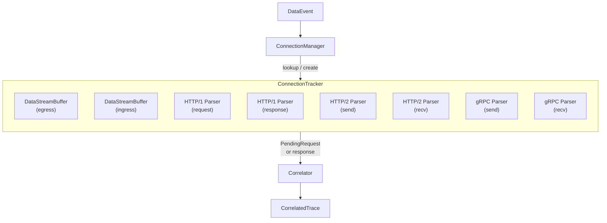

# conn — Per-Connection Lifecycle Management

This package implements per-TCP-connection state tracking, protocol parser dispatch, and population-level connection management.

## Architecture

## Components

### `ConnectionManager`

Population-level tracker with thread-safe `map[ConnectionKey]*ConnectionTracker`.

| Feature | Detail |
|---------|--------|
| Connection creation | Double-checked locking (RLock for read, Lock for write) |
| Close-on-TCP_CLOSE | BPF emits `FLAG_CONN_CLOSE` events on TCP close; `processEvent` calls `ConnectionManager.Close()` immediately — frees tracker + returns buffers to pool |
| Stale eviction | Safety-net background goroutine (60s tick, 20s stagger at startup). Uses two-phase batched eviction: read-lock scan → write-lock deletes in batches of 64 with `runtime.Gosched()` between batches |
| Shutdown | `Stop()` cancels context; `DestroyAPIObserver` closes all connections |

### `ConnectionTracker`

Per-TCP-connection state machine. Created on first event for a given `{PID, FD, SockPtr}` tuple.

Owns:
- **Two `DataStreamBuffer` instances** — one per direction (egress/ingress). Each is a byte-level ring buffer with skip support for body truncation.
- **Two sets of protocol parsers** — separate HPACK state per direction (required by RFC 7540 §4.3).
- **Protocol detection** — uses BPF-supplied protocol hint (`PROTO_HTTP1`, `PROTO_HTTP2`, `PROTO_GRPC`). Falls back to heuristic detection when BPF hint is `PROTO_UNKNOWN`.
- **Last-activity timestamp** — updated on every event; used by `IsStale()` for idle detection.

### `DataStreamBuffer`

Per-direction byte buffer backed by a `sync.Pool` for GC pressure reduction.

- **Pool design**: `AcquireDataStreamBuffer()` draws from a `sync.Pool` with 16 KB pre-allocated backing arrays. `ReleaseDataStreamBuffer()` returns buffers to the pool on connection close, with a 256 KB cap-gate (oversized buffers are left for GC). The pool naturally converges to the workload's size distribution as buffers grow and get recycled.
- Fixed capacity (128 KB per direction, 256 KB per connection)
- `Write(data)` — appends data with overflow protection; reuses backing array capacity from prior connections
- `SkipNextBytes(n)` — drains bytes from wire without parsing (used after body truncation)
- `Reset()` — clears the buffer but preserves the backing array's capacity (critical for pool efficiency)
- Circuit breaker — after too many consecutive parse errors, the buffer is cleared and the connection is reset

## Data Flow

1. `processEvent` checks `ev.IsConnClose()` — if true, calls `ConnectionManager.Close()` immediately (TCP_CLOSE path). This returns buffers to the pool and prevents FD reuse collisions.
2. `ConnectionManager.Route(ev)` looks up or creates a `ConnectionTracker` for the event's `ConnectionKey`.
3. The tracker selects the appropriate direction buffer (egress/ingress) based on `ev.Direction`.
4. Data is appended to the `DataStreamBuffer` (backing array reused from pool).
5. The appropriate protocol parser is invoked:
   - HTTP/1.x: `http1.Parser.Parse(buf)` → `[]*http1.Message`
   - HTTP/2: `http2.Parser.ParseFrames(buf)` → `[]*http2.Message`
   - gRPC: HTTP/2 parser + `grpc.Parser.ParseMessage(body, headers)` → `*grpc.Message`
6. Parsed messages are converted to `PendingRequest` (requests) or matched via `Correlator` (responses).
7. The correlator returns `[]*CorrelatedTrace` which propagate up to `apiObserver.enrichAndEmit`.

## Configuration

| Parameter | Default | Description |
|-----------|---------|-------------|
| Buffer size | 128 KB | Per-direction byte buffer capacity |
| Buffer pre-alloc | 16 KB | Initial backing array size for pooled buffers (cold-start only; pool converges to workload sizes) |
| Pool cap-gate | 256 KB | Buffers exceeding this capacity are not returned to pool |
| Inactivity timeout | 5 minutes | Idle time before connection is considered stale |
| Eviction tick | 60 seconds | Stale connection eviction interval (20s stagger at startup) |
| Eviction batch size | 64 | Keys deleted per write-lock acquisition during eviction |
| Parse error limit | 10 | Consecutive errors before circuit breaker triggers |

## Ticker Stagger Timeline

All periodic background loops are staggered to prevent concurrent GC pressure spikes:

| Timer | Offset | Interval |
|-------|--------|----------|
| /proc scanners (SSL, Go HTTP/2, gRPC-C) | t=0s | 30s |
| Correlator cleanup | t=10s | 10s |
| Dedup cache cleanup | t=15s | 10s |
| Eviction loop | t=20s | 60s |

## Limitations

- Per-connection memory is bounded at 256 KB (128 KB × 2 directions), limiting capture of large in-flight payloads.
- Protocol detection relies on BPF hints; ambiguous traffic (e.g., HTTP/2 without preface in the captured window) may be misclassified.
- No support for connection migration (PID change due to `exec` or container restart with same FD).
