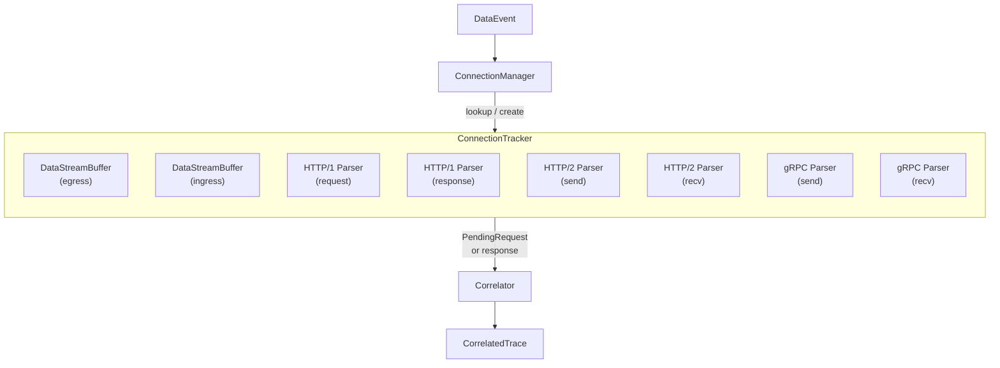

# conn — Per-Connection Lifecycle Management

This package implements per-TCP-connection state tracking, protocol parser dispatch, and population-level connection management.

## Architecture

## Components

### `ConnectionManager`

Population-level tracker with thread-safe `map[ConnectionKey]*ConnectionTracker`.

| Feature | Detail |
|---------|--------|
| Connection creation | Double-checked locking (RLock for read, Lock for write) |
| Stale eviction | Background goroutine (60-second tick) evicts idle connections via `IsStale()` |
| Shutdown | `Stop()` cancels context; `DestroyAPIObserver` closes all connections |

### `ConnectionTracker`

Per-TCP-connection state machine. Created on first event for a given `{PID, FD, SockPtr}` tuple.

Owns:
- **Two `DataStreamBuffer` instances** — one per direction (egress/ingress). Each is a byte-level ring buffer with skip support for body truncation.
- **Two sets of protocol parsers** — separate HPACK state per direction (required by RFC 7540 §4.3).
- **Protocol detection** — uses BPF-supplied protocol hint (`PROTO_HTTP1`, `PROTO_HTTP2`, `PROTO_GRPC`). Falls back to heuristic detection when BPF hint is `PROTO_UNKNOWN`.
- **Last-activity timestamp** — updated on every event; used by `IsStale()` for idle detection.

### `DataStreamBuffer`

Per-direction byte buffer with the following features:

- Fixed capacity (128 KB per direction, 256 KB per connection)
- `Append(data)` — writes data with overflow protection
- `SkipNextBytes(n)` — drains bytes from wire without parsing (used after body truncation)
- Circuit breaker — after too many consecutive parse errors, the buffer is cleared and the connection is reset

## Data Flow

1. `ConnectionManager.Route(ev)` looks up or creates a `ConnectionTracker` for the event's `ConnectionKey`.
2. The tracker selects the appropriate direction buffer (egress/ingress) based on `ev.Direction`.
3. Data is appended to the `DataStreamBuffer`.
4. The appropriate protocol parser is invoked:
   - HTTP/1.x: `http1.Parser.Parse(buf)` → `[]*http1.Message`
   - HTTP/2: `http2.Parser.ParseFrames(buf)` → `[]*http2.Message`
   - gRPC: HTTP/2 parser + `grpc.Parser.ParseMessage(body, headers)` → `*grpc.Message`
5. Parsed messages are converted to `PendingRequest` (requests) or matched via `Correlator` (responses).
6. The correlator returns `[]*CorrelatedTrace` which propagate up to `apiObserver.enrichAndEmit`.

## Configuration

| Parameter | Default | Description |
|-----------|---------|-------------|
| Buffer size | 128 KB | Per-direction byte buffer capacity |
| Inactivity timeout | 5 minutes | Idle time before connection is considered stale |
| Parse error limit | 10 | Consecutive errors before circuit breaker triggers |

## Limitations

- Per-connection memory is bounded at 256 KB (128 KB × 2 directions), limiting capture of large in-flight payloads.
- Protocol detection relies on BPF hints; ambiguous traffic (e.g., HTTP/2 without preface in the captured window) may be misclassified.
- No support for connection migration (PID change due to `exec` or container restart with same FD).
