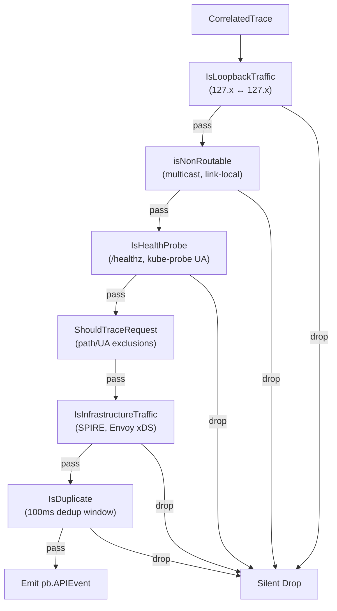

# filter — Event Filtering and Deduplication

This package implements multi-layer filtering for the API Observer pipeline, determining which captured HTTP/gRPC events are emitted to consumers and which are silently dropped.

## Architecture



## Filter Layers

### 1. Loopback Traffic (`IsLoopbackTraffic`)

Drops traffic where both source and destination are loopback addresses (`127.0.0.0/8`). Also drops unresolved addresses (`0.0.0.0`, empty string) and RFC 1918 private addresses matching `192.168.x.x` (host-internal pod-to-self traffic).

### 2. Non-Routable Addresses (`isNonRoutable`)

Drops traffic involving addresses that are never valid API endpoints:
- Loopback: `127.0.0.0/8`
- Link-local: `169.254.0.0/16`
- Multicast: `224.0.0.0/4` (224.x – 239.x)
- Broadcast: `255.255.255.255`

### 3. Health Probe Detection (`IsHealthProbe`)

Suppresses Kubernetes liveness, readiness, and startup probes by matching:
- **URL prefix**: `/healthz`, `/readyz`, `/livez`, `/health`
- **User-Agent prefix**: `kube-probe/`, `GoogleHC/`
- **Response body pattern**: `"health":[` (JSON health check responses)

### 4. Request-Level Filtering (`ShouldTraceRequest`)

Currently pass-all. Planned: configurable path and User-Agent exclusions (e.g., `/metrics`, Prometheus scrape).

### 5. Infrastructure Traffic (`IsInfrastructureTraffic`)

Drops known control-plane gRPC services based on `:authority` header and gRPC service name prefixes:

| Prefix | Service |
|--------|---------|
| `spire.api.server.` | SPIRE server APIs |
| `spire.api.agent.` | SPIRE agent APIs |
| `spire.plugin.` | SPIRE plugin interfaces |
| `envoy.service.discovery.` | Envoy xDS (ADS, CDS, LDS) |
| `envoy.service.ext_proc.` | Envoy external processing |
| `spire-server`, `spire-agent` | SPIRE authority patterns |
| `agents-operator.agents.svc.` | KubeArmor agents operator |

Additional blocked authorities can be configured via `ConfigApiBlockedAuthorities` in the KubeArmor ConfigMap.

### 6. Deduplication (`DedupCache`)

Time-based deduplication with a 100ms window. Key construction:

```
{clientIP}:{ephemeralPort}|{method}|{path}|{status}
```

The client is identified by the higher port number (ephemeral port), which remains constant regardless of whether the event is observed from the pod-IP or service-VIP side. This deduplicates pod-vs-service observations without losing unique requests.

The `DedupCache` runs a background cleanup goroutine (10-second tick) to evict expired entries. It exposes a `Stop()` method for clean shutdown.

### 7. Port Exclusion (BPF-Level)

Kernel-side port filtering via `port_exclusion_map` — excluded traffic never reaches userspace. See [configurable-port-filter.md](../docs/configurable-port-filter.md).

## Configuration

| Parameter | Source | Default | Description |
|-----------|--------|---------|-------------|
| Untracked namespaces | ConfigMap `untrackedNs` | `kube-system, kubearmor, agents` | Namespaces excluded from tracing |
| Blocked authorities | ConfigMap `apiBlockedAuthorities` | (none) | Additional `:authority` prefixes to filter |
| Dedup TTL | Hardcoded | 100ms | Deduplication window |
| Port exclusions | CLI `--apiObserverExcludedPorts` | K8s infra ports | BPF-level port filter |

## Limitations

- **No IP-to-namespace resolution**: `ShouldTraceConnection` accepts namespace parameters but the caller currently passes empty strings because IP-to-namespace resolution is not yet implemented. The filter is defined but not active.
- **Dedup window**: The 100ms window may miss duplicates in high-latency scenarios or catch false positives in high-throughput burst scenarios.
- **Health probe detection**: Pattern-based; may miss custom health check implementations that don't follow Kubernetes conventions.
