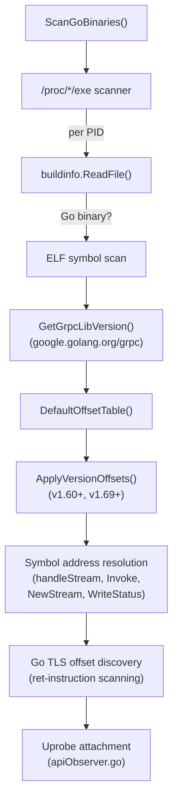

# goprobe — Go Binary Discovery and Uprobe Target Resolution

This package discovers Go binaries using gRPC, net/http HTTP/2, or crypto/tls and resolves the symbol addresses and struct field offsets needed by BPF Go uprobes.

Adapted from Pixie's `uprobe_manager.cc` and OpenTelemetry's Go eBPF tracer.

## Architecture

## Components

### `scanner.go` — Go Binary Scanner

Walks `/proc/*/exe` and identifies Go binaries via `debug/buildinfo.ReadFile()`. For each Go binary:

1. Checks for gRPC, net/http, or crypto/tls dependencies in build info
2. Resolves function symbol addresses from ELF symbol tables
3. Deduplicates by inode (`syscall.Stat_t.Ino`) — multiple PIDs sharing the same binary are probed only once

Target functions for uprobe attachment:

| Function | Purpose | Ring Buffer |
|----------|---------|-------------|
| `(*grpc.Server).handleStream` | Server-side gRPC method + status capture | `go_grpc_events` |
| `(*ClientConn).Invoke` | Client-side unary gRPC calls | `go_grpc_events` |
| `(*ClientConn).NewStream` | Client-side streaming gRPC calls | `go_grpc_events` |
| `(*http2Server).WriteStatus` | gRPC response status + trailers | `go_grpc_events` |
| `(*loopyWriter).writeHeader` | HTTP/2 outgoing header capture | `go_h2_events` |
| `crypto/tls.(*Conn).Read` | Go TLS read (decrypted data) | `apiobserver_events` |
| `crypto/tls.(*Conn).Write` | Go TLS write (plaintext before encryption) | `apiobserver_events` |

### `offsets.go` — Struct Field Offset Tables

Defines the `GoOffsetTable` with sensible defaults for recent gRPC versions (≥ 1.60). These offsets correspond to Go struct fields that BPF probes read:

| Offset Key | Go Struct Field | Default |
|---|---|---|
| `GoOffGRPCStreamMethod` | `transport.Stream.method` | 80 |
| `GoOffGRPCStreamID` | `transport.Stream.id` | 8 |
| `GoOffGRPCStatusS` | `status.Status.s` | 0 |
| `GoOffGRPCStatusCode` | Codes within status struct | 0 |
| `GoOffTLSConnConn` | `crypto/tls.Conn.conn` | 0 |
| `GoOffMetaFieldsPtr` | `MetaHeadersFrame.Fields.Ptr` | 8 |
| `GoOffMetaFieldsLen` | `MetaHeadersFrame.Fields.Len` | 16 |
| `GoOffLoopyWriterFramer` | `loopyWriter.framer` | 40 |

`ApplyVersionOffsets()` adjusts offsets based on detected gRPC library version:
- **v1.60+**: `GoOffGRPCV160 = 1` (extra context parameter in `handleStream`)
- **v1.69+**: `GoOffGRPCV169 = 1` (server stream wrapper changes)

### `go_tls_offsets.go` — Go TLS Ret-Instruction Discovery

Go's ABI does not guarantee epilogue patterns, making `uretprobe` unreliable. Instead, this module scans the function body for `RET` instructions and attaches individual uprobes at each return site.

Process:
1. Read function bounds from ELF symbol table
2. Scan for architecture-specific RET instructions:
   - **amd64**: `0xC3` (RET)
   - **arm64**: `0xD65F03C0` (RET x30)
3. Return offsets relative to function start for multi-site uprobe attachment

## Configuration

| Parameter | Source | Default | Description |
|-----------|--------|---------|-------------|
| Scan interval | Hardcoded | 30 seconds | Background scanner frequency |
| `ProcRoot` | `--procfsMount` via `ssl.ProcRoot` | `/proc` | Host procfs path |

## Limitations

- **Go-only**: Does not benefit Java, Python, Rust, C++ gRPC implementations
- **Version sensitivity**: Struct field offsets are version-dependent; untested gRPC versions may have incorrect offsets
- **DWARF dependency**: Some offset resolution paths require DWARF debug info; stripped binaries fall back to defaults
- **No hot-reload**: Newly started Go processes are picked up on the next scan cycle (up to 30-second delay)
