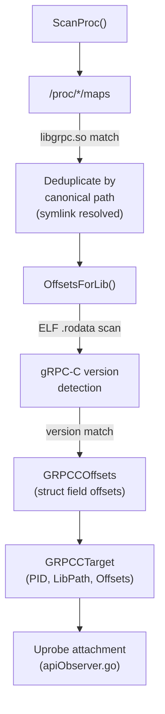

# grpcc — gRPC-C (libgrpc.so) Library Discovery

This package discovers processes using the native C/C++ gRPC library (`libgrpc.so`) and resolves struct offsets needed by BPF uprobes to capture gRPC metadata.

## Architecture



## Components

### `scanner.go` — Process Scanner

Walks `/proc/*/maps` and identifies processes with `libgrpc.so` loaded. For each unique library path:

1. Resolves symlinks for stable cache keying (`filepath.EvalSymlinks`)
2. Calls `OffsetsForLib()` to detect gRPC-C version and resolve struct offsets
3. Deduplicates: each unique library path is scanned once, regardless of how many processes share it (e.g., multiple Python workers)

Returns `[]GRPCCTarget` — one entry per `(PID, library path)` pair with resolved offsets.

### `symaddrs.go` — Version Detection and Offset Tables

Detects the gRPC-C library version by scanning the ELF `.rodata` section for version string patterns. Maps detected versions to pre-computed struct field offsets.

Target uprobe function:
- `grpc_chttp2_maybe_complete_recv_initial_metadata` — captures incoming gRPC `:path` header from `grpc_metadata_batch` struct

The `GRPCCOffsets` struct provides field offsets for:
- Metadata batch key/value locations
- Stream ID field within the transport stream struct

## Data Flow

```
libgrpc.so uprobe
    → BPF reads grpc_metadata_batch.method
    → Emits GRPCCHeaderEvent to grpcc_events ring buffer
    → Go-side ParseGRPCCHeaderEvent() decodes {PID, FD, StreamID, Method}
    → Correlator enrichment via InjectGoHTTP2Headers
```

## Limitations

- **Version table**: Only pre-mapped gRPC-C versions are supported. Unknown versions are logged and skipped.
- **C/C++ only**: Covers native gRPC-C and language bindings that use `libgrpc.so` (Python, Ruby, PHP). Does not cover Java (uses its own Netty-based transport) or Go (uses pure-Go transport).
- **No hot-reload**: Newly started processes are discovered on the next scan cycle.
- **Struct stability**: gRPC-C struct layouts change between releases; each new version requires offset verification.
