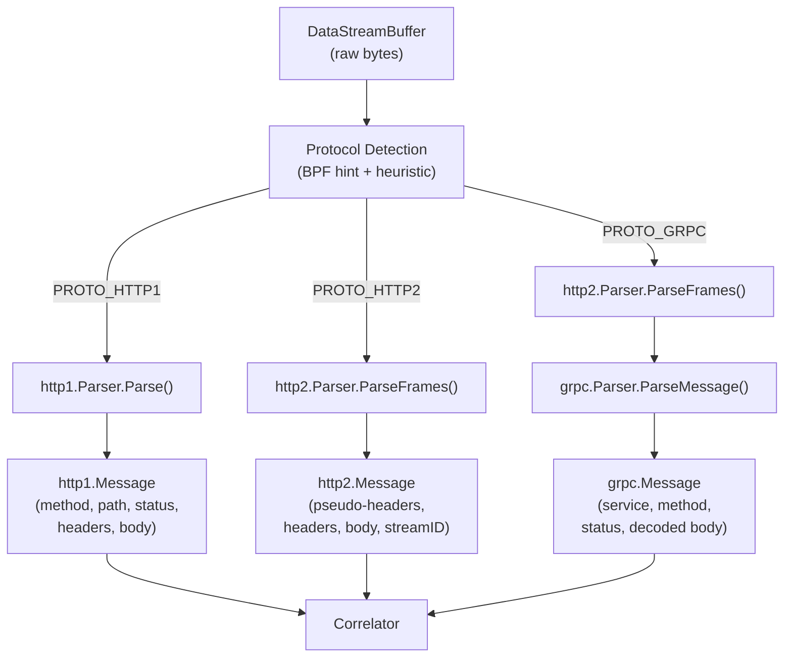

# protocols — HTTP/1.x, HTTP/2, and gRPC Parsers

This directory contains protocol-specific parsers for the three wire protocols supported by the API Observer.

## Package Structure

```
protocols/
├── http1/          # HTTP/1.x request/response parser
│   └── parser.go
├── http2/          # HTTP/2 frame parser + HPACK
│   ├── parser.go
│   ├── hpack.go
│   ├── README.md   # Detailed HTTP/2 + gRPC design document
│   └── bhpack/     # Tolerant HPACK decoder (OpenTelemetry-derived)
│       ├── hpack.go
│       ├── huffman.go
│       ├── static_table.go
│       └── tables.go
└── grpc/           # gRPC LPM framing + protobuf decode
    ├── parser.go
    └── body_detector.go
```

## Data Flow



---

## http1 — HTTP/1.x Parser

### Design

One `Parser` instance per connection per direction:
- `NewParser(true)` for egress (request parsing)
- `NewParser(false)` for ingress (response parsing)

The parser is stateless between calls — each invocation receives a byte slice from the `DataStreamBuffer` and returns:
- `msgs` — zero or more complete `Message` structs
- `consumed` — bytes consumed from the buffer front
- `skipBytes` — bytes to drain from the wire after consumption (body truncation overflow)
- `remaining` — unconsumed tail bytes (incomplete message)
- `err` — non-nil only for unrecoverable format violations

### Body Handling

| Encoding | Strategy |
|----------|----------|
| `Content-Length` | Read exact bytes; truncate at 124 KB |
| `Transfer-Encoding: chunked` | Decode chunks; emit partial after 512 bytes if terminal chunk absent |
| None (request) | No body (GET, HEAD, etc.) |
| None (response) | Treated as body-less |

Body cap is 124 KB (`maxBodyBytes`). Bodies exceeding this are truncated:
- Binary types (`application/octet-stream`, `image/*`, `video/*`, `audio/*`): replaced with `[binary data omitted]`
- Text types: first 124 KB captured + `\n... [truncated]` marker

The `skipBytes` return value tells the caller how many additional wire bytes belong to this body but were not captured. The `DataStreamBuffer.SkipNextBytes()` mechanism drains these to keep the connection aligned for the next message.

### Error Recovery

`FindFrameBoundary()` scans forward for the next valid HTTP/1.x start token (`GET `, `POST `, `HTTP/`) to recover from parse failures mid-stream.

---

## http2 — HTTP/2 Frame Parser

### Design

Per-connection parser with HPACK state. **Two instances per connection** (one per direction) to maintain separate HPACK dynamic tables as required by RFC 7540 §4.3.

Handles:
- Client preface detection (`PRI * HTTP/2.0\r\n\r\nSM\r\n\r\n`)
- Frame types: DATA, HEADERS, CONTINUATION, SETTINGS, RST_STREAM, GOAWAY, WINDOW_UPDATE, PING
- HPACK header decompression with per-stream header fragment buffering
- Stream lifecycle tracking (open → half-closed → closed)

### Tolerant HPACK Decoder (`bhpack`)

The `bhpack` package is a mid-stream-safe HPACK implementation adapted from OpenTelemetry's Go eBPF tracer:

- On invalid dynamic-table references (common when BPF attaches mid-connection), emits `HeaderField{Name: "BAD INDEX"}` sentinel instead of returning an error
- Sets `failedToIndex` flag to avoid further dynamic table corruption
- Static-table entries and literal headers decode correctly regardless of mid-stream state
- Critical pseudo-headers (`:method`, `:path`, `:status`) are almost always recoverable because they are frequently encoded via the static table or as literals

### Request vs Response Classification

Direction-based classification (trusts BPF direction flag):
- Server observation: ingress = request, egress = response
- Client observation: egress = request, ingress = response

Header-based heuristic (`:method` vs `:status`) kept only as fallback.

See [protocols/http2/README.md](http2/README.md) for the comprehensive HTTP/2 and gRPC design document.

---

## grpc — gRPC Parser

### Design

gRPC runs over HTTP/2 using its own conventions:

| gRPC Concept | HTTP/2 Mapping |
|---|---|
| Service/Method | `:path` = `/package.Service/Method` |
| Content type | `content-type: application/grpc` (or `+proto`, `+json`) |
| Status | Trailers: `grpc-status` (integer code) + `grpc-message` |
| Message framing | Length-Prefixed Message (LPM): `[1B compressed][4B big-endian length][payload]` |

### Message Parsing Pipeline

1. **LPM extraction** (`ParseLPM`): splits DATA frame body into individual gRPC messages. Handles partial frames by buffering in `Parser.partialBuf`.

2. **Decompression**: if `grpc-encoding: gzip` and compressed flag is set, decompresses via `compress/gzip`.

3. **Protobuf decode** (`DecodePBToText`): schema-less wire format decoding using `proto.Unmarshal` into `emptypb.Empty` to capture all fields as unknown fields, then renders via `protowire` walker. Output format: `field_number: value`. Nested messages rendered as `N { ... }`, strings as Go `%q` format. This mirrors Pixie's `ParsePB` → `TextFormat::PrintToString` pipeline.

4. **Trailer extraction** (`ParseTrailers`): extracts `grpc-status` and `grpc-message` from HTTP/2 HEADERS frames with END_STREAM.

### Body Detector (`body_detector.go`)

`IsGRPCBody(b)` is a fallback classifier when `content-type` is absent (lost to HPACK mid-stream). Validates:
1. LPM header: compressed flag ∈ {0, 1}, message length ≤ 16 MB
2. Payload starts with valid protobuf varint tag (field number > 0, wire type 0–5)

False-positive rate is very low due to the combined LPM + protobuf tag validation.

---

## Limitations

| Limitation | Impact |
|------------|--------|
| HPACK `BAD INDEX` entries | Mid-stream connections may have incomplete auxiliary headers |
| Body truncation | HTTP/1.x: 124 KB cap; gRPC: 512 bytes cap |
| Chunked streaming | Long-running chunked responses emit partial body after 512 bytes |
| No schema-aware protobuf | Field names are unknown; output uses field numbers only |
| Single gRPC compression | Only gzip supported; zstd, snappy, etc. produce `<Failed to gunzip data>` |
