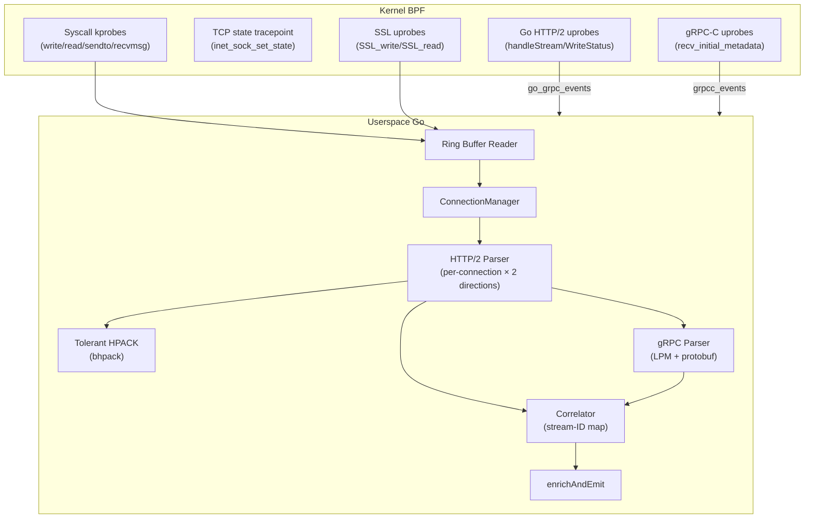

# HTTP/2 & gRPC Traffic Capture in KubeArmor API Observer

This document describes how the KubeArmor API Observer captures HTTP/2 and gRPC traffic, the architecture of the implementation, and known limitations.

---

## 1. Overview

The API Observer provides **transparent, sidecar-free** visibility into HTTP/2 and gRPC request/response flows using eBPF kprobes, uprobes, and Go-specific instrumentation:

- Captures method, path, authority, status, headers, and body (up to a safe limit).
- Handles **multiplexed HTTP/2 streams** correctly with per-stream correlation.
- Recovers **gRPC service and method names** from both wire parsing and uprobe metadata.
- Works even when tracing starts **mid-connection** (HPACK dynamic tables already populated).
- Minimizes per-connection memory, suitable for always-on security monitoring.

---

## 2. High-Level Architecture

### 2.1 Data Flow Overview

### 2.2 HTTP/2 & gRPC-Specific Components

| Component | Package | Purpose |
|-----------|---------|---------|
| In-kernel HTTP/2/gRPC heuristic | BPF | Frame validation + `"grpc"` token scan |
| HTTP/2 parser | `protocols/http2` | Frame parsing, stream tracking, HPACK state |
| Tolerant HPACK decoder | `protocols/http2/bhpack` | Mid-stream-safe HPACK (OpenTelemetry-derived) |
| gRPC parser | `protocols/grpc` | LPM framing, protobuf decode, trailer extraction |
| Go gRPC uprobes | `goprobe` + BPF | Goroutine-based correlation for Go binaries |
| Go HTTP/2 header uprobes | `goprobe` + BPF | `loopyWriter.writeHeader` + `hpack.WriteField` probes |
| gRPC-C uprobes | `grpcc` + BPF | `libgrpc.so` metadata capture |

---

## 3. In-Kernel Protocol Detection

The BPF layer performs cheap, best-effort classification before handing data to userspace.

### 3.1 HTTP/2 Preface & Frame Validation

For each captured payload:
1. Checks for the **client preface** `"PRI * HTTP/2.0\r\n\r\nSM\r\n\r\n"` at the start of the connection.
2. Validates the 9-byte HTTP/2 frame header:
   - Length ≤ 16 MB
   - Type within `[0x0..0x9]`
   - Stream ID sanity (non-zero for data-bearing frames)

### 3.2 gRPC Detection

Scans the first 128 bytes of HEADERS frames for the token `"grpc"` (typically via `content-type: application/grpc`). If found, the connection is tagged as gRPC.

### 3.3 Sticky Classification

Once classified as HTTP/2 or gRPC, later events falling back to `PROTO_UNKNOWN` reuse the last known classification. Unclassified packets are dropped.

---

## 4. HTTP/2 Parsing & HPACK Handling

### 4.1 Per-Connection HTTP/2 Parser

The `protocols/http2.Parser` type owns all connection-level state:

- One `HPACKDecoder` instance per parser
- `map[streamID]StreamState` for active stream tracking
- Connection-level settings (max frame size, header list size)

`Parser.ParseFrames` iterates over complete frames:
1. Optionally consumes the client preface
2. For HEADERS/CONTINUATION: buffers header fragments, decodes HPACK block on `END_HEADERS`
3. For DATA frames: appends body bytes, marks `IsEndStream` on `END_STREAM`

### 4.2 Mid-Stream HPACK Problem

BPF often attaches after a connection has already exchanged headers. The HPACK dynamic table is non-empty, but the decoder's view is empty. The stock Go `hpack.Decoder` returns fatal `invalid indexed representation` errors, dropping all stream state.

### 4.3 Tolerant HPACK Decoder (bhpack)

Adapted from OpenTelemetry's implementation:

- Invalid dynamic-table references emit `HeaderField{Name: "BAD INDEX"}` sentinel instead of errors
- Sets `failedToIndex` flag to prevent further dynamic table pollution
- Static-table entries and literal headers decode correctly regardless of mid-stream state
- Critical pseudo-headers (`:method`, `:path`, `:status`) are almost always recoverable

### 4.4 Per-Direction HPACK State

HTTP/2 requires **separate dynamic tables per direction** (RFC 7540 §4.3). The `ConnectionTracker` maintains two independent `Parser` instances:

- `h2Send`: egress direction (local → remote)
- `h2Recv`: ingress direction (remote → local)

### 4.5 Request vs Response Classification

Primary: **BPF direction flag** determines request vs response.
Fallback: header-based heuristic (`:method` → request, `:status` → response).

---

## 5. gRPC Support

### 5.1 Kernel-Side Detection

gRPC classification requires:
- HTTP/2 classification (preface/frame validation), and
- Presence of `"grpc"` in the HEADERS block

### 5.2 User-Space gRPC Parser

Once an HTTP/2 message is reconstructed, the `protocols/grpc.Parser`:
1. Validates `content-type` for `application/grpc` variants
2. Extracts Length-Prefixed Message (LPM) frames: `[1B compressed][4B length][payload]`
3. Decompresses gzip if `grpc-encoding: gzip`
4. Decodes protobuf via schema-less wire format (`proto.Unmarshal` into `emptypb.Empty` + `protowire` walker)
5. Extracts trailers: `grpc-status`, `grpc-message`

### 5.3 Body Detector Fallback

`grpc.IsGRPCBody()` classifies traffic when `content-type` is absent (mid-stream HPACK loss). Validates LPM header structure + protobuf varint tag at payload start. Low false-positive rate.

### 5.4 Go gRPC Uprobes (OTel-Style)

Reuses OpenTelemetry's approach:

- **Goroutine pointer** read from TLS register provides stable correlation key
- BPF map keyed by `{goroutine_addr, pid}` stores start timestamp + Stream pointer
- On function return, reads `transport.Stream.Method` (Go string) for full path

Target functions:
- `(*grpc.Server).handleStream` — server-side
- `(*ClientConn).Invoke` / `(*ClientConn).NewStream` — client-side
- `(*http2Server).WriteStatus` — status/trailers

### 5.5 Go HTTP/2 Header Uprobes

Capture outgoing HTTP/2 headers at the transport layer:

- `loopyWriter.writeHeader` — captures header fields being written to the wire
- `hpack.WriteField` — captures individual HPACK-encoded header fields

These probes emit `GoH2TransportEvent` (batch of up to 20 headers) or `GoH2SingleHeaderEvent` (individual header field) via the `go_h2_events` ring buffer.

### 5.6 gRPC-C Uprobes

For native C/C++ gRPC (`libgrpc.so`) and language bindings (Python, Ruby):

- Uprobe on `grpc_chttp2_maybe_complete_recv_initial_metadata`
- Captures `:path` from `grpc_metadata_batch` struct
- Emits `GRPCCHeaderEvent` via `grpcc_events` ring buffer

### 5.7 Correlator Integration

Three integration points:

1. **`InjectGoHTTP2Headers`** — merges Go uprobe headers into pending HTTP/2 stream entries
2. **`InjectGoGRPCEvent`** — creates synthetic `CorrelatedTrace` from standalone Go gRPC events
3. **gRPC-C header injection** — enriches HTTP/2 requests with method paths from `GRPCCHeaderEvent`

---

## 6. Request/Response Correlation for HTTP/2/gRPC

### 6.1 Stream Correlation

Per-connection state: `map[ConnectionKey]map[streamID]PendingRequest`

- **Request**: store `PendingRequest` keyed by `(ConnectionKey, streamID)`
- **Response**: look up by `(ConnectionKey, streamID)`, remove entry, construct `CorrelatedTrace`
- Unmatched responses counted in `UnmatchedResponses` stat

### 6.2 Cleanup & Timeouts

- **TCP close**: `CloseConnection` flushes all pending stream entries
- **Background goroutine**: 10-second tick, evicts requests older than 30 seconds
- **Transport headers**: orphaned Go uprobe header entries evicted alongside request cleanup

---

## 7. Body Capture & Truncation Strategy

| Aspect | Limit | Notes |
|--------|-------|-------|
| Per-direction HTTP buffer | 128 KB | 256 KB per connection total |
| HTTP/1.x body cap | 124 KB | Headers always fully captured |
| gRPC body cap | 512 bytes | Protobuf wire decoded to text |
| Binary MIME types | 0 bytes | Replaced with `[binary data omitted]` |
| BPF per-event cap | ~8 KB (`MAX_DATA_SIZE`) | Kernel ring buffer entry limit |

When body cap is reached:
1. Emit event with captured body
2. Set truncation flag
3. Drain remaining bytes via `DataStreamBuffer.SkipNextBytes()` to maintain stream alignment

---

## 8. Known Limitations

1. **HPACK BAD INDEX entries** — mid-stream connections may have incomplete auxiliary headers. Critical pseudo-headers usually recoverable.

2. **Heuristic gRPC detection** — scans only first 128 bytes of HEADERS for `"grpc"`. Exotic servers may be misclassified.

3. **TLS coverage** — requires SSL uprobes attached with correct offsets. Without working uprobes, HTTP/2/gRPC over TLS appears as encrypted data.

4. **Go-only goroutine uprobes** — non-Go services rely solely on HTTP/2 frame parsing.

5. **Body truncation** — large payloads and streaming RPCs are truncated.

6. **Mid-stream attach** — first few messages after BPF attachment may be missing path/headers until HPACK state rebuilds or Go uprobes supply metadata.

7. **Single compression codec** — only gzip supported for gRPC decompression.

---

## 9. Future Work

1. **Configurable body and buffer sizes** — expose `maxBodyBytes` and buffer caps via configuration
2. **Configurable protocol and namespace filters** — BPF-side map-based runtime configuration
3. **Better mid-stream recovery** — retroactive BAD INDEX patching from uprobe metadata
4. **Richer gRPC semantics** — distinguish unary vs streaming; surface message counts
5. **Testing matrix expansion** — systematic coverage of Java, C++, Python, Rust gRPC implementations and intermediaries (Envoy, Istio)

---

## 10. Relevant Code

### BPF Layer
- `BPF/apiobserver/protocol_inference.h` — HTTP/2 preface/frame validation, gRPC heuristic
- `BPF/apiobserver/go_http2_trace.h` — Go gRPC uprobes, goroutine-based correlation
- `BPF/apiobserver/grpc_c_trace.h` — gRPC-C uprobes

### Parsers & HPACK
- `protocols/http2/parser.go` — HTTP/2 frame parsing and stream tracking
- `protocols/http2/hpack.go` — wrapper around tolerant HPACK decoder
- `protocols/http2/bhpack/` — HPACK implementation (OpenTelemetry-derived)
- `protocols/grpc/parser.go` — gRPC LPM framing, protobuf decode, trailer handling
- `protocols/grpc/body_detector.go` — fallback gRPC body classification

### Events & Correlation
- `events/events.go` — `DataEvent` representation and binary parsing
- `events/go_header_event.go` — Go gRPC uprobe event decoding
- `events/go_http2_transport_event.go` — Go HTTP/2 transport header events
- `events/grpcc_header_event.go` — gRPC-C uprobe event decoding
- `events/types.go` — `PendingRequest`, `CorrelatedTrace`, stream state types
- `events/correlator.go` — `AddHTTP2Request`, `MatchHTTP2Response`, `InjectGoHTTP2Headers`, `InjectGoGRPCEvent`
- `events/conn/tracker.go` — `ConnectionTracker` with per-direction HTTP/2 parser instances

### Filters & Enrichment
- `filter/filterer.go` — health probe, loopback, infrastructure traffic filtering
- `filter/dedup.go` — time-based deduplication cache
