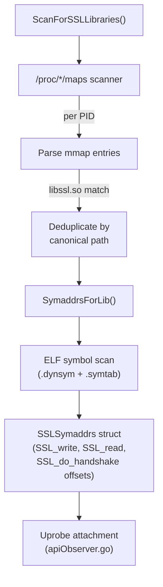

# ssl — OpenSSL/BoringSSL Library Discovery

This package implements container-aware SSL/TLS library discovery for uprobe attachment. It scans process memory maps to find loaded SSL libraries and resolves the symbol offsets needed by BPF uprobes.

## Architecture

## Components

### `procmaps.go` — Process Map Scanner

Scans `/proc/<pid>/maps` for loaded SSL/TLS libraries:

| Library Pattern | Description |
|-----------------|-------------|
| `libssl.so` | OpenSSL |
| `libssl.so.3` | OpenSSL 3.x |
| `libssl.so.1.1` | OpenSSL 1.1.x |
| `libssl.so.1.0.0` | OpenSSL 1.0.x |

Container-aware path resolution:
- Uses `ProcRoot` variable (default `/proc`, configurable via `--procfsMount`)
- Resolves container paths via `/proc/<pid>/root/<path>` translation
- Self-instrumentation skip via `SelfHostPID` and `SelfExePath` matching

### `symaddrs.go` — Symbol Offset Resolution

Resolves function addresses from ELF symbol tables:

| Symbol | Probe Type |
|--------|-----------|
| `SSL_write` | uprobe (capture plaintext before encryption) |
| `SSL_read` | uretprobe (capture plaintext after decryption) |
| `SSL_do_handshake` | uprobe (track handshake state) |

Scans both `.dynsym` (dynamic symbols) and `.symtab` (full symbol table) to handle both dynamically and statically linked binaries.

## Configuration

| Parameter | Source | Default | Description |
|-----------|--------|---------|-------------|
| `ProcRoot` | `--procfsMount` | `/proc` | Host procfs path |
| Scan interval | Hardcoded | 30 seconds | Background scanner frequency |

## Limitations

- Only supports OpenSSL/BoringSSL (`libssl.so`). LibreSSL, GnuTLS, and rustls are not covered.
- Symbol offset resolution requires non-stripped libraries. Fully stripped SSL libraries (rare in practice) will fail probe attachment.
- Go TLS (crypto/tls) is handled by the `goprobe` package, not this package.
