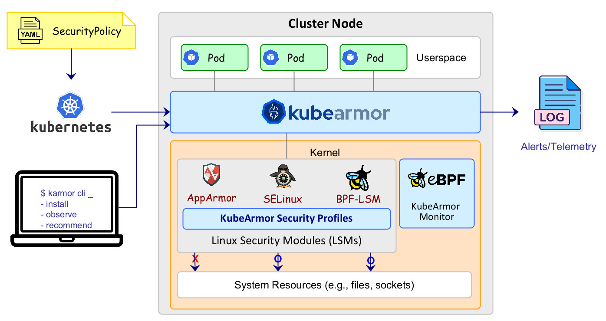

KubeArmor is a cloud-native runtime security enforcement system that restricts the behavior \(such as process execution, file access, and networking operations\) of containers and nodes (VMs) at the system level.

KubeArmor leverages [Linux security modules \(LSMs\)](https://en.wikipedia.org/wiki/Linux_Security_Modules) such as [AppArmor](https://en.wikipedia.org/wiki/AppArmor), [SELinux](https://en.wikipedia.org/wiki/Security-Enhanced_Linux), or [BPF-LSM](https://lwn.net/Articles/808048/)\) to enforce the user-specified policies. KubeArmor generates alerts/telemetry events with container/pod/namespace identities by leveraging eBPF.

## Functionality Overview

### Use-cases
- Restrict the behavior of containers and nodes (VMs) at the system level

  Traditional container security solutions protect containers by determining their inter-container relations \(i.e., service flows\) at the network level. In contrast, KubeArmor prevents malicious or unknown behaviors in containers by specifying their desired actions \(e.g., a specific process should only be allowed to access a sensitive file\). KubeArmor also allows operators to restrict the behaviors of nodes (VMs) based on node identities.

- Enforce security policies to containers and nodes (VMs) at runtime

  In general, security policies \(e.g., Seccomp and AppArmor profiles\) are statically defined within pod definitions for Kubernetes, and they are applied to containers at creation time. Then, the security policies are not allowed to be updated in runtime.

  To address those problems, KubeArmor users k8s CRDs to define security policies, such that the orchestration of the policy is handled by the k8s control plane. KubeArmor leverages Linux Security Modules (LSMs) to enforce the security policies at the container level according to the labels of given containers and security policies. Similiarly, KubeArmor support policy enforcement at the Host/Node/VM level using `KubeArmorHostSecurityPolicy` k8s resource.

- Produce container-aware alerts and system logs

  LSMs do not have any container-related information; thus, they generate alerts and system logs only based on system metadata \(e.g., User ID, Group ID, and process ID\). It is hard to figure out what containers cause policy violations. KubeArmor uses an eBPF-based system monitor to keep track of process life cycles in containers and even nodes, and converts system metadata to container/node identities when LSMs generate alerts and system logs for any policy violations from containers and nodes (VMs).

- Provide easy-to-use semantics for policy definitions

  KubeArmor provides the ability to monitor the life cycles of containers' processes and take policy decisions based on them. In general, it is much easier to deny a specific action, but it is more difficult to allow only specific actions while denying all. KubeArmor manages internal complexities associated with handling such policy decisions and provides easy semantics towards policy language.

- Support network security enforcement among containers

  KubeArmor aims to protect containers and nodes (VMs) themselves rather than inter-container/inter-node communications. However, using KubeArmor a user can add policies that could apply policy settings at the level of network system calls \(e.g., bind\(\), listen\(\), accept\(\), and connect\(\)\), thus controlling interactions among containers and nodes (VMs).

## Getting Started

Please take a look at the following documents.

1. [Getting Started](getting-started/deployment_guide.md)
2. [Security Policy Specification for Containers](getting-started/security_policy_specification.md)
3. [Security Policy Examples for Containers](getting-started/security_policy_examples.md)
4. [Security Policy Specification for Nodes (VMs)](getting-started/host_security_policy_specification.md)
5. [Security Policy Examples for Nodes (VMs)](getting-started/host_security_policy_examples.md)

If you want to make a contribution, please refer to the following documents too.

1. [Contribution Guide](contribution/contribution_guide.md)
2. [Development Guide](contribution/development_guide.md)
3. [Testing Guide](contribution/testing_guide.md)

## Community

### Biweekly Meetup

- Where: [Zoom Link](https://bit.ly/kubearmor-zoom)
- Minutes: [Document](https://docs.google.com/document/d/1IqIIG9Vz-PYpbUwrH0u99KYEM1mtnYe6BHrson4NqEs/edit)
- Calendar invite: [Google Calendar](https://calendar.google.com/event?action=TEMPLATE&tmeid=MWN0MTlzYWFoM2tkcXZidTk1cHZjNjNyOGtfMjAyMjAyMTBUMTUwMDAwWiBjXzJmMXRiYnNqNWdrNmdnbGpzMzA4NnAwamw4QGc&tmsrc=c_2f1tbbsj5gk6ggljs3086p0jl8%40group.calendar.google.com&scp=ALL)
- ICS: [ICS file](getting-started/resources/KubeArmorMeetup.ics) for setting up meeting on your calendar

### Slack

Please join the [KubeArmor Slack channel](https://join.slack.com/t/kubearmor/shared_invite/zt-1ltmqdbc6-rSHw~LM6MesZZasmP2hAcA) to communicate with KubeArmor community.

## License

KubeArmor is licensed under the Apache License, Version 2.0.  
The eBPF-based container monitor is licensed under the General Public License, Version 2.0.

## Notice/Credits

- KubeArmor uses [Tracee](https://github.com/aquasecurity/tracee/)'s system call utility functions developed by [Aqua Security](https://aquasec.com).

## CNCF

KubeArmor is Sandbox Project of the Cloud Native Computing Foundation

