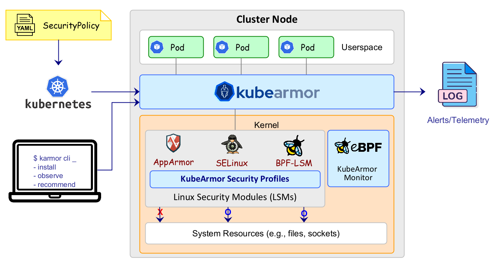

KubeArmor is a cloud-native runtime security enforcement system that restricts the behavior \(such as process execution, file access, and networking operations\) of pods, containers, and nodes (VMs) at the system level.

KubeArmor leverages [Linux security modules \(LSMs\)](https://en.wikipedia.org/wiki/Linux_Security_Modules) such as [AppArmor](https://en.wikipedia.org/wiki/AppArmor), [SELinux](https://en.wikipedia.org/wiki/Security-Enhanced_Linux), or [BPF-LSM](https://docs.kernel.org/bpf/prog_lsm.html) to enforce the user-specified policies. KubeArmor generates rich alerts/telemetry events with container/pod/namespace identities by leveraging eBPF.

|  |   |
|:---|:---|
| :muscle: **[Harden Infrastructure](getting-started/hardening_guide.md)** 
:chains: Protect critical paths such as cert bundles  :clipboard: MITRE, STIGs, CIS based rules  :left_luggage: Restrict access to raw DB table | :ring: **[Least Permissive Access](getting-started/least_permissive_access.md)** 
:traffic_light: Process Whitelisting  :traffic_light: Network Whitelisting  :control_knobs: Control access to sensitive assets |
| :telescope: **[Application Behavior](getting-started/workload_visibility.md)** 
:dna: Process execs, File System accesses  :compass: Service binds, Ingress, Egress connections  :microscope: Sensitive system call profiling | :snowflake: **[Deployment Models](getting-started/deployment_models.md)** 
:wheel_of_dharma: Kubernetes Deployment :whale2: Containerized Deployment :computer: VM/Bare-Metal Deployment |

## Architecture Overview

## Documentation :notebook:

* :point_right: [Getting Started](getting-started/deployment_guide.md)
* :dart: [Use Cases](getting-started/use-cases/hardening.md)
* :heavy_check_mark: [KubeArmor Support Matrix](getting-started/support_matrix.md)
* :chess_pawn: [How is KubeArmor different?](getting-started/differentiation.md)
* :scroll: Security Policy for Pods/Containers [[Spec](getting-started/security_policy_specification.md)] [[Examples](getting-started/security_policy_examples.md)]
* :scroll: Cluster level security Policy for Pods/Containers [[Spec](getting-started/cluster_security_policy_specification.md)] [[Examples](getting-started/cluster_security_policy_examples.md)]
* :scroll: Security Policy for Hosts/Nodes [[Spec](getting-started/host_security_policy_specification.md)] [[Examples](getting-started/host_security_policy_examples.md)]
* :scroll: Network Security Policy for Hosts/Nodes [[Spec](getting-started/network_security_policy_specification.md)] [[Examples](getting-started/network_security_policy_examples.md)] 
... [detailed documentation](https://docs.kubearmor.io/kubearmor/)

### Contributors :busts_in_silhouette:

* :blue_book: [Contribution Guide](contribution/contribution_guide.md)
* :technologist: [Development Guide](contribution/development_guide.md), [Testing Guide](contribution/testing_guide.md)
* :raised_hand: [Join KubeArmor Slack](https://cloud-native.slack.com/archives/C02R319HVL3)
* :question: [FAQs](getting-started/FAQ.md)

### Biweekly Meeting

- :speaking_head: [Zoom Link](http://zoom.kubearmor.io)
- :page_facing_up: Minutes: [Document](https://docs.google.com/document/d/1IqIIG9Vz-PYpbUwrH0u99KYEM1mtnYe6BHrson4NqEs/edit)
- :calendar: Calendar invite: [Google Calendar](http://www.google.com/calendar/event?action=TEMPLATE&dates=20220210T150000Z%2F20220210T153000Z&text=KubeArmor%20Community%20Call&location=&details=%3Ca%20href%3D%22https%3A%2F%2Fdocs.google.com%2Fdocument%2Fd%2F1IqIIG9Vz-PYpbUwrH0u99KYEM1mtnYe6BHrson4NqEs%2Fedit%22%3EMinutes%20of%20Meeting%3C%2Fa%3E%0A%0A%3Ca%20href%3D%22%20http%3A%2F%2Fzoom.kubearmor.io%22%3EZoom%20Link%3C%2Fa%3E&recur=RRULE:FREQ=WEEKLY;INTERVAL=2;BYDAY=TH&ctz=Asia/Calcutta), [ICS file](getting-started/resources/KubeArmorMeetup.ics)

### Community & Governance

KubeArmor is a community-governed project. The following documents describe how the project is run:

- :scroll: [Governance](./GOVERNANCE.md) — roles, decision-making, vendor neutrality, sub-teams, voting.
- :busts_in_silhouette: [Maintainers](./MAINTAINERS.md) — current Maintainers, Reviewers, and Emeritus Maintainers, with affiliations.
- :handshake: [Code of Conduct](./CODE_OF_CONDUCT.md) — we follow the [CNCF Code of Conduct](https://github.com/cncf/foundation/blob/main/code-of-conduct.md).
- :package: [Release Process](./RELEASES.md) — cadence, release candidates, release manager, support window.
- :lock: [Security Policy](./SECURITY.md) — how to report a vulnerability.

## Notice/Credits :handshake:

- KubeArmor uses [Tracee](https://github.com/aquasecurity/tracee/)'s system call utility functions.

## CNCF

KubeArmor is [Sandbox Project](https://www.cncf.io/projects/kubearmor/) of the Cloud Native Computing Foundation.

## ROADMAP

KubeArmor roadmap is tracked via [KubeArmor Projects](https://github.com/orgs/kubearmor/projects?query=is%3Aopen)

## Related Repositories

KubeArmor is more than a single repository. The following repositories under the [`kubearmor`](https://github.com/kubearmor) GitHub organization are part of the wider project. Each is governed under [GOVERNANCE.md](./GOVERNANCE.md) — see the *Subprojects* section there for how core and community subprojects are classified.

> **Note:** This list covers actively maintained repositories. For the complete (including archived) list, see the [organization page](https://github.com/orgs/kubearmor/repositories).

### Core

| Repository | What it is |
|---|---|
| [KubeArmor](https://github.com/kubearmor/KubeArmor) | The main runtime security enforcement daemon. This repository. |
| [kubearmor-client](https://github.com/kubearmor/kubearmor-client) | `karmor`, the official command-line tool for installing, configuring, and observing KubeArmor. |
| [charts](https://github.com/kubearmor/charts) | Official Helm charts for KubeArmor and the KubeArmor Operator. |
| [policy-templates](https://github.com/kubearmor/policy-templates) | Community-curated library of System and Network policy templates for KubeArmor (and Cilium). |
| [kubearmor.io](https://github.com/kubearmor/kubearmor.io) | Source for the [kubearmor.io](https://kubearmor.io) website. |
| [.project](https://github.com/kubearmor/.project) | Project metadata for CNCF `.project` automation (CLOMonitor, landscape, etc.). |

### Integrations and adapters

| Repository | What it is |
|---|---|
| [otel-adapter](https://github.com/kubearmor/otel-adapter) | OpenTelemetry receiver for KubeArmor events and alerts. |
| [kubearmor-prometheus-exporter](https://github.com/kubearmor/kubearmor-prometheus-exporter) | Prometheus exporter for KubeArmor metrics. |
| [kubearmor-relay-server](https://github.com/kubearmor/kubearmor-relay-server) | Relay/log streaming server that aggregates events from KubeArmor agents. |
| [kubearmor-kafka-client](https://github.com/kubearmor/kubearmor-kafka-client) | Kafka client for streaming KubeArmor logs to a Kafka cluster. |
| [kubearmor-log-client](https://github.com/kubearmor/kubearmor-log-client) | Standalone log client (stdout or file) for consuming KubeArmor logs. |
| [grafana-datasource](https://github.com/kubearmor/grafana-datasource) | Grafana data source backend for visualising KubeArmor data. |
| [kubearmor-dashboards](https://github.com/kubearmor/kubearmor-dashboards) | ELK-stack dashboards for KubeArmor logs and alerts. |
| [kubearmor-action](https://github.com/kubearmor/kubearmor-action) | GitHub Action that runs KubeArmor against a workload for CI security checks. |
| [rancherui](https://github.com/kubearmor/rancherui) | Rancher Manager UI extension for managing KubeArmor through Rancher. |
| [sidekick](https://github.com/kubearmor/sidekick) | Glue to connect KubeArmor events into downstream ecosystems. |

### Deployment and packaging

| Repository | What it is |
|---|---|
| [custom-packages](https://github.com/kubearmor/custom-packages) | Custom `.deb` / `.rpm` packaging definitions. |
| [packer-plugin-kubearmor](https://github.com/kubearmor/packer-plugin-kubearmor) | HashiCorp Packer plugin for baking KubeArmor into images. |

### Specialised projects

| Repository | What it is |
|---|---|
| [k8tls](https://github.com/kubearmor/k8tls) | (Pronounced *cattles*) — assesses server port security by detecting TLS and certificate configuration. |
| [modelarmor](https://github.com/kubearmor/modelarmor) | ML model security, including pickle-injection PoC and adversarial-attack demos. |
| [kvm-service](https://github.com/kubearmor/kvm-service) | Service for orchestrating KubeArmor policies to VMs and bare-metal hosts via either a Kubernetes or non-Kubernetes control plane. |
| [libbpf](https://github.com/kubearmor/libbpf) | Go eBPF helper library based on the upstream libbpf API. |
| [kbc](https://github.com/kubearmor/kbc) | KubeArmor Benchmark Calculator. |

<!--
TODO: Confirm classification of each repository as **core subproject** (governed by this repo's GOVERNANCE.md, CODEOWNERS subset of Maintainers) versus **community subproject** (own MAINTAINERS file, autonomous on technical decisions but bound by CoC and vendor-neutrality clauses). This is CNCF DD blocker F.

Also, the following repositories have not been pushed to in over 12 months and may be candidates for archiving — confirm with Maintainers before next release:
  artefacts, certified-operators, marketplace-kubernetes, minikube, kubearmor.github.io, openhorizon-demo (already archived), test-enterprise-gha, runtime-security-best-practices, log4j-CVE-2021-44228, kastore, koach, KubeArmor-demo (last push 2023), tag-security, kubearmor-relay-server-KA (looks duplicated).
-->

This list is generated iteratively — open a pull request to add a new repository or correct a description.
