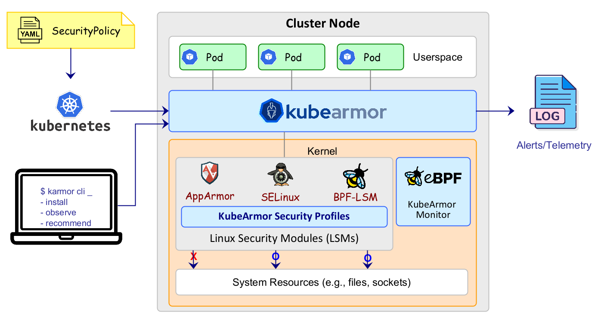

<p align="center">
  
</p>

<h3 align="center">Runtime security that blocks in the kernel, not after the fact</h3>

<p align="center">
  Pods, containers, VMs and bare metal. One policy language for all of them.
</p>

<p align="center">
  <a href="https://docs.kubearmor.io/kubearmor/"><b>Docs</b></a>   ·  
  <a href="#quick-start"><b>Quick start</b></a>   ·  
  <a href="#sample-policies"><b>Sample policies</b></a>   ·  
  <a href="whitepapers/container-runtime-security/"><b>Whitepaper</b></a>   ·  
  <a href="https://deepwiki.com/kubearmor/KubeArmor"><b>Chat with the repo</b></a>   ·  
  <a href="https://ctf.kubearmor.io/"><b>AI Security CTF</b></a>   ·  
  <a href="https://cloud-native.slack.com/archives/C02R319HVL3"><b>Slack</b></a>
</p>

<p align="center">
<a href="https://github.com/kubearmor/KubeArmor/actions/workflows/ci-test-ginkgo.yml/"></a>
<a href="https://bestpractices.coreinfrastructure.org/projects/5401"></a>
<a href="https://clomonitor.io/projects/cncf/kubearmor"></a>
<a href="https://securityscorecards.dev/viewer/?uri=github.com/kubearmor/KubeArmor"></a>
<a href="https://app.fossa.com/projects/git%2Bgithub.com%2Fkubearmor%2FKubeArmor?ref=badge_shield"></a>
<a href="https://app.fossa.com/projects/git%2Bgithub.com%2Fkubearmor%2FKubeArmor?ref=badge_shield"></a>
<a href="https://artifacthub.io/packages/search?kind=19"></a>
<a href="https://github.com/kubearmor/KubeArmor/discussions"></a>
</p>

---

KubeArmor is a cloud-native runtime security enforcement system that restricts the behavior (such as
process execution, file access, and networking operations) of pods, containers, and nodes (VMs) at
the system level.

KubeArmor uses [Linux security modules (LSMs)](https://en.wikipedia.org/wiki/Linux_Security_Modules)
such as [AppArmor](https://en.wikipedia.org/wiki/AppArmor),
[SELinux](https://en.wikipedia.org/wiki/Security-Enhanced_Linux), or
[BPF-LSM](https://docs.kernel.org/bpf/prog_lsm.html) to enforce the user-specified policies.
KubeArmor generates rich alerts and telemetry events with container, pod, and namespace identities
by using eBPF.

Most tools detect, then react, after the code has already run. KubeArmor asks the kernel to refuse:

```console
$ kubectl exec -it $POD -- bash -c "apt update && apt install masscan"
sh: 1: apt: Permission denied
command terminated with exit code 126
```

|  |   |
|:---|:---|
| 💪 **[Harden Infrastructure](getting-started/hardening_guide.md)** <hr>🔗 Protect critical paths such as cert bundles <br>📋 MITRE, STIGs, CIS based rules <br>🧳 Restrict access to raw DB tables | 💍 **[Least Permissive Access](getting-started/least_permissive_access.md)** <hr>🚦 Process allow-listing <br>🚦 Network allow-listing <br>🎛️ Control access to sensitive assets |
| 🔭 **[Application Behavior](getting-started/workload_visibility.md)** <hr>🧬 Process execs, file system accesses <br>🧭 Service binds, ingress, egress connections <br>🔬 Sensitive system call profiling | ❄️ **[Deployment Models](getting-started/deployment_models.md)** <hr>☸️ Kubernetes deployment<br>🐳 Containerized deployment<br>💻 VM and bare-metal deployment |

## Quick start

```sh
helm repo add kubearmor https://kubearmor.github.io/charts
helm repo update kubearmor
helm upgrade --install kubearmor-operator kubearmor/kubearmor-operator -n kubearmor --create-namespace
kubectl apply -f https://raw.githubusercontent.com/kubearmor/KubeArmor/main/pkg/KubeArmorOperator/config/samples/sample-config.yml
```

Then the `karmor` CLI, for telemetry and policy generation:

```sh
curl -sfL http://get.kubearmor.io/ | sudo sh -s -- -b /usr/local/bin
```

No node changes, no runtime swap. Full walkthrough in the
[deployment guide](getting-started/deployment_guide.md).

## Sample policies

Copy one, change the selector, apply it. The
[deployment guide](https://docs.kubearmor.io/kubearmor/quick-links/deployment_guide#sample-policies)
runs these against a test nginx pod.

<details>
<summary><b>🔑 Stop credential harvesting</b> (cloud keys, SSH keys, service account token)</summary>

<br>

Kubernetes mounts a service account token in every pod by default. Cloud keys and SSH keys sit at
known paths, so one `cat` is enough.

```yaml
apiVersion: security.kubearmor.com/v1
kind: KubeArmorPolicy
metadata:
  name: block-credential-harvesting
  namespace: default
spec:
  severity: 7
  message: "credential access blocked"
  selector:
    matchLabels:
      app: nginx
  file:
    matchDirectories:
    - dir: /run/secrets/kubernetes.io/serviceaccount/
      recursive: true
    - dir: /root/.aws/
      recursive: true
    - dir: /root/.ssh/
      recursive: true
    matchPaths:
    - path: /root/.npmrc
    - path: /root/.docker/config.json
    - path: /etc/shadow
  action:
    Block
```

The read fails inside the pod, and `karmor logs` records who tried it:

```console
(inside pod) $ cat /run/secrets/kubernetes.io/serviceaccount/token
cat: /run/secrets/kubernetes.io/serviceaccount/token: Permission denied
```

</details>

<details>
<summary><b>🌱 Protect environment variables</b> (secrets that arrive as env vars)</summary>

<br>

A secret passed as an environment variable stays readable at `/proc/<pid>/environ` for the life of
the process, by any code in the pod.

```yaml
apiVersion: security.kubearmor.com/v1
kind: KubeArmorPolicy
metadata:
  name: block-proc-environ-access
  namespace: default
spec:
  severity: 7
  message: "environment variable access blocked"
  selector:
    matchLabels:
      app: nginx
  file:
    matchPatterns:
    - pattern: /proc/*/environ
  action:
    Block
```

`matchPatterns` needs the AppArmor enforcer. On BPF-LSM nodes, list the exact paths with `matchPaths`
instead. Run `karmor probe` to see which enforcer your nodes use.

</details>

<details>
<summary><b>🔍 Block filesystem discovery</b> (file listing and search binaries)</summary>

<br>

A web server does not run `ls` or `find`. Block them and the attacker cannot look around before
taking anything.

```yaml
apiVersion: security.kubearmor.com/v1
kind: KubeArmorPolicy
metadata:
  name: block-filesystem-discovery
  namespace: default
spec:
  severity: 5
  message: "filesystem discovery blocked"
  selector:
    matchLabels:
      app: nginx
  process:
    matchPaths:
    - path: /bin/ls
    - path: /usr/bin/ls
    - path: /usr/bin/find
    - path: /usr/bin/dir
    - path: /usr/bin/tree
  action:
    Block
```

</details>

<details>
<summary><b>🦠 Block malware staging</b> (package managers, downloaders, scanners)</summary>

<br>

A payload has to land before it runs. Attackers use the package manager, then a downloader, then a
scanner. Production pods need none of them.

```yaml
apiVersion: security.kubearmor.com/v1
kind: KubeArmorPolicy
metadata:
  name: block-malware-staging
  namespace: default
spec:
  severity: 8
  message: "attacker tooling blocked"
  selector:
    matchLabels:
      app: nginx
  process:
    matchPaths:
    - path: /usr/bin/apt
    - path: /usr/bin/apt-get
    - path: /sbin/apk
    - path: /usr/bin/yum
    - path: /usr/bin/curl
    - path: /usr/bin/wget
    - path: /usr/bin/nmap
    - path: /usr/bin/masscan
    - path: /usr/bin/docker
    - path: /usr/bin/kubectl
  action:
    Block
```

</details>

<details>
<summary><b>🛡️ Allow only the app, deny the rest</b> (zero trust posture)</summary>

<br>

The others name what to block. This one names what to allow, and the kernel refuses the rest. Set
the namespace posture first.

```sh
kubectl annotate ns default kubearmor-file-posture=block --overwrite
```

```yaml
apiVersion: security.kubearmor.com/v1
kind: KubeArmorPolicy
metadata:
  name: only-allow-nginx-exec
  namespace: default
spec:
  severity: 8
  message: "only the application may execute"
  selector:
    matchLabels:
      app: nginx
  file:
    matchDirectories:
    - dir: /
      recursive: true
  process:
    matchPaths:
    - path: /usr/sbin/nginx
    - path: /bin/bash
  action:
    Allow
```

Any `Allow` action puts the pod in least permissive mode. Run `karmor recommend` to generate a
starting allow-list from what the workload actually does.

</details>

More in [policy-templates](https://github.com/kubearmor/policy-templates), mapped to MITRE, CIS and
STIG. Specs are under [Policy reference](#policy-reference).

## Architecture

KubeArmor runs as a DaemonSet, one pod per node, without privileged host access. It turns your
policy into rules for whichever LSM the node has.



Enforcement happens at the LSM hook and never waits on userspace, so a dropped event costs you log
lines and nothing else. Container identity comes from the CRI socket, or from
[OCI hooks](https://kubearmor.io/blog/kubearmor-oci-hooks-container-security) if you want to drop
that mount.

## How KubeArmor compares

Every engine sees the same syscall. What differs is when it can act. Detect and respond kills the
process after it ran. KubeArmor denies the call at the LSM hook, so it never runs.

<details>
<summary><b>Engine comparison</b> (Tetragon, Falco, Tracee, NeuVector, gVisor)</summary>

<br>

| Engine | Model | Inline block | Allow-list policy | Sandboxing |
|---|---|:-:|:-:|:-:|
| **KubeArmor** | detect + inline LSM enforcement | ✅ | ✅ | ✅ |
| Tetragon | detect + kill or override return | ⚠️ | ✅ | ❌ |
| Falco + Talon | detect and respond | ❌ | ❌ | ❌ |
| Tracee | detect only | ❌ | ❌ | ❌ |
| NeuVector | detect + kill from userspace | ❌ | ✅ | ❌ |
| gVisor | syscall interception in a guest kernel | ✅ | ✅ | ✅ |

eBPF observes, LSMs enforce: kprobes and tracepoints report an event, they cannot reject a syscall.
A kill signal always lands after the code ran. KubeArmor needs no node reboot and no runtime swap.

</details>

📄 **[Whitepaper: Container Runtime Security](whitepapers/container-runtime-security/)**, on how each
engine enforces down to the kernel primitive. Shorter version:
[differentiation](getting-started/differentiation.md).

## Recent attacks, and the policy that stops them

Public 2025 write-ups. The entry points differ, the next steps repeat: run a payload, read a secret,
call home. A policy can cut any of them.

<details>
<summary><b>Five 2025 attacks, and the policy that cuts each chain</b></summary>

<br>

| Attack | What happened | Where KubeArmor cuts the chain |
|---|---|---|
| **React2Shell**<br>CVE-2025-55182, Dec 2025 | Unauthenticated RCE gave shell access inside pods. Actors harvested mounted service account tokens, queried RBAC, then deployed miners. [Unit 42](https://unit42.paloaltonetworks.com/modern-kubernetes-threats/) | Deny reads on `/var/run/secrets/kubernetes.io/serviceaccount/token`. Allow-list the app process, so `curl` and the miner never execute. |
| **Shai-Hulud npm worm**<br>Sep and Nov 2025 | A `postinstall` script harvested npm tokens, GitHub PATs, and cloud keys, then published them to public repos. A later variant wiped the home directory. [Wiz](https://www.wiz.io/blog/shai-hulud-npm-supply-chain-attack) | In CI and build pods, deny reads on `~/.npmrc`, `~/.aws/credentials`, and SSH keys. Deny egress except the registry. Deny writes outside the workspace. |
| **IngressNightmare**<br>CVE-2025-1974, Mar 2025 | Unauthenticated RCE in the ingress-nginx admission controller, whose service account can read Secrets in every namespace. [Wiz](https://www.wiz.io/blog/ingress-nginx-kubernetes-vulnerabilities) | Allow only `nginx` and its workers to execute in that pod. Deny writes to `/etc/nginx`. Deny the token read the next step needs. |
| **Dero miner in containers**<br>2025 | Attackers reached exposed Docker APIs, then a worm installed `masscan` and a Docker client inside running containers to spread. [Securelist](https://securelist.com/dero-miner-infects-containers-through-docker-api/116546/) | Deny `apt`, `apk`, `yum`. Deny `docker` and `kubectl` binaries in workload pods. Deny access to `/var/run/docker.sock`. |
| **nullifAI models**<br>Hugging Face, Feb 2025 | Two models carried pickle payloads that opened a reverse shell on load. The platform scanner did not flag them. [ReversingLabs](https://www.reversinglabs.com/blog/rl-identifies-malware-ml-model-hosted-on-hugging-face) | Sandbox the inference pod. Allow only the Python binary. Deny shell spawn, raw sockets, and unlisted egress. |

MITRE and CIS mappings live in the [hardening guide](getting-started/hardening_guide.md).

</details>

## AI security and sandboxing

An LLM agent is a process. So is an MCP server, and so is a model server. Each one reads files,
spawns children, and opens sockets, so the policy you already write covers them. Prompt injection is
a prompt-level attack, but the damage is system-level: the agent calls a tool, the tool runs a
process. A guardrail can reduce the injection. Only the kernel stops the `exec` that follows.

<details>
<summary><b>Controls, risks, and where to start</b></summary>

<br>

| Risk | What the attacker gets | Policy control |
|---|---|---|
| Prompt injection to shell | agent runs `curl`, `nmap`, `apk add` | Allow only the interpreter binary. Deny every other exec. |
| Credential theft | reads `/root/.aws/credentials`, the SA token | Block reads on secret paths. Allow the app path only. |
| Model supply chain payload | a pickle load opens a reverse shell | Deny raw sockets and unlisted egress from the model pod. |
| Persistence in the sandbox | writes a script to `/tmp`, then runs it | Deny write plus exec on writable directories. |

The controls are the ordinary ones: which binaries the process may start, whether it gets a shell,
whether it may run `curl` or `nmap`, which paths it reads, which hosts it reaches. You do not change
the application, and you do not need a MicroVM per workload.

| Resource | What it is |
|---|---|
| 🧠 [ModelArmor](https://docs.kubearmor.io/kubearmor/use-cases/modelarmor) | KubeArmor policy for model and agent workloads. |
| 🥒 [Pickle injection PoC](https://docs.kubearmor.io/kubearmor/use-cases/modelarmor/modelarmor-pickle-code) | A model file that opens a reverse shell, and the policy that stops it. |
| 📦 [modelarmor](https://github.com/kubearmor/modelarmor) | Source, demos, adversarial-attack examples. |
| 🚩 [AI Security CTF](https://ctf.kubearmor.io/) | Free labs. Break guardrails, hijack a tool chain, reach a hidden API. |

</details>

## Documentation

| Guide | What it covers |
|---|---|
| 👉 [Getting Started](getting-started/deployment_guide.md) | Install KubeArmor, install the CLI, apply your first policy. |
| 🎯 [Use Cases](getting-started/use-cases/hardening.md) | Hardening, least permissive access, network segmentation. |
| ✔️ [Support Matrix](getting-started/support_matrix.md) | Which platforms, kernels, and LSMs are supported. |
| ♟️ [How is KubeArmor different?](getting-started/differentiation.md) | Inline enforcement compared with detect and respond. |
| ❓ [FAQs](getting-started/FAQ.md) | Common install and enforcement questions. |
| 📚 [Full documentation](https://docs.kubearmor.io/kubearmor/) | Everything, on docs.kubearmor.io. |

### Policy reference

| Policy kind | Spec | Examples |
|---|---|---|
| 📜 Pods and containers | [Spec](getting-started/security_policy_specification.md) | [Examples](getting-started/security_policy_examples.md) |
| 📜 Cluster level, pods and containers | [Spec](getting-started/cluster_security_policy_specification.md) | [Examples](getting-started/cluster_security_policy_examples.md) |
| 📜 Hosts and nodes | [Spec](getting-started/host_security_policy_specification.md) | [Examples](getting-started/host_security_policy_examples.md) |
| 📜 Network, hosts and nodes | [Spec](getting-started/network_security_policy_specification.md) | [Examples](getting-started/network_security_policy_examples.md) |

### Learn and explore

| Link | What you get |
|---|---|
| 💬 [KubeArmor on DeepWiki](https://deepwiki.com/kubearmor/KubeArmor) | Ask the codebase questions in plain language. |
| 🚩 [AI Security CTF](https://ctf.kubearmor.io/) | Prompt injection, agent workflow hijack, guardrail bypass. |
| 📄 [Whitepaper](whitepapers/container-runtime-security/) | Seven runtime security engines compared at the kernel-primitive level. |
| 📝 [Blog](https://kubearmor.io/blog) | Release notes, benchmarks, and deep dives. |
| 📺 [YouTube](https://www.youtube.com/@kubearmor) | Demos and community call recordings. |

## Contribute

| Link | What it covers |
|---|---|
| 📘 [Contribution Guide](contribution/contribution_guide.md) | Fork, branch, and raise a pull request. |
| 🧑‍💻 [Development Guide](contribution/development_guide.md) | Build and run KubeArmor from source. |
| 🧪 [Testing Guide](contribution/testing_guide.md) | Run the test suites before you push. |
| 🐛 [Good first issues](https://github.com/kubearmor/KubeArmor/issues?q=is%3Aissue+is%3Aopen+label%3A%22good+first+issue%22) | Scoped for a first contribution. |
| 💬 [Chat with the repo](https://deepwiki.com/kubearmor/KubeArmor) | DeepWiki, to find the right file faster. |

### Community

| Link | What it is |
|---|---|
| ✋ [Slack](https://cloud-native.slack.com/archives/C02R319HVL3) | `#kubearmor` on CNCF Slack. |
| 💭 [Discussions](https://github.com/kubearmor/KubeArmor/discussions) | Questions, ideas, and design threads. |
| 🗣️ [Biweekly community call](https://zoom-lfx.platform.linuxfoundation.org/meeting/94897266452?password=b0e513f6-6459-453b-a00e-5f068add2e71) | LFX Zoom link. Every second Thursday. |
| 📄 [Meeting minutes](https://docs.google.com/document/d/1IqIIG9Vz-PYpbUwrH0u99KYEM1mtnYe6BHrson4NqEs/edit) | Notes from past calls. |
| 📅 [Calendar](http://www.google.com/calendar/event?action=TEMPLATE&dates=20220210T150000Z%2F20220210T153000Z&text=KubeArmor%20Community%20Call&location=&details=%3Ca%20href%3D%22https%3A%2F%2Fdocs.google.com%2Fdocument%2Fd%2F1IqIIG9Vz-PYpbUwrH0u99KYEM1mtnYe6BHrson4NqEs%2Fedit%22%3EMinutes%20of%20Meeting%3C%2Fa%3E%0A%0A%3Ca%20href%3D%22https%3A%2F%2Fzoom-lfx.platform.linuxfoundation.org%2Fmeeting%2F94897266452%3Fpassword%3Db0e513f6-6459-453b-a00e-5f068add2e71%22%3EZoom%20Link%3C%2Fa%3E&recur=RRULE:FREQ=WEEKLY;INTERVAL=2;BYDAY=TH&ctz=Asia/Calcutta) | Google Calendar, or the [ICS file](getting-started/resources/KubeArmorMeetup.ics). |
| 🧾 [Adopters](./ADOPTERS.md) | Organizations running KubeArmor. Add yours. |

### Governance

| Document | What it covers |
|---|---|
| 📜 [Governance](./GOVERNANCE.md) | Roles, decision-making, vendor neutrality, sub-teams, voting. |
| 👥 [Maintainers](./MAINTAINERS.md) | Current Maintainers, Reviewers, and Emeritus, with affiliations. |
| 🤝 [Code of Conduct](./CODE_OF_CONDUCT.md) | We follow the [CNCF Code of Conduct](https://github.com/cncf/foundation/blob/main/code-of-conduct.md). |
| 📦 [Release Process](./RELEASES.md) | Cadence, release candidates, release manager, support window. |
| 🔒 [Security Policy](./SECURITY.md) | How to report a vulnerability. |
| 🗺️ [Roadmap](https://github.com/orgs/kubearmor/projects?query=is%3Aopen) | Tracked as KubeArmor Projects. |

## CNCF

KubeArmor is a [Sandbox Project](https://www.cncf.io/projects/kubearmor/) of the Cloud Native Computing Foundation.


## Related repositories

Repositories under the [`kubearmor`](https://github.com/kubearmor) organization, governed under
[GOVERNANCE.md](./GOVERNANCE.md). For the full list, including archived repositories, see the
[organization page](https://github.com/orgs/kubearmor/repositories).

### Core

| Repository | What it is |
|---|---|
| [KubeArmor](https://github.com/kubearmor/KubeArmor) | The main runtime security enforcement daemon. This repository. |
| [kubearmor-client](https://github.com/kubearmor/kubearmor-client) | `karmor`, the official command-line tool for installing, configuring, and observing KubeArmor. |
| [charts](https://github.com/kubearmor/charts) | Official Helm charts for KubeArmor and the KubeArmor Operator. |
| [policy-templates](https://github.com/kubearmor/policy-templates) | Community-curated library of System and Network policy templates for KubeArmor (and Cilium). |
| [kubearmor.io](https://github.com/kubearmor/kubearmor.io) | Source for the [kubearmor.io](https://kubearmor.io) website. |
| [.project](https://github.com/kubearmor/.project) | Project metadata for CNCF `.project` automation (CLOMonitor, landscape, etc.). |

### Integrations and adapters

| Repository | What it is |
|---|---|
| [otel-adapter](https://github.com/kubearmor/otel-adapter) | OpenTelemetry receiver for KubeArmor events and alerts. |
| [kubearmor-prometheus-exporter](https://github.com/kubearmor/kubearmor-prometheus-exporter) | Prometheus exporter for KubeArmor metrics. |
| [kubearmor-relay-server](https://github.com/kubearmor/kubearmor-relay-server) | Relay/log streaming server that aggregates events from KubeArmor agents. |
| [kubearmor-kafka-client](https://github.com/kubearmor/kubearmor-kafka-client) | Kafka client for streaming KubeArmor logs to a Kafka cluster. |
| [kubearmor-log-client](https://github.com/kubearmor/kubearmor-log-client) | Standalone log client (stdout or file) for consuming KubeArmor logs. |
| [grafana-datasource](https://github.com/kubearmor/grafana-datasource) | Grafana data source backend for visualising KubeArmor data. |
| [kubearmor-dashboards](https://github.com/kubearmor/kubearmor-dashboards) | ELK-stack dashboards for KubeArmor logs and alerts. |
| [kubearmor-action](https://github.com/kubearmor/kubearmor-action) | GitHub Action that runs KubeArmor against a workload for CI security checks. |
| [rancherui](https://github.com/kubearmor/rancherui) | Rancher Manager UI extension for managing KubeArmor through Rancher. |
| [sidekick](https://github.com/kubearmor/sidekick) | Glue to connect KubeArmor events into downstream ecosystems. |

<!--
TODO: Confirm classification of each repository as **core subproject** (governed by this repo's GOVERNANCE.md, CODEOWNERS subset of Maintainers) versus **community subproject** (own MAINTAINERS file, autonomous on technical decisions but bound by CoC and vendor-neutrality clauses). This is CNCF DD blocker F.

Also, the following repositories have not been pushed to in over 12 months and may be candidates for archiving. Confirm with Maintainers before the next release:
  artefacts, certified-operators, marketplace-kubernetes, minikube, kubearmor.github.io, openhorizon-demo (already archived), test-enterprise-gha, runtime-security-best-practices, log4j-CVE-2021-44228, kastore, koach, KubeArmor-demo (last push 2023), tag-security, kubearmor-relay-server-KA (looks duplicated).
-->

Open a pull request to add a repository or fix a description.
