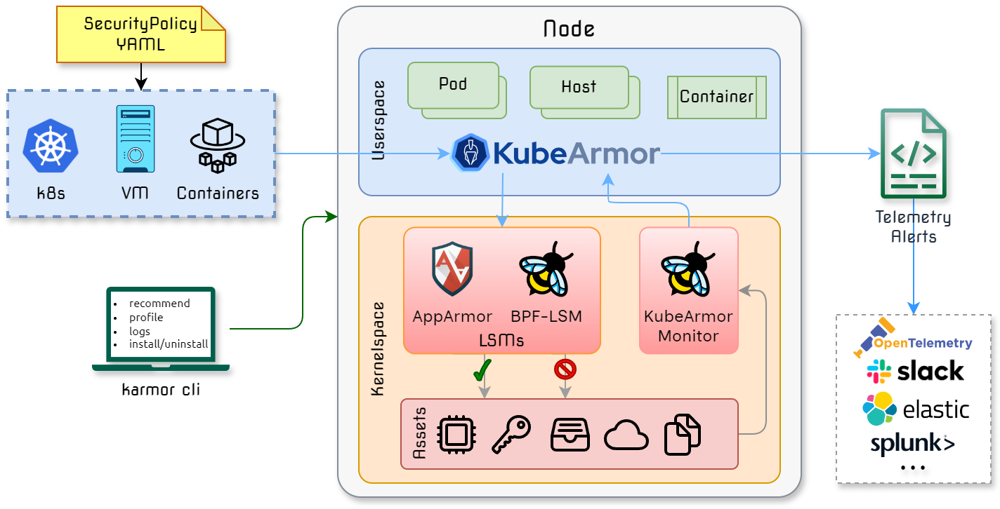

KubeArmor is a cloud-native runtime security enforcement system that restricts the behavior \(such as process execution, file access, and networking operations\) of pods, containers, and nodes (VMs) at the system level.

KubeArmor leverages [Linux security modules \(LSMs\)](https://en.wikipedia.org/wiki/Linux_Security_Modules) such as [AppArmor](https://en.wikipedia.org/wiki/AppArmor), [SELinux](https://en.wikipedia.org/wiki/Security-Enhanced_Linux), or [BPF-LSM](https://docs.kernel.org/bpf/prog_lsm.html) to enforce the user-specified policies. KubeArmor generates rich alerts/telemetry events with container/pod/namespace identities by leveraging eBPF.

|  |   |
|:---|:---|
| :muscle: **[Harden Infrastructure](getting-started/hardening_guide.md)** 
:small_blue_diamond: Protect critical paths such as cert bundles :chains:  :small_blue_diamond: MITRE, STIGs, CIS based rules :clamp:  :small_blue_diamond: Restrict access to raw DB table :left_luggage: | :ring: **[Least Permissive Access](getting-started/least_permissive_access.md)** 
:small_blue_diamond: Process Whitelisting :traffic_light: :small_blue_diamond: Network Whitelisting :traffic_light: :small_blue_diamond: Control access to sensitive assets :control_knobs:|
| :snowflake: **[Network Segmentation](getting-started/network_segmentation.md)** 
:small_blue_diamond: Communication Graph between services/pods :spider_web: :small_blue_diamond: Generate k8s network policies :magic_wand: :small_blue_diamond: Keep policies in sync with app updates :inbox_tray:| :telescope: **[Workload Visibility](getting-started/workload_visibility.md)** 
:small_blue_diamond: Process execs, File System accesses :dna: :small_blue_diamond: Service binds, Ingress, Egress connections :compass:  :small_blue_diamond: Sensitive system call profiling :microscope:|

## Architecture Overview

## Documentation :notebook:

* :point_right: [Getting Started](getting-started/deployment_guide.md)
* :dart: [Use Cases](getting-started/use-cases.md)
* :heavy_check_mark: [KubeArmor Support Matrix](getting-started/support_matrix.md)
* :medal_sports: [How is KubeArmor different?](getting-started/differentiation.md)
* :scroll: Security Policy for Pods/Containers [[Spec](getting-started/security_policy_specification.md)] [[Examples](getting-started/security_policy_examples.md)]
* :scroll: Security Policy for Hosts/Nodes [[Spec](getting-started/host_security_policy_specification.md)] [[Examples](getting-started/host_security_policy_examples.md)]

### Contributors :busts_in_silhouette:

* :octocat: [Contribution Guide](contribution/contribution_guide.md)
* :technologist: [Development Guide](contribution/development_guide.md), [Testing Guide](contribution/testing_guide.md)
* :raising_hand_woman: [Join KubeArmor Slack](https://join.slack.com/t/kubearmor/shared_invite/zt-1ltmqdbc6-rSHw~LM6MesZZasmP2hAcA)
* :question: [FAQs](FAQ.md)

### Biweekly Meetup

- :speaking_head: [Zoom Link](https://bit.ly/kubearmor-zoom)
- :page_facing_up: Minutes: [Document](https://docs.google.com/document/d/1IqIIG9Vz-PYpbUwrH0u99KYEM1mtnYe6BHrson4NqEs/edit)
- :calendar: Calendar invite: [Google Calendar](https://calendar.google.com/event?action=TEMPLATE&tmeid=MWN0MTlzYWFoM2tkcXZidTk1cHZjNjNyOGtfMjAyMjAyMTBUMTUwMDAwWiBjXzJmMXRiYnNqNWdrNmdnbGpzMzA4NnAwamw4QGc&tmsrc=c_2f1tbbsj5gk6ggljs3086p0jl8%40group.calendar.google.com&scp=ALL), [ICS file](getting-started/resources/KubeArmorMeetup.ics)

## Notice/Credits :handshake:

- KubeArmor uses [Tracee](https://github.com/aquasecurity/tracee/)'s system call utility functions.

## CNCF

KubeArmor is [Sandbox Project](https://www.cncf.io/projects/kubearmor/) of the Cloud Native Computing Foundation.

