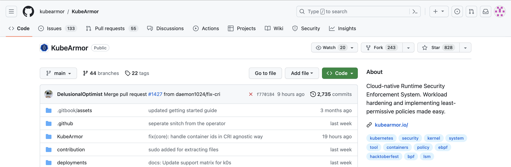
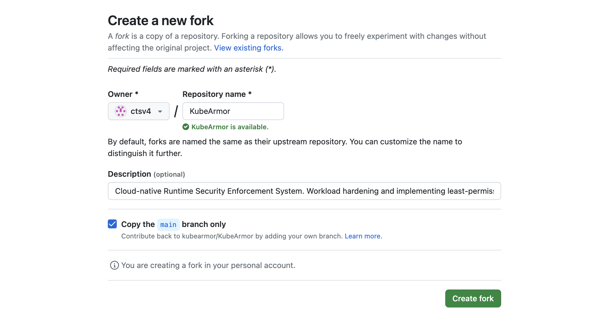
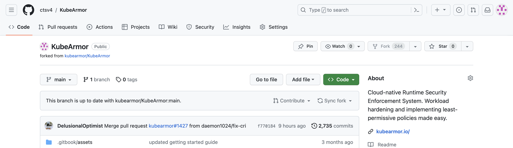
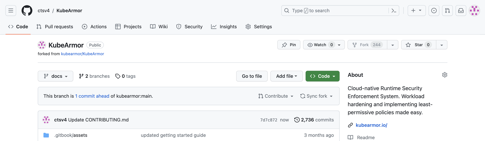
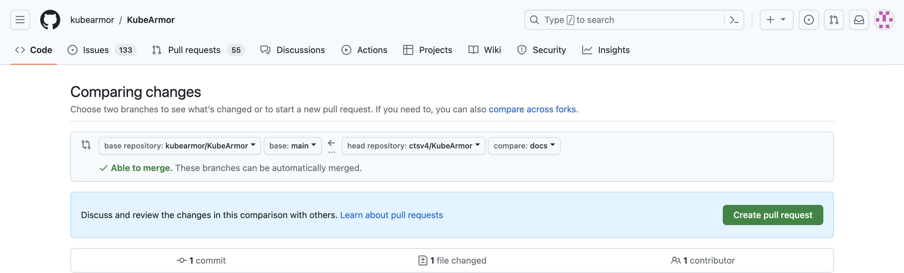
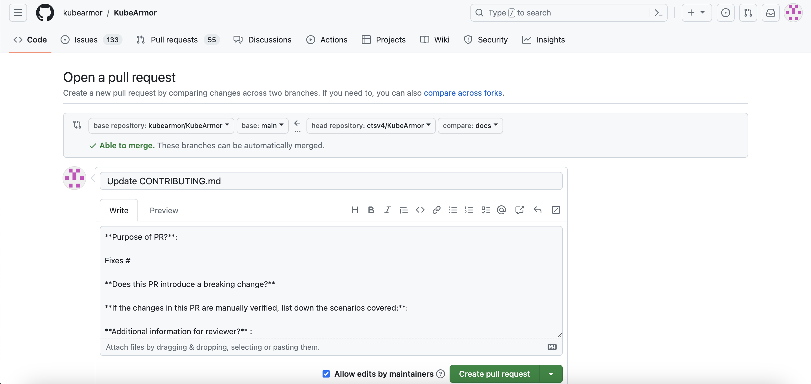

# Contribution Guide

If you want to make a contribution, please follow the steps below.

1. Fork this repository \(KubeArmor\)

   First, fork this repository by clicking on the Fork button \(top right\).

     

   Then, click your ID on the pop-up screen.

     

   This will create a copy of KubeArmor in your account.

     

2. Clone the repository

   Now clone Kubearmor locally into your dev environment.

   ```text
    $ git clone https://github.com/[your GitHub ID]/KubeArmor
   ```

   This will clone a copy of Kubearmor installed in your dev environment.

3. Make changes

   First, go into the repository directory and make some changes.

   Please refer to [development guide](development_guide.md) to set up your environment for KubeArmor contribution.  

4. Check the changes

   Please run "test_kubearmor.sh" before committing the changes

   ```text
   cd KubeArmor/KubeArmor/build
   ~/KubeArmor/KubeArmor/build$ ./test_kubearmor.sh
   ```

   If you see any warnings or errors, please fix them first.

5. Commit changes

   Please see your changes using "git status" and add them to the branch using "git add".

   ```text
    $ cd KubeArmor
    ~/KubeArmor$ git status
    ~/KubeArmor$ git add [changed file]
   ```

   Then, commit the changes using the "git commit" command.

   ```text
    ~/KubeArmor$ git commit -m "Add a new feature by [your name]"
   ```

   Please make sure that your changes are properly tested on your machine.  

6. Push changes to your forked repository

   Push your changes using the "git push" command.

   ```text
    ~/KubeArmor$ git push
   ```

7. Create a pull request with your changes with the following steps

   First, go to your repository on GitHub.

     

   Then, click "Pull request" button.

     

   After checking your changes, click 'Create pull request'.

     

   A pull request should contain the details of all commits as specific as possible. Also, please make sure that you have "Fixes: \#\(issue number\)".  

   Finally, click the "Create pull request" button.

   The changes would be merged post a review by the respective module owners. Once the changes are merged, you will get a notification, and the corresponding issue will be closed.
