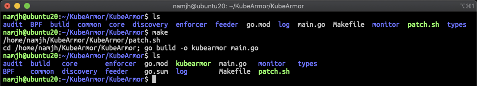
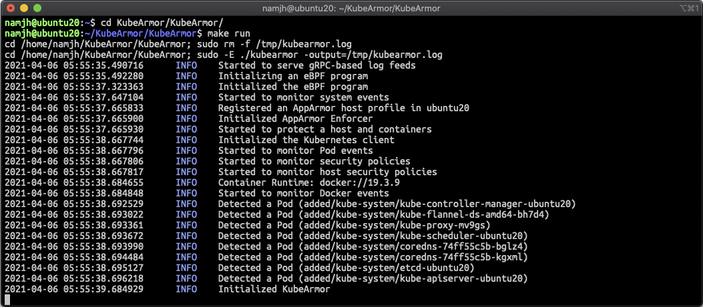

# Development Guide

## Development

1. Self-managed Kubernetes
   * Requirements

     List of minimum requirements for self-managed Kubernetes.
     ```text
     OS - Ubuntu 18.04
     Kubernetes - v1.19
     Docker - 18.03 or Containerd - 1.3.7
     Linux Kernel - v4.15
     LSM - AppArmor
     ```

     KubeArmor is designed for Kubernetes, which means that Kubernetes should be ready in your environment. If Kubernetes is not prepared yet, please refer to [Kubernetes installation guide](k8s_installation_guide_ubuntu.md). KubeArmor also requires Docker or Containerd since it internally uses its APIs. If you have other container platforms \(e.g., Podman\), please make an issue in this repository. While we are going to adopt other container platforms in KubeArmor, we may be able to adjust the priorities of our planned tasks on demand. KubeArmor requires LSMs to operate properly; thus, please make sure that your environment supports LSMs \(at least, AppArmor\).

  
     Note that KubeArmor does not work on MiniKube because MiniKube does not support AppArmor. In addition, KubeArmor does not work with Docker Desktops on Windows and macOS because KubeArmor integrates with Linux-kernel native primitives such as LSMs.  


    * \(Optional\) MicroK8s Setup

      Instead of self-managed Kubernetes, you can set up MicroK8s. For this, please run the following command.

       ```text
       $ cd contribution/microk8s
       (microk8s) $ ./install_microk8s.sh
       ```

   * Development Setup

     In order to install all dependencies, please run the following command.

     ```text
     $ cd contribution/self-managed-k8s
     (self-managed-k8s) $ ./setup.sh
     ```

     [setup.sh](https://github.com/accuknox/KubeArmor/blob/master/contribution/self-managed-k8s/setup.sh) will automatically install BCC \(latest\), Go \(v1.15.2\), and Protobuf \(3.14.0\).

     Now, you are ready to develop any code for KubeArmor. Enjoy your journey with KubeArmor.  
2. Vagrant Environment
   * Requirements

     Here is the list of requirements for a Vagrant environment

     ```text
     Vagrant - v2.2.9
     VirtualBox - v6.0
     ```

     If you do not have Vagrant and VirtualBox in your environment, you can easily install them by running the following command.

     ```text
     cd contribution/vagrant
     (host) $ ./setup.sh
     ```

     If you do not have ssh keys in '~/.ssh' yet, you need to run the following command in advance.

     ```text
     (host) $ ssh-keygen -> [Enter] -> [Enter] -> [Enter]
     ```

    * VM Setup using Vagrant

      Now, it is time to create a VM for development. You can directly use the vagrant command to create a VM.

      ```text
      (vagrant) $ vagrant up
      ```

	  To stop the vagrant VM
	  ```text
      (vagrant) $ vagrant halt
	  ```

      If you want to remove the created VM, please run the following command.

      ```text
      (vagrant) $ vagrant destroy
      ```

      You are ready to develop the code for KubeArmor. Enjoy your journey with KubeArmor.

      ```text
      (vagrant) $ vagrant ssh
      ```

	* VM Setup using latest Linux kernel (netnext)

	To use the latest linux kernel for dev env you can pass an environment variable `NETNEXT=1` to vagrant.
      ```text
      (host) KubeArmor/contribution/vagrant$ NETNEXT=1 vagrant up
      (host) KubeArmor/contribution/vagrant$ NETNEXT=1 vagrant ssh
      (host) KubeArmor/contribution/vagrant$ NETNEXT=1 vagrant halt
      (host) KubeArmor/contribution/vagrant$ NETNEXT=1 vagrant destroy
	  ```

3.  Environment Check
    * Compilation

        Check if KubeArmor can be compiled on your environment without any problems.

        ```text
        $ cd KubeArmor/KubeArmor
        (KubeArmor) $ make
        ```

          

        If you see any error messages, please let us know the issue with the full error messages through KubeArmor's slack.

    * Execution

        In order to directly run KubeArmor in a host (not as a container), you need to run a local proxy in advance.

        ```text
        $ kubectl proxy &
        ```

        Then, run KubeArmor on your environment.

        ```text
        $ cd KubeArmor/KubeArmor
        (KubeArmor) $ make run
        ```

          

        When you run KubeArmor like the above screen, there are the lines you should see.

        - "Started to serve gRPC-based log feeds"
        - "Started to monitor system events"
        - "Started to protect a host and containers" (if -enableHostPolicy is set)
        - "Started to monitor Pod events"
        - "Started to monitor security policies"
        - "Started to monitor host security policies" (if -enableHostPolicy is set)
        - "Started to monitor {Docker|Containrd} events"
        - "Detected a Pod (added/...)"

        If you see those messages, you are ready to implement something in KubeArmor. You can refer to [Testing Guide](testing_guide.md) to check if your update works with the existing code of KubeArmor properly.

## Code Directories

Here, we briefly give you an overview of KubeArmor's directories.

* Source code for KubeArmor \(/KubeArmor\)

  ```text
  KubeArmor/
    audit                - Audit logger (deprecated)
    BPF                  - eBPF code for system monitor
    common               - Libraries internally used
    core                 - The main body (start point) of KubeArmor
    discovery            - Automated security policy discovery (under development)
    enforcer             - Runtime policy enforcer (enforcing security policies into LSMs)
    feeder               - gRPC-based feeder (sending audit/system logs to a log server)
    log                  - Message logger (stdout) for KubeArmor
    monitor              - eBPF-based system monitor (mapping process IDs to container IDs)
    types                - Type definitions
  KubeArmor-relay-server - Relay server for KubeArmor's distributed log collection
  protobuf/              - Protocol buffer
  ```

* Source code for KubeArmor's log client

  ```text
  LogClient/    - gRPC-based stdout/file client
  MySQLClient/  - gRPC-based MySQL client
  KafkaClient/  - gRPC-based Kafka client
  protobuf/     - Protocol buffer
  ```

* Source code for KubeArmor's custom resource definition \(CRD\)

  ```text
  pkg/KubeArmorPolicy/      - KubeArmorPolicy CRD generated by Kube-Builder
  pkg/KubeArmorHostPolicy/  - KubeArmorHostPolicy CRD generated by Kube-Builder
  ```

* Scripts for GKE

  ```text
  GKE/          - scripts to set up the enforcer in a container-optimized OS (COS)
  ```

* Files for testing

  ```text
  examples/     - Example microservices for testing
  tests/        - Automated test framework for KubeArmor
  ```

