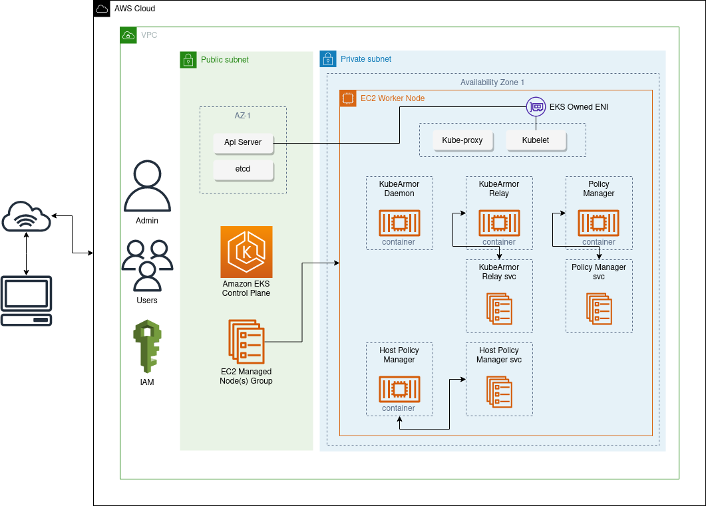

# Deploy KubeArmor on EKS

Kubearmor can be deployed on the Amazon EKS cluster, it can be deployed using Helm chart or Kubearmor CLI-tool [karmor](https://github.com/kubearmor/kubearmor-client). This guide aims to provide detailed information for deploying Kubearmor on Amazon EKS Cluster.

This deployment guide requires a basic level understanding of [AWS Services](https://aws.amazon.com/) and assumes that the user is familiar with [Amazon EKS](https://aws.amazon.com/eks/) and [Kubenetes](https://kubernetes.io/). In this guide, we’ll create a new EKS cluster if you want to deploy the Kubearmor to an existing EKS cluster make sure that the AWS user must have sufficient [IAM Permissions](https://docs.aws.amazon.com/IAM/latest/UserGuide/introduction_access-management.html) and roles to deploy Kubernetes resources. For more information, follow [Add IAM user or roles to Amazon EKS Cluster](https://docs.aws.amazon.com/eks/latest/userguide/add-user-role.html) and [Required Permissions](https://docs.aws.amazon.com/eks/latest/userguide/view-kubernetes-resources.html#view-kubernetes-resources-permissions). Kubernetes resources deployed with Kubearmor are Daemonset, Deployment, Serviceaccount with ClusterRoleBinding, and Services.

## 1. Prerequisites and Requirements for the deployment

### Host Requirements

Kubearmor supports a wide range of Kubernetes engines and Operating systems. Some environments support only partial features of the Kubearmor for example Amazon Linux 2 (kernel version 5.4) does not support security policy enforcement in the k8s mode. [The k8s support matrix](https://github.com/kubearmor/KubeArmor/blob/main/getting-started/support_matrix.md#k8s-support-matrix) provides an overview of the supported Kubernetes engines, operating systems, and supported Kubearmor features.

### Precheck Using Kubearmor CLI-tool

`Karmor` can be used to check the supported Kubearmor features in the current environment. Make sure that kubeconfig should be configured with the AWS ECS cluster configs.

Install karmor cli-tool

```
$ curl -sfL http://get.kubearmor.io/ | sudo sh -s -- -b /usr/local/bin
```

Run the following command

```
$ karmor probe

# Example Output

Didn't find KubeArmor in systemd or Kubernetes, probing for support for KubeArmor

Host:
	 Observability/Audit: Supported (Kernel Version 5.15.0)
	 Enforcement: Full (Supported LSMs: lockdown,capability,landlock,yama,apparmor)
To get full probe, a daemonset will be deployed in your cluster - This daemonset will be deleted after probing
Use --full tag to get full probing
```

As in the example output, it will show the information of the supported Kubearmor features i.e. Observability, Enforcement, etc by the current environment.

### Technical Requirements

EKS cluster can be set up in many ways such as using AWS management console, using eksctl a tool provided by AWS and IaC tools i.e. Terraform, Ansible can also be used to create an EKS cluster. In this guide we are going to use the eksctl tool to setup the cluster, for more information read [Getting started with Amazon EKS](https://docs.aws.amazon.com/eks/latest/userguide/getting-started.html).

- Set up AWS credentials on your system

  Follow the [Getting started with Amazon EKS](https://docs.aws.amazon.com/eks/latest/userguide/getting-started.html "Getting started with Amazon EKS") guide

- Install eksctl

  Install eksctl on your local system

  ```
  curl --silent --location "https://github.com/weaveworks/eksctl/releases/latest/download/eksctl_$(uname -s)_amd64.tar.gz" | tar xz -C /tmp
  sudo mv /tmp/eksctl /usr/local/bin
  eksctl version
  ```

### Supported Regions

There are no region-based restrictions applicable to the KubeArmor. It supports all the regions where Amazon EKS is available.

## 2. Creating an EKS cluster

eksctl creates several required resources automatically i.e. dedicated VPC, managed node group, required IAM roles and security groups, and EKS cluster which has to be created manually if the cluster is created using AWS management console. eksctl also adds the cluster configurations to the kubeconfig file in ~/.kube that enables the kubectl to talk with the EKS cluster.

- Create ClusterConfig (eks-config.yaml)

  <details>
  <summary>(Option 1) Create an EKS cluster configuration using Ubuntu 20.04 </summary>
  KubeArmor needs kernel headers installed on each node, so we create an EKS cluster with the following configuration:

  ```yaml
  apiVersion: eksctl.io/v1alpha5
  kind: ClusterConfig

  metadata:
    name: kubearmor-ub20
    region: us-east-2

  nodeGroups:
    - name: ng-1
      amiFamily: "Ubuntu2004"
      desiredCapacity: 1
      ssh:
        allow: true
      preBootstrapCommands:
        - "sudo apt install linux-headers-$(uname -r)"
  ```

  Save the above EKS `ClusterConfig` yaml as `eks-config.yaml`.
  </details>

  <details>
  <summary>(Option 2) Create an EKS cluster configuration using Amazon Linux 2 </summary>
  KubeArmor needs kernel headers installed on each node, so we create an EKS cluster with the following configuration:

  ```yaml
  apiVersion: eksctl.io/v1alpha5
  kind: ClusterConfig

  metadata:
    name: kubearmor-cluster
    region: us-east-2

  nodeGroups:
    - name: ng-1
      desiredCapacity: 2
      ssh:
        allow: true

      preBootstrapCommands:
        - "sudo yum install -y kernel-devel-$(uname --kernel-release)"
  ```

  Save the above EKS `ClusterConfig` yaml as `eks-config.yaml`.

  ### Limitation

  KubeArmor on RedHat based Linux distributions currently supports the audit mode only, which means that you are not able to enforce security policies while the events related to the policies can be audited.
  </details>

  <details>
  <summary>(Option 3) Create an EKS cluster configuration using Bottlerocket </summary>

  Follow the
  [Using a Bottlerocket AMI with Amazon EKS](https://github.com/bottlerocket-os/bottlerocket/blob/develop/QUICKSTART-EKS.md) guide.
  </details>

- Create the EKS cluster:

  Create the cluster using eksctl

  ```
  eksctl create cluster -f ./eks-config.yaml
  ```

  <details>
    <summary>Output for eksctl create cluster</summary>

  ```
  aws@pandora:~$ eksctl create cluster -f ./eks-ub20.yaml
  2021-11-09 07:30:48 [ℹ]  eksctl version 0.70.0
  2021-11-09 07:30:48 [ℹ]  using region us-east-2
  2021-11-09 07:30:49 [ℹ]  setting availability zones to [us-east-2b us-east-2a us-east-2c]
  2021-11-09 07:30:49 [ℹ]  subnets for us-east-2b - public:192.168.0.0/19 private:192.168.96.0/19
  2021-11-09 07:30:49 [ℹ]  subnets for us-east-2a - public:192.168.32.0/19 private:192.168.128.0/19
  2021-11-09 07:30:49 [ℹ]  subnets for us-east-2c - public:192.168.64.0/19 private:192.168.160.0/19
  2021-11-09 07:30:49 [!]  Custom AMI detected for nodegroup ng-1. Please refer to https://github.com/weaveworks/eksctl/issues/3563 for upcoming breaking changes
  2021-11-09 07:30:49 [ℹ]  nodegroup "ng-1" will use "ami-027c737021be27497" [Ubuntu2004/1.20]
  2021-11-09 07:30:50 [ℹ]  using SSH public key "/home/aws/.ssh/id_rsa.pub" as "eksctl-demo2-kubearmor-ub20-nodegroup-ng-1-03:fb:f9:0e:5a:56:13:1e:a4:d6:ab:7e:f3:b2:83:81"
  2021-11-09 07:30:51 [ℹ]  using Kubernetes version 1.20
  2021-11-09 07:30:51 [ℹ]  creating EKS cluster "demo2-kubearmor-ub20" in "us-east-2" region with un-managed nodes
  2021-11-09 07:30:51 [ℹ]  1 nodegroup (ng-1) was included (based on the include/exclude rules)
  2021-11-09 07:30:51 [ℹ]  will create a CloudFormation stack for cluster itself and 1 nodegroup stack(s)
  2021-11-09 07:30:51 [ℹ]  will create a CloudFormation stack for cluster itself and 0 managed nodegroup stack(s)
  2021-11-09 07:30:51 [ℹ]  if you encounter any issues, check CloudFormation console or try 'eksctl utils describe-stacks --region=us-east-2 --cluster=demo2-kubearmor-ub20'
  2021-11-09 07:30:51 [ℹ]  CloudWatch logging will not be enabled for cluster "demo2-kubearmor-ub20" in "us-east-2"
  2021-11-09 07:30:51 [ℹ]  you can enable it with 'eksctl utils update-cluster-logging --enable-types={SPECIFY-YOUR-LOG-TYPES-HERE (e.g. all)} --region=us-east-2 --cluster=demo2-kubearmor-ub20'
  2021-11-09 07:30:51 [ℹ]  Kubernetes API endpoint access will use default of {publicAccess=true, privateAccess=false} for cluster "demo2-kubearmor-ub20" in "us-east-2"
  2021-11-09 07:30:51 [ℹ]
  2 sequential tasks: { create cluster control plane "demo2-kubearmor-ub20",
      2 sequential sub-tasks: {
          wait for control plane to become ready,
          create nodegroup "ng-1",
      }
  }
  2021-11-09 07:30:51 [ℹ]  building cluster stack "eksctl-demo2-kubearmor-ub20-cluster"
  2021-11-09 07:30:52 [ℹ]  deploying stack "eksctl-demo2-kubearmor-ub20-cluster"
  2021-11-09 07:31:22 [ℹ]  waiting for CloudFormation stack "eksctl-demo2-kubearmor-ub20-cluster"
  2021-11-09 07:31:54 [ℹ]  waiting for CloudFormation stack "eksctl-demo2-kubearmor-ub20-cluster"
  2021-11-09 07:32:55 [ℹ]  waiting for CloudFormation stack "eksctl-demo2-kubearmor-ub20-cluster"
  2021-11-09 07:33:56 [ℹ]  waiting for CloudFormation stack "eksctl-demo2-kubearmor-ub20-cluster"
  2021-11-09 07:34:57 [ℹ]  waiting for CloudFormation stack "eksctl-demo2-kubearmor-ub20-cluster"
  2021-11-09 07:35:58 [ℹ]  waiting for CloudFormation stack "eksctl-demo2-kubearmor-ub20-cluster"
  2021-11-09 07:36:59 [ℹ]  waiting for CloudFormation stack "eksctl-demo2-kubearmor-ub20-cluster"
  2021-11-09 07:38:00 [ℹ]  waiting for CloudFormation stack "eksctl-demo2-kubearmor-ub20-cluster"
  2021-11-09 07:39:01 [ℹ]  waiting for CloudFormation stack "eksctl-demo2-kubearmor-ub20-cluster"
  2021-11-09 07:40:02 [ℹ]  waiting for CloudFormation stack "eksctl-demo2-kubearmor-ub20-cluster"
  2021-11-09 07:41:03 [ℹ]  waiting for CloudFormation stack "eksctl-demo2-kubearmor-ub20-cluster"
  2021-11-09 07:42:04 [ℹ]  waiting for CloudFormation stack "eksctl-demo2-kubearmor-ub20-cluster"
  2021-11-09 07:44:11 [ℹ]  building nodegroup stack "eksctl-demo2-kubearmor-ub20-nodegroup-ng-1"
  2021-11-09 07:44:11 [!]  Custom AMI detected for nodegroup ng-1, using legacy nodebootstrap mechanism. Please refer to https://github.com/weaveworks/eksctl/issues/3563 for upcoming breaking changes
  2021-11-09 07:44:11 [ℹ]  --nodes-min=1 was set automatically for nodegroup ng-1
  2021-11-09 07:44:11 [ℹ]  --nodes-max=1 was set automatically for nodegroup ng-1
  2021-11-09 07:44:12 [ℹ]  deploying stack "eksctl-demo2-kubearmor-ub20-nodegroup-ng-1"
  2021-11-09 07:44:12 [ℹ]  waiting for CloudFormation stack "eksctl-demo2-kubearmor-ub20-nodegroup-ng-1"
  2021-11-09 07:44:29 [ℹ]  waiting for CloudFormation stack "eksctl-demo2-kubearmor-ub20-nodegroup-ng-1"
  2021-11-09 07:44:47 [ℹ]  waiting for CloudFormation stack "eksctl-demo2-kubearmor-ub20-nodegroup-ng-1"
  2021-11-09 07:45:07 [ℹ]  waiting for CloudFormation stack "eksctl-demo2-kubearmor-ub20-nodegroup-ng-1"
  2021-11-09 07:45:25 [ℹ]  waiting for CloudFormation stack "eksctl-demo2-kubearmor-ub20-nodegroup-ng-1"
  2021-11-09 07:45:46 [ℹ]  waiting for CloudFormation stack "eksctl-demo2-kubearmor-ub20-nodegroup-ng-1"
  2021-11-09 07:46:06 [ℹ]  waiting for CloudFormation stack "eksctl-demo2-kubearmor-ub20-nodegroup-ng-1"
  2021-11-09 07:46:26 [ℹ]  waiting for CloudFormation stack "eksctl-demo2-kubearmor-ub20-nodegroup-ng-1"
  2021-11-09 07:46:44 [ℹ]  waiting for CloudFormation stack "eksctl-demo2-kubearmor-ub20-nodegroup-ng-1"
  2021-11-09 07:47:03 [ℹ]  waiting for CloudFormation stack "eksctl-demo2-kubearmor-ub20-nodegroup-ng-1"
  2021-11-09 07:47:20 [ℹ]  waiting for CloudFormation stack "eksctl-demo2-kubearmor-ub20-nodegroup-ng-1"
  2021-11-09 07:47:37 [ℹ]  waiting for CloudFormation stack "eksctl-demo2-kubearmor-ub20-nodegroup-ng-1"
  2021-11-09 07:47:57 [ℹ]  waiting for CloudFormation stack "eksctl-demo2-kubearmor-ub20-nodegroup-ng-1"
  2021-11-09 07:47:58 [ℹ]  waiting for the control plane availability...
  2021-11-09 07:47:58 [✔]  saved kubeconfig as "/home/aws/.kube/config"
  2021-11-09 07:47:58 [ℹ]  no tasks
  2021-11-09 07:47:58 [✔]  all EKS cluster resources for "demo2-kubearmor-ub20" have been created
  2021-11-09 07:47:59 [ℹ]  adding identity "arn:aws:iam::199488642388:role/eksctl-demo2-kubearmor-ub20-nodeg-NodeInstanceRole-1AQF5DSREK44B" to auth ConfigMap
  2021-11-09 07:48:00 [ℹ]  nodegroup "ng-1" has 0 node(s)
  2021-11-09 07:48:00 [ℹ]  waiting for at least 1 node(s) to become ready in "ng-1"
  2021-11-09 07:49:32 [ℹ]  nodegroup "ng-1" has 1 node(s)
  2021-11-09 07:49:32 [ℹ]  node "ip-192-168-82-227.us-east-2.compute.internal" is ready
  2021-11-09 07:49:34 [ℹ]  kubectl command should work with "/home/aws/.kube/config", try 'kubectl get nodes'
  2021-11-09 07:49:34 [✔]  EKS cluster "demo2-kubearmor-ub20" in "us-east-2" region is ready
  ```

  </details>

## 3. Deploying KubeArmor

Karmor tool can be used to quick install and interact with the Kubearmor on EKS cluster. Karmor can auto-detect the running environment and installs the Kubearmor with applicable configurations. It deploys k8s resources i.e. Daemonset, Deployments, Services, Serviceaccount with ClusterRole, and CRDs in the cluster node. We've observed the estimated time it takes to complete the installation is approximately 2 minutes. Karmor shows the information about installation time in the output.

### Architecture Overview


The main components of the Kubearmor deployed in the Kubernetes node are as follows:

### Kubearmor Daemon

The Kubearmor runs as a Daemonset that deploys a pod on each Kubernetes node. It configures the core components of the Kubearmor on the node consisting of the ebpf-based system monitor, Linux security module (lsm) based enforcer and Logger service to serve the logs and alerts. It exposes port 32767 to serve the logs, alerts and messages using the grpc service. Some of the volume mounts declared with pods are /opt/kubearmor/BPF for the bpf binaries, /sys/fs/bpf to manage bpf persistent objects, /etc/apparmor.d for apparmor profiles if the Kubearmor is configured with apparmor as lsm enforcement, and also mounts the CRI socket based on the container runtime Kubernetes is configured with.

### Kubearmor Relay

KubeArmor's relay server collects all messages, alerts, and system logs generated by KubeArmor in each node, and then it allows other logging systems to simply collect those through the service ('kubearmor.kube-system.svc') of the relay server.

### Custom Controllers

To manage the state of the CRDs `kubeArmorPolicy` and `KubeArmorHostPolicy` associated custom controllers `kubearmor-policy-manager` and `kubearmor-host-policy-manager` are deployed.

### KubeArmor Annotations

The annotations are added to the pods by the KubeArmor to manage and configure the applicable security profile. There are two types of annotations that we add.

1. KubeArmor specific annotations:

`kubearmor-visibility`: defines the visibility level ("process,file,network,capabilities")

`kubearmor-policy`: can be either "audited or enabled" and sets whether policy enforcement will take place

2. Apparmor specific annotation:

This annotation is used to maintain a mapping between pod/container and the apparmor profile. It follows the pattern container.apparmor.security.beta.kubernetes.io/<container_name>: <profile_ref>

### Resource Usage

KubeArmor custom controllers, `kubearmor-policy-manager` and `kubearmor-host-policy-managers` are deployed with resource request and limit defined as following:

|             | **CPU** | **Memory** |
| ----------- | ------- | ---------- |
| **Request** | 100m    | 20Mi       |
| **Limits**  | 100m    | 40Mi       |

**KubeArmor Daemon Resource Usage**

KubeArmor is deployed without any resource limit constraints to improve the reliability. The resource usage of the KubeArmor is relative to the workload running on the node that we'll discuss next using example testcases.

> To manage resources and prevent accedental burst in the resource usage it is recommended to setup service limits using [AWS Service Quotas](https://aws.amazon.com/premiumsupport/knowledge-center/manage-service-limits/)

**Testcase A**:
We deployed a sample WordPress application along with the MySQL instance for the database using the [yaml manifest](https://raw.githubusercontent.com/kubearmor/KubeArmor/main/examples/wordpress-mysql/wordpress-mysql-deployment.yaml). The resource usage observed for the pods running WordPress and MySQL container is as the following:

| **Pod Name**              | **CPU** | **Memory** |
| ------------------------- | ------- | ---------- |
| mysql-64d6f94d6c-92k77    | 1m      | 459Mi      |
| wordpress-bc7dd8d9c-jmxqx | 1m      | 24Mi       |

We deployed the KubeArmor on the same node and armed up both pods to be monitored and protected. We observed the resource usage by the Kubearmor daemon and Kubearmor-relay pods and observed the max usage as follows:

| **Pod Name**                     | **CPU** | **Memory** |
| -------------------------------- | ------- | ---------- |
| kubearmor-6bqh4                  | 17m     | 78Mi       |
| kubearmor-relay-645667c695-xv6nl | 18m     | 15Mi       |

**TestCase B**:
In this scenario, we deployed 5 pods each running a customized container image [ubuntu-w-utils](https://hub.docker.com/r/kubearmor/ubuntu-w-utils) with ubuntu as base os. The resource usage observed for each of the pods is as follows:

| **Pod Name**                         | **CPU** | **Memory** |
| ------------------------------------ | ------- | ---------- |
| ubuntu-1-deployment-77dd6c77c4-4nwr6 | 1m      | 40Mi       |
| ubuntu-2-deployment-6c7558cf49-kc9pw | 1m      | 40Mi       |
| ubuntu-3-deployment-75fdb9d4b8-xlhrx | 1m      | 42Mi       |
| ubuntu-4-deployment-77fd9b8db-fl6cg  | 1m      | 40Mi       |
| ubuntu-5-deployment-5fdf8444c5-vn9dr | 1m      | 40Mi       |

The resource usage observed for the KubeArmor daemon and KubeArmor-relay pods are as:
| **Pod Name** | **CPU** | **Memory** |
|---------------------------|---------|------------|
| kubearmor-6bqh4 | 18m | 83Mi |
| kubearmor-relay-645667c695-xv6nl | 18m | 15Mi |

**Note**: The two testcase scenarios above do not represent the max resource usage by the KubeArmor instead it represents the relationship between the resource usage by the KubeArmor and the characteristic of container workloads armed up on the Kubernetes node.
The resource usage observed in both the testcases appears to be the same. In the former testcase, there are only two pods armed up but they are resource heavy than the workloads in the letter testcase. The ubuntu pods are not running any continuous-running application.
The KubeArmor resource usage is relative to the workload running on the node.

### Security

> No root-privileges are required to deploy the Kubearmor to the EKS cluster. Any user with required permissions granted to the assumed IAM role can deploy the Kubearmor to an EKS cluster. Check [Enabling IAM user and role access to your cluster](https://docs.aws.amazon.com/eks/latest/userguide/add-user-role.html) for more information on how to add additional users to interact with the existing cluster.

> Kubearmor follows the policy of least privilege for all access grants. Kubearmor daemon deploys with only the required capabilities assigned to the container.

```yaml
securityContext:
  privileged: false
  capabilities:
    drop:
      - ALL
    add:
      - SETUID
      - SETGID
      - SETPCAP
      - SYS_ADMIN
      - SYS_PTRACE
      - MAC_ADMIN
      - SYS_RESOURCE
      - IPC_LOCK
      - CAP_DAC_OVERRIDE
      - CAP_DAC_READ_SEARCH
```

### Installation Steps

### 1. Download and install karmor cli-tool

```
$ curl -sfL http://get.kubearmor.io/ | sudo sh -s -- -b /usr/local/bin
```

### 2. Install KubeArmor

```
$ karmor install

Auto Detected Environment: docker
CRD kubearmorpolicies.security.kubearmor.com ...
CRD kubearmorhostpolicies.security.kubearmor.com ...
Service Account ...
Cluster Role Bindings ...
KubeArmor Relay Service ...
KubeArmor Relay Deployment ...
KubeArmor DaemonSet ...
KubeArmor Policy Manager Service ...
KubeArmor Policy Manager Deployment ...
KubeArmor Host Policy Manager Service ...
KubeArmor Host Policy Manager Deployment ...
```

## 4. Inspecting Installation

After installation completes to check if Kubearmor along with all the components and features running properly karmor has a built-in command that can be used.

```
$ karmor probe
```

Running `karmor probe` command will get all the required information from the node Kubearmor currently running on. It displays the information of all the Kubearmor resources and their running status and apart from that it also displays the pods armed up by the Kubearmor along with respective applied security policies and default posture configuration for the containers which can either `Allow`, `Block` or ‘Audit’. Following is the example output of running the command `karmor probe` with the Kubearmor already running on the node.

```
$ karmor probe

# Example Output

Found KubeArmor running in Kubernetes

Daemonset :
 	kubearmor 	Desired: 1	Ready: 1	Available: 1
Deployments :
 	kubearmor-relay              	Desired: 1	Ready: 1	Available: 1
 	kubearmor-host-policy-manager	Desired: 1	Ready: 1	Available: 1
 	kubearmor-policy-manager     	Desired: 1	Ready: 1	Available: 1
 	kubearmor-annotation-manager 	Desired: 1	Ready: 1	Available: 1
Containers :
 	kubearmor-relay-64c6fff875-ztxmx              	Running: 1	Image Version: kubearmor/kubearmor-relay-server:latest
 	kubearmor-host-policy-manager-7989bc8f6c-jpjz6	Running: 2	Image Version: gcr.io/kubebuilder/kube-rbac-proxy:v0.5.0
 	kubearmor-policy-manager-8876798d6-l2ccn      	Running: 2	Image Version: gcr.io/kubebuilder/kube-rbac-proxy:v0.5.0
 	kubearmor-annotation-manager-85857fc8d7-dzwgm 	Running: 2	Image Version: gcr.io/kubebuilder/kube-rbac-proxy:v0.8.0
 	kubearmor-8mckg                               	Running: 1	Image Version: kubearmor/kubearmor:stable
Node 1 :
 	OS Image:                 	Ubuntu 20.04.5 LTS
 	Kernel Version:           	5.15.0-48-generic
 	Kubelet Version:          	v1.24.4+k3s1
 	Container Runtime:        	containerd://1.6.6-k3s1
 	Active LSM:               	AppArmor
 	Host Security:            	true
 	Container Security:       	true
 	Container Default Posture:	block(File)            	block(Capabilities)	block(Network)
 	Host Default Posture:     	block(File)            	block(Capabilities)	block(Network)
Armored Up pods :
+-----------------+-------------------------------------+----------------------------+
|    NAMESPACE    |                NAME                 |           POLICY           |
+-----------------+-------------------------------------+----------------------------+
| wordpress-mysql | mysql-7f4bb47ff9-bjkwc              |                            |
+                 +-------------------------------------+----------------------------+
|                 | wordpress-6f599c9b49-p8d2j          | ksp-wordpress-block-config |
+-----------------+-------------------------------------+----------------------------+
| syscalls        | ubuntu-1-deployment-597876fdb-5zm9f |                            |
+-----------------+-------------------------------------+----------------------------+

```

## 5. Upgrade Kubearmor

At the time of writing this guide the latest release of the Kubearmor is v0.6.0. We recommend users install the latest version as it equipped the user with the latest features and performance optimization. The process to upgrade the Kubearmor to the latest version is very simple and can be completed in a few command executions.

### Security policy backup

Kubearmor creates a backup for all the applied policies in the `/opt/kubearmor/policies` directory, therefore there’s no need to backup any of the policies by the user manually. Whenever a policy has been created or modified the same is updated in the backup by the Kubearmor automatically. Whenever Kubearmor restarts/reinstalled it fetches all the policies from the backup and enforces them to the respective pod/container.

### Upgrade the karmor version

If the current version of the karmor running on your system is not the latest then it is recommended to install the latest version by running the following command:

```
$ sudo karmor selfupdate
```

### Uninstall Kubearmor

Uninstall the old version of The Kubearmor, It can be uninstalled by running the command:

```
$ karmor uninstall
```

### Install Latest Version

```
$ karmor install –image=latest
```

Successful completion of the above command installs the latest version of the Kubearmor.

## 6. Certificates Rotation

As per security best practices in the Kubernetes, it is recommended to rotate the certificate as it reaches the expiration. To know more about certificate rotation in Kubernetes read more [Certificate Rotation](https://kubernetes.io/docs/reference/access-authn-authz/kubelet-tls-bootstrapping/#certificate-rotation). Karmor cli-tool provides a command `rotate-tls` that can be used to rotate the controller tls certificates in zero downtime.

Run the command

```
$ karmor rotate-tls
Checking if all needed component are present ...
All needed component are present ...
Generating temporary certificates ...
Using suffix t8q9w for all new temporary resources ...
Installing temporary resources ...
KubeArmor Annotation Controller temporary TLS certificates ...
KubeArmor Annotation Controller temporary Deployment ...
Waiting for the deployment to start, sleeping 15 seconds ...
KubeArmor Annotation Controller temporary Service ...
KubeArmor Annotation Controller temporary Mutation Admission Registration ...
Temporarily removing the main mutation registation ...
Generating new certificates ...
Updating the main TLS secret ...
Refreshing controller deployment ...
Restoring main mutation registation ...
Deleting temprary ressources ...
Mutation Admission Registration ...
KubeArmor Annotation Controller Service ...
KubeArmor Annotation Controller Deployment ...
KubeArmor Annotation Controller TLS certificates ...
Certificates were rotated ...
```

## 7. Troubleshoot and Recovery

### CrashLoopBackOff

CrashLoopBackOff is a common error that may appear while running an application on Kubernetes.
If you encounter this error while deploying KubeArmor then to resolve it we suggest reinstalling the KubeArmor
after uninstalling it.

### Inspect Policy Violation

KubeArmor provides an easy-to-use security policy schema to implement the policy but determining security posture for the container workload requires thorough visibility of the container and it's a tedious task to do manually.

When a container workload is armed up and security policy is applied, its runtime behaviour will be changed. The runtime behaviour of a container depends on the applied security policy and default posture. KubeArmor generated alerts and logs can be used to understand the (anonymous) runtime behaviour of a container.

**Using karmor tool to get alerts/logs**

```
$ karmor log
```

will generate alerts for each event that violates either KubeArmor security policy or default posture.

**Log Filters:**
there are various filter options available to the `karmor log` command that can be applied to get the desired logs/alerts.

```
$ karmor log --logFilter <option>
```

`logFilter`: can be used to specify the type of logs to get i.e. logs/alerts/both

- `system`: to get system logs
- `policy`: to get the alerts
- `all`: to get both alerts and logs

`podname`: to get the logs/alerts from a specific pod

`containername`: to get the logs/alerts from a particular container

`namespace`: to get the logs/alerts from a particular namespace

`operation`: to get the logs/alerts specific to an operation i.e. process, file or network

Apart from some options mentioned above various other filters are also available. To find more information on the available filter options run the command:

```
karmor log --help
```

**Recover KubeArmor**

To recover the KubeArmor from any fault condition, reinstall/upgrade the KubeArmor after uninstalling the existing installed KubeArmor. It is safe to uninstall the KubeArmor direcctly, There's no need to complete any preliminary process to keep all the supporting files i.e. Security Policies and applied configurations. KubeArmor handles it all by itself.

## 8. Support

For any problem faced during installation or using the KubeArmor reach out to us by joining our active KubeArmor community on [KubeArmor Slack Channel](https://join.slack.com/t/kubearmor/shared_invite/zt-1ltmqdbc6-rSHw~LM6MesZZasmP2hAcA/)

## 9. License

KubeArmor is licensed under the Apache License, Version 2.0.

The eBPF-based container monitor is licensed under the General Public License, Version 2.0.
