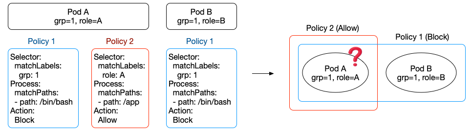

# Consideration in Policy Action

While operators can define security policies with an action \(either Block or Allow\), KubeArmor may handle those policies differently \(blacklist vs. whitelist\).

If the actions of all security policies for a container are 'Block', then these policies are handled in a blacklist manner. However, if at least one security policy's action is 'Allow', then all security policies for a container are handled in a whitelist manner, meaning that some security policies may be handled differently in containers.

Here, we introduce an example of how security policies are handled differently. There are two pods: pod A with \(grp=1, role=A\) and pod B with \(grp=1, role=B\). Let us say that an operator wants to block the execution of a bash shell in those pods, so the operator first defines a policy with \(selector → grp=1, process → /bin/bash, action → block\). Then, /bin/bash cannot be executed in the pods while some other applications are still executable \(blacklist\).

After that, let us say that the operator also wants the pods with role=A to execute /app only. Then, this policy will be enforced into Pod A. At this point, a problem may occur. Since Pod A has an 'Allow' policy and a 'Block' policy together, the way to handle those policies is changed from a blacklist manner to a whitelist manner, which means that Pod A will be only able to execute /app. Here, if Pod A needs to only run /app, then everything will be fine. However, what if Pod A had to implicitly execute some other applications \(e.g., /agent\)? Then, there will be a severe problem since all applications except for /app will be blocked in Pod A.

