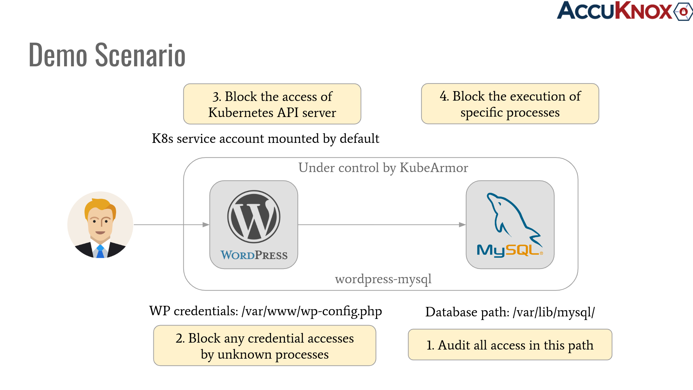

# Getting Started Guide

If you do not have a k8s cluster, check the [pre-requisites](#prerequisites) to setup one.

If you want to try KubeArmor directly on the host without k8s, [run KubeArmor in systemd mode](kubearmor_vm.md).

Check the [KubeArmor support matrix](support_matrix.md) to verify if your platform is supported.

## Deployment Steps

### 1. Download and install karmor cli-tool

```
curl -sfL http://get.kubearmor.io/ | sudo sh -s -- -b /usr/local/bin
```

### 2. Install KubeArmor

```
karmor install
```

<details>
  <summary>Output of karmor install</summary>

```
aws@pandora:~$ karmor install
Auto Detected Environment : docker
CRD kubearmorpolicies.security.kubearmor.com ...
CRD kubearmorhostpolicies.security.kubearmor.com ...
Service Account ...
Cluster Role Bindings ...
KubeArmor Relay Service ...
KubeArmor Relay Deployment ...
KubeArmor DaemonSet ...
KubeArmor Policy Manager Service ...
KubeArmor Policy Manager Deployment ...
KubeArmor Host Policy Manager Service ...
KubeArmor Host Policy Manager Deployment ...
```

</details>

### 3. Deploying sample app

#### a. Deploy sample [wordpress-mysql app](../examples/wordpress-mysql.md)

```
$ kubectl apply -f https://raw.githubusercontent.com/kubearmor/KubeArmor/main/examples/wordpress-mysql/wordpress-mysql-deployment.yaml
```

### 4. Use cases and deploy Security Policy



<details>
  <summary>
    <b>Use case 1: Audit access to sensitive data paths</b>
  </summary>

MySQL uses `/var/lib/mysql` path as the default data directory. An audit policy will generate an alert for each operation associated with the resource i.e. a file or binary, specified in the policy. The details logs about the event can help in identifying unauthorized access and potential security breaches. We'll Create a KubeArmor Security policy to audit access to `/var/lib/mysql` folder path recursively.

**Before applying any policy**

There will'be no alert generated by the KubeArmor for any access to the `/var/lib/mysql` directory or subdirectories.

Start Observing KubeArmor logs by executing the following command in a separate terminal/tab.
```
$ karmor log
local port to be used for port forwarding kubearmor-relay-xxxxxxxxx-xxxxx: 32767
Created a gRPC client (localhost:32767)
Checked the liveness of the gRPC server
Started to watch alerts
```
Creating a file inside `/var/lib/mysql` directory, execute the following command and observe the logs.
```
$ POD_NAME=$(kubectl get pods -n wordpress-mysql -l "app=mysql" -o jsonpath='{.items[0].metadata.name}') && kubectl -n wordpress-mysql exec -it $POD_NAME -- bash

root@mysql-6c6fcdccf-v6qhz:/# touch /var/lib/mysql/test
root@mysql-6c6fcdccf-v6qhz:/# ls /var/lib/mysql/
auto.cnf     ib_logfile1  mysql         test    wordpress
ib_logfile0  ibdata1    performance_schema

root@mysql-6c6fcdccf-v6qhz:/# exit
```

we can see that the file `test` has been created in the `/var/lib/mysql` directory and no alert was generated for this event by the KubeArmor.

#### **Applying [security policy](../examples/wordpress-mysql/security-policies/ksp-mysql-audit-dir.yaml) to audit all access to `/var/lib/mysql` directory**

```yaml
# ksp-mysql-audit-dir.yaml

apiVersion: security.kubearmor.com/v1
kind: KubeArmorPolicy
metadata:
  name: ksp-mysql-audit-dir
  namespace: wordpress-mysql
spec:
  severity: 5
  selector:
    matchLabels:
      app: mysql
  file:
    matchDirectories:
      - dir: /var/lib/mysql/
        recursive: true
  action: Audit
```

```
$ kubectl apply -f https://raw.githubusercontent.com/kubearmor/KubeArmor/main/examples/wordpress-mysql/security-policies/ksp-mysql-audit-dir.yaml
```

#### **Start Observing Alerts**

Before simulating the policy violation in the next step execute the following command in a new terminal/tab to start observing KubeArmor logs/alerts, output for the same will be discussed in the upcoming section `Getting Alerts/Telemetry from KubeArmor`.

```
$ karmor log
```

#### **Simulate policy violation**

```
$ POD_NAME=$(kubectl get pods -n wordpress-mysql -l "app=mysql" -o jsonpath='{.items[0].metadata.name}') && kubectl -n wordpress-mysql exec -it $POD_NAME -- bash

root@mysql-6c6fcdccf-v6qhz:/# touch /var/lib/mysql/test-1
root@mysql-6c6fcdccf-v6qhz:/# ls /var/lib/mysql/
auto.cnf     ib_logfile1  mysql         test    wordpress
ib_logfile0  ibdata1    performance_schema  test-1

root@mysql-6c6fcdccf-v6qhz:/# exit

```

#### **Getting Alerts/Telemetry from KubeArmor**

KubeArmor will generate an alert for the event that violates the applied security policy, the output will be similar as the following:

```
$ karmor log
local port to be used for port forwarding kubearmor-relay-xxxxxxxxx-xxxxx: 32767
Created a gRPC client (localhost:32767)
Checked the liveness of the gRPC server
Started to watch alerts
== Alert / 2022-10-27 06:44:29.961193 ==
ClusterName: default
HostName: hp-HP-Compaq-6005-Pro-MT-PC
NamespaceName: wordpress-mysql
PodName: mysql-6c6fcdccf-v6qhz
Labels: app=mysql
ContainerName: mysql
ContainerID: 80531c5a2d9389db9aa23b0b7c76e41e49946c992be7a58299b8f45d58e0e28e
ContainerImage: docker.io/library/mysql:5.6@sha256:20575ecebe6216036d25dab5903808211f1e9ba63dc7825ac20cb975e34cfcae
Type: MatchedPolicy
PolicyName: ksp-mysql-audit-dir
Severity: 5
Source: /usr/bin/touch /var/lib/mysql/test-1
Resource: /var/lib/mysql/test-1
Operation: File
Action: Audit
Data: syscall=SYS_OPEN flags=O_WRONLY|O_CREAT|O_NOCTTY|O_NONBLOCK
Enforcer: eBPF Monitor
Result: Passed
HostPID: 95974
HostPPID: 2235
PID: 275
PPID: 2235
ParentProcessName: /var/lib/rancher/k3s/data/ec00304416df58a8da2a883b1b87ab882b199ef11c4e01b28f07d643c8067d91/bin/containerd-shim-runc-v2
ProcessName: /bin/touch

```

We can see that after applying the policy now KubeArmor is generating an alert for all the access to the `/var/lib/mysql` directory.

</details>

<details>
  <summary>
    <b>Use case 2: Block access to files with sensitive data</b>

  </summary>

A pod may contain unprotected files with sensitive data that need to be protected from unauthorised access. In our sample wordpress app, wordpress pod contains a file `wp-config.php` that has sensitive auth credentials. KubeArmor security policy can be applied to block access to this file from unknown processes.

**Before Applying any Policy**

```
POD_NAME=$(kubectl get pods -n wordpress-mysql -l "app=wordpress" -o jsonpath='{.items[0].metadata.name}') && kubectl -n wordpress-mysql exec -it $POD_NAME -- bash

root@wordpress-84dbf54bb8-8kczs:/var/www/html# cat /var/www/html/wp-config.php

root@wordpress-84dbf54bb8-8kczs:/var/www/html# exit
```

<details>
  <summary>Output:</summary>

```
<?php
/**
* The base configuration for WordPress
*
* The wp-config.php creation script uses this file during the
* installation. You don't have to use the website, you can
* copy this file to "wp-config.php" and fill in the values.
*
* This file contains the following configurations:
*
* * MySQL settings
* * Secret keys
* * Database table prefix
* * ABSPATH
*
* @link https://codex.wordpress.org/Editing_wp-config.php
*
* @package WordPress
*/

// ** MySQL settings - You can get this info from your web host ** //
/** The name of the database for WordPress */
define('DB_NAME', 'wordpress');

/** MySQL database username */
define('DB_USER', 'root');

/** MySQL database password */
define('DB_PASSWORD', 'root-password');

/** MySQL hostname */
define('DB_HOST', 'mysql');

/** Database Charset to use in creating database tables. */
define('DB_CHARSET', 'utf8');

/** The Database Collate type. Don't change this if in doubt. */
define('DB_COLLATE', '');

/**#@+
* Authentication Unique Keys and Salts.
*
* Change these to different unique phrases!
* You can generate these using the {@link https://api.wordpress.org/secret-key/1.1/salt/ WordPress.org secret-key service}
* You can change these at any point in time to invalidate all existing cookies. This will force all users to have to log in again.
*
* @since 2.6.0
*/
define('AUTH_KEY',         'fb81b069fe42ffcc486ad1b1d63f213a35409d28');
define('SECURE_AUTH_KEY',  '7ebb161e3da79bbab3f4bf3aabfd2fda16b3a8b4');
define('LOGGED_IN_KEY',    '0f420b5a27189aeb368316e4a1cf67dc1a0b5f86');
define('NONCE_KEY',        '3b0c768e6d365ab8f9e3d902b2ed8924a32df17c');
define('AUTH_SALT',        '2453305062382e8a46e9ed2200f4c2e1ac9570ad');
define('SECURE_AUTH_SALT', '50c9ea4a77c7ff3a99454cb56f4d77e293928106');
define('LOGGED_IN_SALT',   '19bd1fdeb2c02782040dae45e56aacf50360099a');
define('NONCE_SALT',       '9da51482769e954e713c31409cbc22ed048b09be');

/**#@-*/

/**
* WordPress Database Table prefix.
*
* You can have multiple installations in one database if you give each
* a unique prefix. Only numbers, letters, and underscores please!
*/
$table_prefix  = 'wp_';

/**
* For developers: WordPress debugging mode.
*
* Change this to true to enable the display of notices during development.
* It is strongly recommended that plugin and theme developers use WP_DEBUG
* in their development environments.
*
* For information on other constants that can be used for debugging,
* visit the Codex.
*
* @link https://codex.wordpress.org/Debugging_in_WordPress
*/
define('WP_DEBUG', false);

// If we're behind a proxy server and using HTTPS, we need to alert Wordpress of that fact
// see also http://codex.wordpress.org/Administration_Over_SSL#Using_a_Reverse_Proxy
if (isset($_SERVER['HTTP_X_FORWARDED_PROTO']) && $_SERVER['HTTP_X_FORWARDED_PROTO'] === 'https') {
  $_SERVER['HTTPS'] = 'on';
}

/* That's all, stop editing! Happy blogging. */

/** Absolute path to the WordPress directory. */
if ( !defined('ABSPATH') )
  define('ABSPATH', dirname(__FILE__) . '/');

/** Sets up WordPress vars and included files. */
require_once(ABSPATH . 'wp-settings.php');
```

</details>

#### **Applying [security policy](../examples/wordpress-mysql/security-policies/ksp-wordpress-block-config.yaml) to block access to the `wp-config.php`**

```yaml
# ksp-wordpress-block-config.yaml

apiVersion: security.kubearmor.com/v1
kind: KubeArmorPolicy
metadata:
  name: ksp-wordpress-block-config
  namespace: wordpress-mysql
spec:
  severity: 10
  selector:
    matchLabels:
      app: wordpress
  file:
    matchPaths:
      - path: /var/www/html/wp-config.php
        fromSource:
          - path: /bin/cat
  action: Block
```

```
$ kubectl apply -f https://raw.githubusercontent.com/kubearmor/KubeArmor/main/examples/wordpress-mysql/security-policies/ksp-wordpress-block-config.yaml
```

#### **Start Observing Alerts**

Before simulating the policy violation in the next step execute the following command in a new terminal/tab to start observing KubeArmor logs/alerts, output for the same will be discussed in the upcoming section `Getting Alerts/Telemetry from KubeArmor`.

```
$ karmor log
```

#### **Simulate policy violation**

```
$ POD_NAME=$(kubectl get pods -n wordpress-mysql -l "app=wordpress" -o jsonpath='{.items[0].metadata.name}') && kubectl -n wordpress-mysql exec -it $POD_NAME -- bash

root@wordpress-84dbf54bb8-8kczs:/var/www/html# cat /var/www/html/wp-config.php
cat: /var/www/html/wp-config.php: Permission denied

root@wordpress-84dbf54bb8-8kczs:/var/www/html# exit
```

it can be seen that now access to the `wp-config.php` by the `cat` binary/process has been blocked.

#### **Getting Alerts/Telemetry from KubeArmor**

It can be seen in the following alert that, the process `/bin/cat` with pid as 418 was trying to access the file `wp-config.php` which leads to the policy violation so the access is blocked by the enforcer.

```
$ karmor log
local port to be used for port forwarding kubearmor-relay-xxxxxxxxx-xxxxx: 32767
Created a gRPC client (localhost:32767)
Checked the liveness of the gRPC server
Started to watch alerts
== Alert / 2022-10-27 06:44:41.608403 ==
ClusterName: default
HostName: hp-HP-Compaq-6005-Pro-MT-PC
NamespaceName: wordpress-mysql
PodName: wordpress-84dbf54bb8-8kczs
Labels: app=wordpress
ContainerName: wordpress
ContainerID: d830e1336a638aa98c2d58167864966d82d7c6cea13b5586535078e2bab07ffc
ContainerImage: docker.io/library/wordpress:4.8-apache@sha256:6216f64ab88fc51d311e38c7f69ca3f9aaba621492b4f1fa93ddf63093768845
Type: MatchedPolicy
PolicyName: ksp-wordpress-block-config
Severity: 10
Source: /bin/cat /var/www/html/wp-config.php
Resource: /var/www/html/wp-config.php
Operation: File
Action: Block
Data: syscall=SYS_OPEN flags=O_RDONLY
Enforcer: AppArmor
Result: Permission denied
HostPID: 96110
HostPPID: 2230
PID: 418
PPID: 2230
ParentProcessName: /var/lib/rancher/k3s/data/ec00304416df58a8da2a883b1b87ab882b199ef11c4e01b28f07d643c8067d91/bin/containerd-shim-runc-v2
ProcessName: /bin/cat

```

</details>

</details>

<details>
  <summary>
    <b>Use case 3: Block access to k8s service account token</b>
  </summary>

A pod is the primary execution unit in K8s. One problem with this approach is that all the processes within that pod have unrestricted access to the pod's volume mounts. One such volume mount is a service account token. Thus, accessing a service account token using an injected binary is a common attack pattern in K8s. This use case explains how you can protect access (Block) to the service account token through known processes only.

**Before Applying any Policy**

```
$ POD_NAME=$(kubectl get pods -n wordpress-mysql -l "app=wordpress" -o jsonpath='{.items[0].metadata.name}') && kubectl -n wordpress-mysql exec -it $POD_NAME -- bash

root@wordpress-84dbf54bb8-8kczs:/var/www/html# cat /run/secrets/kubernetes.io/serviceaccount/token
eyJhbGciOiJSUzI1NiIsImtpZCI6InNKYl9CSE5nRkE1eEZ2bWpuTHVYYWZHZk5BZzBBVUNscGp0a3BHQm5GMUEifQ.eyJhdWQiOlsiaHR0cHM6Ly9rdWJlcm5ldGVzLmRlZmF1bHQuc3ZjLmNsdXN0ZXIubG9jYWwiLCJrM3MiXSwiZXhwIjoxNjk4NTc0MzIzLCJpYXQiOjE2NjcwMzgzMjMsImlzcyI6Imh0dHBzOi8va3ViZXJuZXRlcy5kZWZhdWx0LnN2Yy5jbHVzdGVyLmxvY2FsIiwia3ViZXJuZXRlcy5pbyI6eyJuYW1lc3BhY2UiOiJ3b3JkcHJlc3MtbXlzcWwiLCJwb2QiOnsibmFtZSI6IndvcmRwcmVzcy03ODdmNDU3ODZmLWZjZ2htIiwidWlkIjoiODFkOGRiZGItMDg4Ni00ODI1LTljYmQtNDBiZDU3MWM2NDBmIn0sInNlcnZpY2VhY2NvdW50Ijp7Im5hbWUiOiJkZWZhdWx0IiwidWlkIjoiZWIwNDgwY2QtYjA4MS00YzA4LWJhZTgtMmRiYjI0OGIwMWU2In0sIndhcm5hZnRlciI6MTY2NzA0MTkzMH0sIm5iZiI6MTY2NzAzODMyMywic3ViIjoic3lzdGVtOnNlcnZpY2VhY2NvdW50OndvcmRwcmVzcy1teXNxbDpkZWZhdWx0In0.KLZjWcDJ4iOGeaJ3wbje8DofMOjR0UMvu6o0zFxJ-cqy2-49YV7bSqNTx9JWMt5RJuf0g068PEkv5MbusV1FqHaBW0TmcIYlEkhdIyEd8ktJTggbvPcDsaxT1nIRjkvM11u2znZ8eGYx7YLPapqF5hf5bKqx9kRTGIrTuv30Yge_bqyRuARm-Ep2Uj-r54X7a7JagyH1_q8Snp8FylvbXhmJkhQ5B9rZ7l7rdkmjCe8J0CYkYeQ26yJ5pw4O7IXmaw6PQVVmZ1LrJ7GLOxzL8VbyUne25BSnG4zxEurg-vJm0SUvB6xnWSujv61rOgnpGD4sdyZoZiNbfNzRVLfSRw

root@wordpress-84dbf54bb8-8kczs:/var/www/html# exit
```

It can be seen that currently, it is possible to access the kubernetes serviceaccount token.

#### \*\*Applying [security policy](../examples/wordpress-mysql/security-policies/ksp-wordpress-block-sa.yaml) to block access to `/run/secrets/kubernetes.io/serviceaccount/` directory recursively.

```yaml
# ksp-wordpress-block-sa.yaml

apiVersion: security.kubearmor.com/v1
kind: KubeArmorPolicy
metadata:
  name: ksp-wordpress-block-sa
  namespace: wordpress-mysql
spec:
  severity: 7
  selector:
    matchLabels:
      app: wordpress
  file:
    matchDirectories:
      - dir: /run/secrets/kubernetes.io/serviceaccount/
        recursive: true
  action: Block
```

```
$ kubectl apply -f https://raw.githubusercontent.com/kubearmor/KubeArmor/main/examples/wordpress-mysql/security-policies/ksp-wordpress-block-sa.yaml
```

#### **Start Observing Alerts**

Before simulating the policy violation in the next step execute the following command in a new terminal/tab to start observing KubeArmor logs/alerts, output for the same will be discussed in the upcoming section `Getting Alerts/Telemetry from KubeArmor`.

```
$ karmor log
```

#### **Simulate policy violation**

```
$ POD_NAME=$(kubectl get pods -n wordpress-mysql -l "app=wordpress" -o jsonpath='{.items[0].metadata.name}') && kubectl -n wordpress-mysql exec -it $POD_NAME -- bash

root@wordpress-84dbf54bb8-8kczs:/var/www/html# cat /run/secrets/kubernetes.io/serviceaccount/token
cat: /run/secrets/kubernetes.io/serviceaccount/token: Permission denied

root@wordpress-84dbf54bb8-8kczs:/var/www/html# exit
```

Any access to the directory (recursively) `/run/secrets/kubernetes.io/serviceaccount/` is blocked now.

#### **Getting Alerts/Telemetry from KubeArmor**

KubeArmor will generate an alert for the event that violates the applied security policy, the output will be similar as the following:

```
$ karmor log
local port to be used for port forwarding kubearmor-relay-xxxxxxxxx-xxxxx: 32767
Created a gRPC client (localhost:32767)
Checked the liveness of the gRPC server
Started to watch alerts
== Alert / 2022-10-27 06:44:54.075467 ==
ClusterName: default
HostName: hp-HP-Compaq-6005-Pro-MT-PC
NamespaceName: wordpress-mysql
PodName: wordpress-84dbf54bb8-8kczs
Labels: app=wordpress
ContainerName: wordpress
ContainerID: d830e1336a638aa98c2d58167864966d82d7c6cea13b5586535078e2bab07ffc
ContainerImage: docker.io/library/wordpress:4.8-apache@sha256:6216f64ab88fc51d311e38c7f69ca3f9aaba621492b4f1fa93ddf63093768845
Type: MatchedPolicy
PolicyName: ksp-wordpress-block-sa
Severity: 7
Source: /bin/cat /run/secrets/kubernetes.io/serviceaccount/token
Resource: /run/secrets/kubernetes.io/serviceaccount/..2022_10_27_06_32_25.3090352906/token
Operation: File
Action: Block
Data: syscall=SYS_OPEN flags=O_RDONLY
Enforcer: AppArmor
Result: Permission denied
HostPID: 96331
HostPPID: 2230
PID: 430
PPID: 2230
ParentProcessName: /var/lib/rancher/k3s/data/ec00304416df58a8da2a883b1b87ab882b199ef11c4e01b28f07d643c8067d91/bin/containerd-shim-runc-v2
ProcessName: /bin/cat
```

</details>

</details>

<details>

<summary><b> Use case 4: Block execution of unwanted processes </b></summary>

Container base images have package managers i.e. `apt` that are used to install packages required by the application at runtime. when a container is shipped to production it should be avoided to have package managers running inside the container, it increases the attack surface. If a container gets compromised, attackers can use the package managers to install the binaries required to escalate the attack.

Our sample `wordpress-mysql` application container has package manager `apt` and can be executed once we're inside the container.

#### **Before Applying any Policy**

- Executing `apt` (Successful)

```
$ kubectl exec -it wordpress-84dbf54bb8-8kczs -n wordpress-mysql -- bash
root@wordpress-84dbf54bb8-8kczs:/var/www/html# apt
apt 1.0.9.8.4 for amd64 compiled on Dec 11 2016 09:48:19
Usage: apt [options] command

CLI for apt.
Basic commands:
 list - list packages based on package names
 search - search in package descriptions
 show - show package details

 update - update list of available packages

 install - install packages
 remove  - remove packages

 upgrade - upgrade the system by installing/upgrading packages
 full-upgrade - upgrade the system by removing/installing/upgrading packages

 edit-sources - edit the source information file

root@wordpress-84dbf54bb8-8kczs:/var/www/html# exit
```

- Executing `apt-get` (Successful)

```
root@wordpress-84dbf54bb8-8kczs:/var/www/html# apt-get update
Get:1 http://security.debian.org jessie/updates InRelease [44.9 kB]
Ign http://deb.debian.org jessie InRelease
Get:2 http://deb.debian.org jessie-updates InRelease [16.3 kB]
Get:3 http://deb.debian.org jessie Release.gpg [1652 B]
Get:4 http://deb.debian.org jessie Release [77.3 kB]
Get:5 http://security.debian.org jessie/updates/main amd64 Packages [992 kB]
Get:6 http://deb.debian.org jessie-updates/main amd64 Packages [20 B]
Get:7 http://deb.debian.org jessie/main amd64 Packages [9098 kB]
Fetched 10.2 MB in 11s (859 kB/s)
Reading package lists... Done

root@wordpress-84dbf54bb8-8kczs:/var/www/html# exit
```

#### **Applying [security policy](../examples/wordpress-mysql/security-policies/ksp-wordpress-block-process.yaml) to block `apt` and `apt-get`**

```
$ kubectl apply -f https://raw.githubusercontent.com/kubearmor/KubeArmor/main/examples/wordpress-mysql/security-policies/ksp-wordpress-block-process.yaml
```

```yaml
# ksp-wordpress-block-process.yaml

apiVersion: security.kubearmor.com/v1
kind: KubeArmorPolicy
metadata:
  name: ksp-wordpress-block-process
  namespace: wordpress-mysql
spec:
  severity: 3
  selector:
    matchLabels:
      app: wordpress
  process:
    matchPaths:
      - path: /usr/bin/apt
      - path: /usr/bin/apt-get
  action: Block
```

#### **Start Observing Alerts**

Before simulating the policy violation in the next step execute the following command in a new terminal/tab to start observing KubeArmor logs/alerts, output for the same will be discussed in the upcoming section `Getting Alerts/Telemetry from KubeArmor`.

```
$ karmor log
```

#### **Simulate policy violation**

```
$ POD_NAME=$(kubectl get pods -n wordpress-mysql -l "app=wordpress" -o jsonpath='{.items[0].metadata.name}') && kubectl -n wordpress-mysql exec -it $POD_NAME -- bash

root@wordpress-84dbf54bb8-8kczs:/var/www/html# apt
bash: /usr/bin/apt: Permission denied
root@wordpress-84dbf54bb8-8kczs:/var/www/html# apt-get update
bash: /usr/bin/apt-get: Permission denied

root@wordpress-84dbf54bb8-8kczs:/var/www/html# exit
```

As it can be seen that the execution of `apt` and `apt-get` binaries/process has been blocked now.

#### **Getting Alerts/Telemetry from KubeArmor**

An information-rich alert will be generated for every event/operation that violates the KubeArmor security policy. In the following alert, we can see the information of the event that violates the applied policy in the earlier step that blocks the execution of the processes `apt` and `apt-get`.

```
$ karmor log
local port to be used for port forwarding kubearmor-relay-xxxxxxxxx-xxxxx: 32867
Created a gRPC client (localhost:32867)
Checked the liveness of the gRPC server
Started to watch alerts
== Alert / 2022-10-27 10:00:53.590020 ==
ClusterName: default
HostName: hp-HP-Compaq-6005-Pro-MT-PC
NamespaceName: wordpress-mysql
PodName: wordpress-84dbf54bb8-8kczs
Labels: app=wordpress
ContainerName: wordpress
ContainerID: 4a08ff32ccc4c9fb264b793882a765ab1c92b5f269308dc90b57d005a4d8f106
ContainerImage: docker.io/library/wordpress:4.8-apache@sha256:6216f64ab88fc51d311e38c7f69ca3f9aaba621492b4f1fa93ddf63093768845
Type: MatchedPolicy
PolicyName: ksp-wordpress-block-process
Severity: 3
Source: /var/lib/rancher/k3s/data/ec00304416df58a8da2a883b1b87ab882b199ef11c4e01b28f07d643c8067d91/bin/runc
Resource: /usr/bin/apt-get update
Operation: Process
Action: Block
Data: syscall=SYS_EXECVE
Enforcer: AppArmor
Result: Permission denied
HostPID: 23070
HostPPID: 23065
PID: 374
PPID: 23065
ParentProcessName: /var/lib/rancher/k3s/data/ec00304416df58a8da2a883b1b87ab882b199ef11c4e01b28f07d643c8067d91/bin/runc
ProcessName: /usr/bin/apt-get
== Alert / 2022-10-27 10:00:53.590020 ==
ClusterName: default
HostName: hp-HP-Compaq-6005-Pro-MT-PC
NamespaceName: wordpress-mysql
PodName: wordpress-84dbf54bb8-8kczs
Labels: app=wordpress
ContainerName: wordpress
ContainerID: 4a08ff32ccc4c9fb264b793882a765ab1c92b5f269308dc90b57d005a4d8f106
ContainerImage: docker.io/library/wordpress:4.8-apache@sha256:6216f64ab88fc51d311e38c7f69ca3f9aaba621492b4f1fa93ddf63093768845
Type: MatchedPolicy
PolicyName: ksp-wordpress-block-process
Severity: 3
Source: /var/lib/rancher/k3s/data/ec00304416df58a8da2a883b1b87ab882b199ef11c4e01b28f07d643c8067d91/bin/runc
Resource: /usr/bin/apt-get update
Operation: Process
Action: Block
Data: syscall=SYS_EXECVE
Enforcer: AppArmor
Result: Permission denied
HostPID: 23070
HostPPID: 23065
PID: 374
PPID: 23065
ParentProcessName: /var/lib/rancher/k3s/data/ec00304416df58a8da2a883b1b87ab882b199ef11c4e01b28f07d643c8067d91/bin/runc
ProcessName: /usr/bin/apt-get
```

</details>

## K8s platforms tested

1. Self-managed (on-prem) k8s
2. Local k8s engines (k3s, microk8s, and minikube)
3. Google Kubernetes Engine (GKE) with Container Optimized OS (COS)
4. GKE with Ubuntu image
5. [Amazon Elastic Kubernetes Service (EKS)](../deployments/EKS)
6. [Azure Kubernetes Service (AKS)](../deployments/AKS)

## Prerequisites

1. [K3s](../deployments/k3s)
2. [MicroK8s](../contribution/microk8s)
3. [Minikube](../contribution/minikube)
4. [Self-managed K8s](../contribution/self-managed-k8s)
5. [Amazon Elastic Kubernetes Service (EKS)](../deployments/EKS#prerequisite-for-the-deployment)
