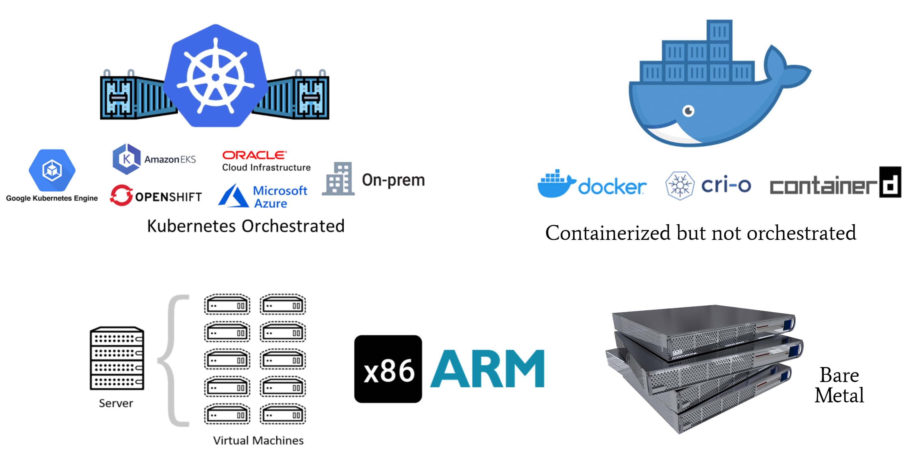

# Supported Deployment Models

KubeArmor supports following deployment models:
1. Kubernetes orchestrated deployment with KubeArmor deployed as a **daemonset**.
2. Containerized deployment with KubeArmor deployed in **systemd mode** on the VM/EC2/Bare-Metal instance.
3. Non-containerized applications with KubeArmor deployed in **systemd mode**.

