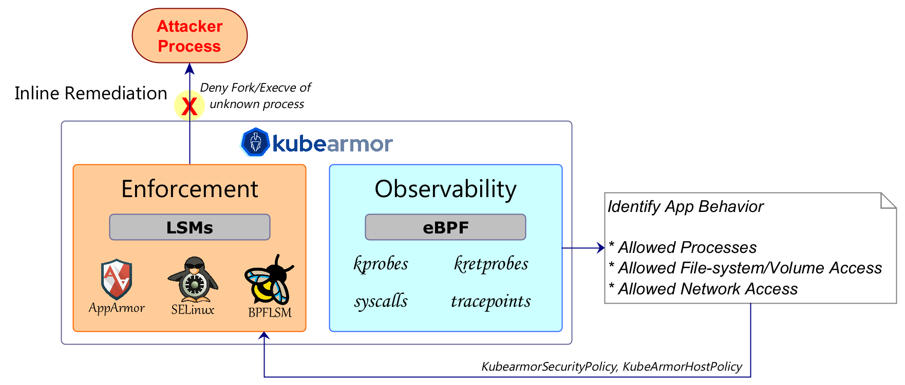
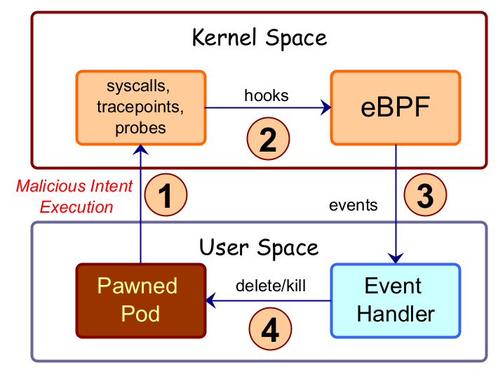
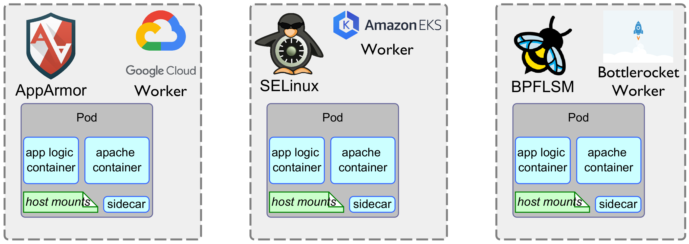
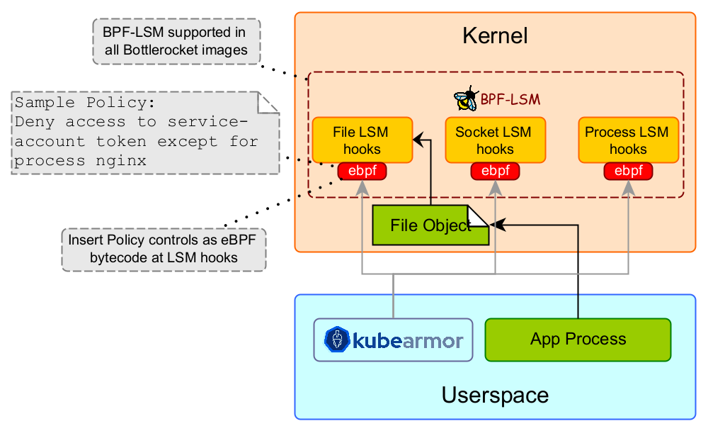

# KubeArmor Differentiation

## Significance of Inline Mitigation

KubeArmor supports attack prevention, not just observability and monitoring.
More importantly, the prevention is handled inline: even before a process is spawned, a rule can deny execution of a process.
Most other systems typically employ "post-attack mitigation" that kills a process/pod after malicious intent is observed, allowing an attacker to execute code on the target environment.
Essentially KubeArmor uses inline mitigation to reduce the attack surface of a pod/container/VM.
KubeArmor leverages best of breed Linux Security Modules (LSMs) such as AppArmor, BPF-LSM, and SELinux (only for host protection) for inline mitigation.
LSMs have several advantages over other techniques:

* KubeArmor does not change anything with the pod/container.
* KubeArmor does not require any changes at the host level or at the CRI (Container Runtime Interface) level to enforce blocking rules. KubeArmor deploys as a non-privileged DaemonSet with certain capabilities that allows it to monitor other pods/containers and the host.
* A given cluster can have multiple nodes utilizing different LSMs. KubeArmor abstracts away complexities of LSMs and provides an easy way to enforce policies. KubeArmor manages complexity of LSMs under-the-hood.

### Post-Attack Mitigation and its flaws

* Post-exploit Mitigation works by killing a suspicious process in response to an alert indicating malicious intent.
* Attacker is allowed to execute a binary. Attacker could disable security controls, access logs, etc to circumvent attack detection.
* By the time a malicious process is killed, sensitive contents could have already been deleted, encrypted, or transmitted.
* [Quoting Grsecurity](https://grsecurity.net/tetragone_a_lesson_in_security_fundamentals), “post-exploitation detection/mitigation is at the mercy of an exploit writer putting little to no effort into avoiding tripping these detection mechanisms.”

## Problems with k8s native Pod Security Context

[Pod Security Context](https://kubernetes.io/docs/tasks/configure-pod-container/security-context/) allows one to specify [native AppArmor](https://kubernetes.io/docs/tutorials/security/apparmor/) or [native SELinux](https://kubernetes.io/docs/tasks/configure-pod-container/security-context/#assign-selinux-labels-to-a-container) policies.

This approach has multiple problems:

1. It is often difficult to predict which LSM (AppArmor or SELinux) would be available on the target node.
2. BPF-LSM is not supported by Pod Security Context.
3. It is difficult to manually specify an AppArmor or SELinux policy. Changing default AppArmor or SELinux policies might result in more security holes since it is difficult to decipher the implications of the changes and can be counter-productive.

### Problems with multi-cloud deployment

Different managed cloud providers use different default distributions.
Google GKE COS uses AppArmor by default, AWS Bottlerocket uses BPF-LSM and SELinux, and AWS Amazon Linux 2 uses only SELinux by default.
Thus it is challenging to use Pod Security Context in multi-cloud deployments.

## Use of BPF-LSM

References:

* [Armoring Cloud Native Workloads with BPF-LSM](https://www.youtube.com/watch?v=uYVaiIX7QC0&ab_channel=CNCF%5BCloudNativeComputingFoundation%5D)
* [Securing Bottlerocket deployments on Amazon EKS with KubeArmor](https://aws.amazon.com/blogs/containers/secure-bottlerocket-deployments-on-amazon-eks-with-kubearmor/)
