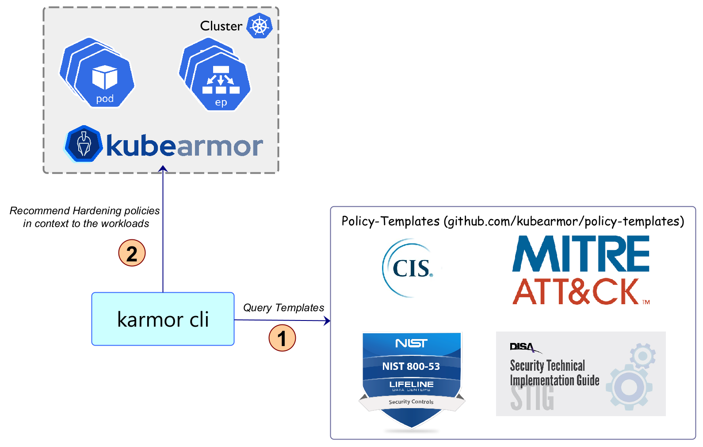

# Harden Infrastructure



KubeArmor is a security solution for the Kubernetes and cloud native platforms that helps protect your workloads from attacks and threats. It does this by providing a set of hardening policies that are based on industry-leading compliance and attack frameworks such as CIS, MITRE, NIST-800-53, and STIGs. These policies are designed to help you secure your workloads in a way that is compliant with these frameworks and recommended best practices.

One of the key features of KubeArmor is that it provides these hardening policies out-of-the-box, meaning that you don't have to spend time researching and configuring them yourself. Instead, you can simply apply the policies to your workloads and immediately start benefiting from the added security that they provide.

Additionally, KubeArmor presents these hardening policies in the context of your workload, so you can see how they will be applied and what impact they will have on your system. This allows you to make informed decisions about which policies to apply, and helps you understand the trade-offs between security and functionality.

Overall, KubeArmor is a powerful tool for securing your Kubernetes workloads, and its out-of-the-box hardening policies based on industry-leading compliance and attack frameworks make it easy to get started and ensure that your system is as secure as possible.

## What is the source of these hardening policies?

Hardening policies are derived from industry leading compliance standards and attack frameworks such as CIS, MITRE, NIST, STIGs, and several others.
[KubeArmor Policy Templates](https://github.com/kubearmor/policy-templates/) contains the latest hardening policies.
KubeArmor client tool (karmor) provides a way (`karmor recommend`) to fetch the policies in the context of the kubernetes workloads or specific container using command line.
The output is a set of [`KubeArmorPolicy`](security_policy_specification.md) or [`KubeArmorHostPolicy`](host_security_policy_specification.md) that can be applied using k8s native tools (such as `kubectl apply`).

The rules in hardening policies are based on inputs from:
1. [MITRE TTPs](https://github.com/kubearmor/policy-templates/)
2. [Security Technical Implementation Guides (STIGs)](https://public.cyber.mil/stigs/)
3. [NIST SP 800-53A](https://csrc.nist.gov/publications/detail/sp/800-53a/rev-4/final)
4. [Center for Internet Security (CIS)](https://www.cisecurity.org/cis-benchmarks/)
5. Several others...

## How to fetch hardening policies?

Pre-requisites:
1. Install KubeArmor
	* `curl -sfL http://get.kubearmor.io/ | sudo sh -s -- -b /usr/local/bin && karmor install`
2. Get the hardening policies in context of all the deployment in namespace NAMESPACE:
	* `karmor recommend -n NAMESPACE`
	* The recommended policies would be available in the `out` folder.

## Sample recommended hardening policies

```
❯ karmor recommend -n dvwa
INFO[0000] pulling image                                 image="cytopia/dvwa:php-8.1"
created policy out/dvwa-dvwa-web/cytopia-dvwa-php-8-1-maintenance-tool-access.yaml ...
created policy out/dvwa-dvwa-web/cytopia-dvwa-php-8-1-cert-access.yaml ...
created policy out/dvwa-dvwa-web/cytopia-dvwa-php-8-1-system-owner-discovery.yaml ...
created policy out/dvwa-dvwa-web/cytopia-dvwa-php-8-1-system-monitoring-deny-write-under-bin-directory.yaml ...
created policy out/dvwa-dvwa-web/cytopia-dvwa-php-8-1-system-monitoring-write-under-dev-directory.yaml ...
created policy out/dvwa-dvwa-web/cytopia-dvwa-php-8-1-system-monitoring-detect-access-to-cronjob-files.yaml ...
created policy out/dvwa-dvwa-web/cytopia-dvwa-php-8-1-least-functionality-execute-package-management-process-in-container.yaml ...
created policy out/dvwa-dvwa-web/cytopia-dvwa-php-8-1-deny-remote-file-copy.yaml ...
created policy out/dvwa-dvwa-web/cytopia-dvwa-php-8-1-deny-write-in-shm-folder.yaml ...
created policy out/dvwa-dvwa-web/cytopia-dvwa-php-8-1-deny-write-under-etc-directory.yaml ...
created policy out/dvwa-dvwa-web/cytopia-dvwa-php-8-1-deny-write-under-etc-directory.yaml ...
INFO[0000] pulling image                                 image="mariadb:10.1"
created policy out/dvwa-dvwa-mysql/mariadb-10-1-maintenance-tool-access.yaml ...
created policy out/dvwa-dvwa-mysql/mariadb-10-1-cert-access.yaml ...
created policy out/dvwa-dvwa-mysql/mariadb-10-1-system-owner-discovery.yaml ...
created policy out/dvwa-dvwa-mysql/mariadb-10-1-system-monitoring-deny-write-under-bin-directory.yaml ...
created policy out/dvwa-dvwa-mysql/mariadb-10-1-system-monitoring-write-under-dev-directory.yaml ...
created policy out/dvwa-dvwa-mysql/mariadb-10-1-system-monitoring-detect-access-to-cronjob-files.yaml ...
created policy out/dvwa-dvwa-mysql/mariadb-10-1-least-functionality-execute-package-management-process-in-container.yaml ...
created policy out/dvwa-dvwa-mysql/mariadb-10-1-deny-remote-file-copy.yaml ...
created policy out/dvwa-dvwa-mysql/mariadb-10-1-deny-write-in-shm-folder.yaml ...
created policy out/dvwa-dvwa-mysql/mariadb-10-1-deny-write-under-etc-directory.yaml ...
created policy out/dvwa-dvwa-mysql/mariadb-10-1-deny-write-under-etc-directory.yaml ...
output report in out/report.txt ...
  Deployment              | dvwa/dvwa-web         
  Container               | cytopia/dvwa:php-8.1  
  OS                      | linux                 
  Arch                    |                       
  Distro                  |                       
  Output Directory        | out/dvwa-dvwa-web     
  policy-template version | v0.1.6                
+-------------------------------------+--------------------------------+----------+--------+---------------------------------------------------+
|               POLICY                |           SHORT DESC           | SEVERITY | ACTION |                       TAGS                        |
+-------------------------------------+--------------------------------+----------+--------+---------------------------------------------------+
| cytopia-dvwa-php-8-1-maintenance-   | Restrict access to maintenance | 1        | Block  | PCI_DSS                                           |
| tool-access.yaml                    | tools (apk, mii-tool, ...)     |          |        | MITRE                                             |
+-------------------------------------+--------------------------------+----------+--------+---------------------------------------------------+
| cytopia-dvwa-php-8-1-cert-          | Restrict access to trusted     | 1        | Block  | MITRE                                             |
| access.yaml                         | certificated bundles in the OS |          |        | MITRE_T1552_unsecured_credentials                 |
|                                     | image                          |          |        |                                                   |
+-------------------------------------+--------------------------------+----------+--------+---------------------------------------------------+
| cytopia-dvwa-php-8-1-system-owner-  | System Information Discovery   | 3        | Block  | MITRE                                             |
| discovery.yaml                      | - block system owner discovery |          |        | MITRE_T1082_system_information_discovery          |
|                                     | commands                       |          |        |                                                   |
+-------------------------------------+--------------------------------+----------+--------+---------------------------------------------------+
| cytopia-dvwa-php-8-1-system-        | System and Information         | 5        | Block  | NIST NIST_800-53_AU-2                             |
| monitoring-deny-write-under-bin-    | Integrity - System Monitoring  |          |        | NIST_800-53_SI-4 MITRE                            |
| directory.yaml                      | make directory under /bin/     |          |        | MITRE_T1036_masquerading                          |
+-------------------------------------+--------------------------------+----------+--------+---------------------------------------------------+
| cytopia-dvwa-php-8-1-system-        | System and Information         | 5        | Audit  | NIST NIST_800-53_AU-2                             |
| monitoring-write-under-dev-         | Integrity - System Monitoring  |          |        | NIST_800-53_SI-4 MITRE                            |
| directory.yaml                      | make files under /dev/         |          |        | MITRE_T1036_masquerading                          |
+-------------------------------------+--------------------------------+----------+--------+---------------------------------------------------+
| cytopia-dvwa-php-8-1-system-        | System and Information         | 5        | Audit  | NIST SI-4                                         |
| monitoring-detect-access-to-        | Integrity - System Monitoring  |          |        | NIST_800-53_SI-4                                  |
| cronjob-files.yaml                  | Detect access to cronjob files |          |        |                                                   |
+-------------------------------------+--------------------------------+----------+--------+---------------------------------------------------+
| cytopia-dvwa-php-8-1-least-         | System and Information         | 5        | Block  | NIST                                              |
| functionality-execute-package-      | Integrity - Least              |          |        | NIST_800-53_CM-7(4)                               |
| management-process-in-              | Functionality deny execution   |          |        | SI-4 process                                      |
| container.yaml                      | of package manager process in  |          |        | NIST_800-53_SI-4                                  |
|                                     | container                      |          |        |                                                   |
+-------------------------------------+--------------------------------+----------+--------+---------------------------------------------------+
| cytopia-dvwa-php-8-1-deny-remote-   | The adversary is trying to     | 5        | Block  | MITRE                                             |
| file-copy.yaml                      | steal data.                    |          |        | MITRE_TA0008_lateral_movement                     |
|                                     |                                |          |        | MITRE_TA0010_exfiltration                         |
|                                     |                                |          |        | MITRE_TA0006_credential_access                    |
|                                     |                                |          |        | MITRE_T1552_unsecured_credentials                 |
|                                     |                                |          |        | NIST_800-53_SI-4(18) NIST                         |
|                                     |                                |          |        | NIST_800-53 NIST_800-53_SC-4                      |
+-------------------------------------+--------------------------------+----------+--------+---------------------------------------------------+
| cytopia-dvwa-php-8-1-deny-write-in- | The adversary is trying to     | 5        | Block  | MITRE_execution                                   |
| shm-folder.yaml                     | write under shm folder         |          |        | MITRE                                             |
+-------------------------------------+--------------------------------+----------+--------+---------------------------------------------------+
| cytopia-dvwa-php-8-1-deny-write-    | The adversary is trying to     | 5        | Block  | NIST_800-53_SI-7 NIST                             |
| under-etc-directory.yaml            | avoid being detected.          |          |        | NIST_800-53_SI-4 NIST_800-53                      |
|                                     |                                |          |        | MITRE_T1562.001_disable_or_modify_tools           |
|                                     |                                |          |        | MITRE_T1036.005_match_legitimate_name_or_location |
|                                     |                                |          |        | MITRE_TA0003_persistence                          |
|                                     |                                |          |        | MITRE MITRE_T1036_masquerading                    |
|                                     |                                |          |        | MITRE_TA0005_defense_evasion                      |
+-------------------------------------+--------------------------------+----------+--------+---------------------------------------------------+
| cytopia-dvwa-php-8-1-deny-write-    | Adversaries may delete or      | 5        | Block  | NIST NIST_800-53 NIST_800-53_CM-5                 |
| under-etc-directory.yaml            | modify artifacts generated     |          |        | NIST_800-53_AU-6(8)                               |
|                                     | within systems to remove       |          |        | MITRE_T1070_indicator_removal_on_host             |
|                                     | evidence.                      |          |        | MITRE MITRE_T1036_masquerading                    |
+-------------------------------------+--------------------------------+----------+--------+---------------------------------------------------+

  Deployment              | dvwa/dvwa-mysql      
  Container               | mariadb:10.1         
  OS                      | linux                
  Arch                    |                      
  Distro                  |                      
  Output Directory        | out/dvwa-dvwa-mysql  
  policy-template version | v0.1.6               
+-------------------------------------+--------------------------------+----------+--------+---------------------------------------------------+
|               POLICY                |           SHORT DESC           | SEVERITY | ACTION |                       TAGS                        |
+-------------------------------------+--------------------------------+----------+--------+---------------------------------------------------+
| mariadb-10-1-maintenance-tool-      | Restrict access to maintenance | 1        | Block  | PCI_DSS                                           |
| access.yaml                         | tools (apk, mii-tool, ...)     |          |        | MITRE                                             |
+-------------------------------------+--------------------------------+----------+--------+---------------------------------------------------+
| mariadb-10-1-cert-access.yaml       | Restrict access to trusted     | 1        | Block  | MITRE                                             |
|                                     | certificated bundles in the OS |          |        | MITRE_T1552_unsecured_credentials                 |
|                                     | image                          |          |        |                                                   |
+-------------------------------------+--------------------------------+----------+--------+---------------------------------------------------+
| mariadb-10-1-system-owner-          | System Information Discovery   | 3        | Block  | MITRE                                             |
| discovery.yaml                      | - block system owner discovery |          |        | MITRE_T1082_system_information_discovery          |
|                                     | commands                       |          |        |                                                   |
+-------------------------------------+--------------------------------+----------+--------+---------------------------------------------------+
| mariadb-10-1-system-monitoring-     | System and Information         | 5        | Block  | NIST NIST_800-53_AU-2                             |
| deny-write-under-bin-directory.yaml | Integrity - System Monitoring  |          |        | NIST_800-53_SI-4 MITRE                            |
|                                     | make directory under /bin/     |          |        | MITRE_T1036_masquerading                          |
+-------------------------------------+--------------------------------+----------+--------+---------------------------------------------------+
| mariadb-10-1-system-monitoring-     | System and Information         | 5        | Audit  | NIST NIST_800-53_AU-2                             |
| write-under-dev-directory.yaml      | Integrity - System Monitoring  |          |        | NIST_800-53_SI-4 MITRE                            |
|                                     | make files under /dev/         |          |        | MITRE_T1036_masquerading                          |
+-------------------------------------+--------------------------------+----------+--------+---------------------------------------------------+
| mariadb-10-1-system-monitoring-     | System and Information         | 5        | Audit  | NIST SI-4                                         |
| detect-access-to-cronjob-files.yaml | Integrity - System Monitoring  |          |        | NIST_800-53_SI-4                                  |
|                                     | Detect access to cronjob files |          |        |                                                   |
+-------------------------------------+--------------------------------+----------+--------+---------------------------------------------------+
| mariadb-10-1-least-functionality-   | System and Information         | 5        | Block  | NIST                                              |
| execute-package-management-process- | Integrity - Least              |          |        | NIST_800-53_CM-7(4)                               |
| in-container.yaml                   | Functionality deny execution   |          |        | SI-4 process                                      |
|                                     | of package manager process in  |          |        | NIST_800-53_SI-4                                  |
|                                     | container                      |          |        |                                                   |
+-------------------------------------+--------------------------------+----------+--------+---------------------------------------------------+
| mariadb-10-1-deny-remote-file-      | The adversary is trying to     | 5        | Block  | MITRE                                             |
| copy.yaml                           | steal data.                    |          |        | MITRE_TA0008_lateral_movement                     |
|                                     |                                |          |        | MITRE_TA0010_exfiltration                         |
|                                     |                                |          |        | MITRE_TA0006_credential_access                    |
|                                     |                                |          |        | MITRE_T1552_unsecured_credentials                 |
|                                     |                                |          |        | NIST_800-53_SI-4(18) NIST                         |
|                                     |                                |          |        | NIST_800-53 NIST_800-53_SC-4                      |
+-------------------------------------+--------------------------------+----------+--------+---------------------------------------------------+
| mariadb-10-1-deny-write-in-shm-     | The adversary is trying to     | 5        | Block  | MITRE_execution                                   |
| folder.yaml                         | write under shm folder         |          |        | MITRE                                             |
+-------------------------------------+--------------------------------+----------+--------+---------------------------------------------------+
| mariadb-10-1-deny-write-under-etc-  | The adversary is trying to     | 5        | Block  | NIST_800-53_SI-7 NIST                             |
| directory.yaml                      | avoid being detected.          |          |        | NIST_800-53_SI-4 NIST_800-53                      |
|                                     |                                |          |        | MITRE_T1562.001_disable_or_modify_tools           |
|                                     |                                |          |        | MITRE_T1036.005_match_legitimate_name_or_location |
|                                     |                                |          |        | MITRE_TA0003_persistence                          |
|                                     |                                |          |        | MITRE MITRE_T1036_masquerading                    |
|                                     |                                |          |        | MITRE_TA0005_defense_evasion                      |
+-------------------------------------+--------------------------------+----------+--------+---------------------------------------------------+
| mariadb-10-1-deny-write-under-etc-  | Adversaries may delete or      | 5        | Block  | NIST NIST_800-53 NIST_800-53_CM-5                 |
| directory.yaml                      | modify artifacts generated     |          |        | NIST_800-53_AU-6(8)                               |
|                                     | within systems to remove       |          |        | MITRE_T1070_indicator_removal_on_host             |
|                                     | evidence.                      |          |        | MITRE MITRE_T1036_masquerading                    |
+-------------------------------------+--------------------------------+----------+--------+---------------------------------------------------+
```

Key highlights:
1. The hardening policies are available by default in the `out` folder separated out in directories based on deployment names.
2. Get an HTML report by using the option `--report report.html` with `karmor recommend`.
3. Get hardening policies in context to specific compliance by specifying `--tag <CIS/MITRE/...>` option.

