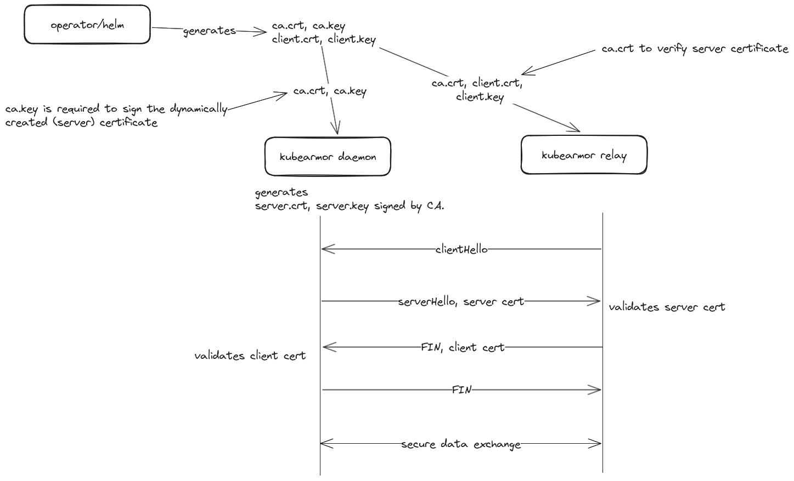

# Security Enhancements for KubeArmor

## 1. Secure Kubearmor with Seccomp

To further enhance the security of KubeArmor itself, it is crucial to protect it using seccomp (secure computing mode), a Linux kernel feature that restricts the system calls (syscalls) a process can make, thereby reducing the attack surface.

With this, Kubearmor will only be using Syscalls necessary to function.


### Enabling seccomp in Kubearmor Configuration 

By default, seccomp is disabled.

In the [Kubearmor Config](https://github.com/kubearmor/KubeArmor/blob/main/pkg/KubeArmorOperator/config/samples/sample-config.yml), set `seccompEnabled: true` and do a `kubectl apply -f config.yaml` to enable seccomp hardening for Kubearmor.

You can check out https://github.com/kubearmor/KubeArmor/blob/bbdc04d4dea3c3e717821e4894f46bd7b30c0d4b/pkg/KubeArmorOperator/seccomp/seccomp.go#L19 to see the list of Syscalls that are allowed by Kubearmor after it is enabled.

### Debugging

There may be some enviroments where seccomp profiles might not work, for example a K8s enviroment where the Kubelet path is different than the default `/var/lib/kubelet`. We are currently in the process of defining our own Kubelet path in a future update.

Other issues like missing syscalls in a particular K8s setup is possible, in that case raise an issue in the [repo](https://github.com/kubearmor/KubeArmor/issues).


## 2. Secure gRPC Communication

Communication with KubeArmor (v1.3.0^) and Relay (v1.2.0^) endpoints
is protected using TLS. Both microservices support mTLS to ensure secure and authenticated communication.




### TLS Configurations

#### KubeArmor Operator

KubeArmorConfig CR supports these [TLS Configurations](https://github.com/kubearmor/KubeArmor/blob/bbdc04d4dea3c3e717821e4894f46bd7b30c0d4b/pkg/KubeArmorOperator/config/crd/bases/operator.kubearmor.com_kubearmorconfigs.yaml#L136-L149)  that can be used to configure TLS.

```
tls:
  enable: true/false
  extraDnsNames: []
  extraIpAddresses: []
```

`extraDnsNames`, and `extraIpAddresses` can be used to configure additional hosts where relay is being served i.e. to connect with relay using port-forward on localhost or 127.0.0.1 it needs to be configured as additional hosts first. 

By default localhost and 127.0.0.1 are configured as additional hosts.

#### KubeArmor Helm Chart

helm chart supports global flag to enable/disable TLS.
```
tls:
  enabled: true/false
```
In addition, both kubearmor and kubearmor relay supports tls specific configurations:
[kubearmor relay tls configurations](https://github.com/kubearmor/KubeArmor/blob/bbdc04d4dea3c3e717821e4894f46bd7b30c0d4b/deployments/helm/KubeArmor/values.yaml#L26)
[kubearmor tls configurations](https://github.com/kubearmor/KubeArmor/blob/bbdc04d4dea3c3e717821e4894f46bd7b30c0d4b/deployments/helm/KubeArmor/values.yaml#L112)

##### Mode 1: External CA and client/server certificates:

`--tlsCertProvider: external`

Use this configuration to provide your own configure CA.
For kubearmor relay both client and server certificates can be provided externally.

KubeArmor only takes CA externally and creates its own certificates signed using provided CA.

##### Mode 2: External CA and dynamic client/server certificates:

`--tlsCertProvider: self`

Provided this configuration for both KubeArmor and Relay, they create their own certificates dynamically signed with provided CA.