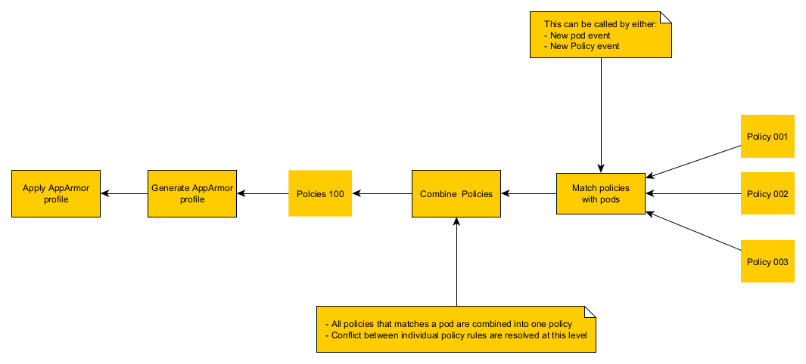

# KubeArmor AppArmor implementation overview

Kubearmor support enforcing policies on systems running apparmor.

## Implementation Overview

Upon the detection of a new Pod or a new policy, KubeArmor will launch a policy-matching process that works as follow:

- If a new pod is detected, KubeArmor will only search for policies that match that particular pod.
- If a new policy is detected, KubeArmor will search for all pods that the policy includes.

When all policies are identified, KubeArmor combines all policies into a single policy. If two policies are conflicting KubeArmor will resolve this conflict.

Once we have a single policy, KubeArmor will generate and load the corresponding AppArmor profile(s).

## AppArmor profile domain transition

KubeArmor makes heavy use of apparmor domain transition to honor `fromSource` rules.

The domain transition is made possible using the `px` permission in apparmor.

The above figure illustrates how we decide that we need to perform a domain transition for a certain binary.
