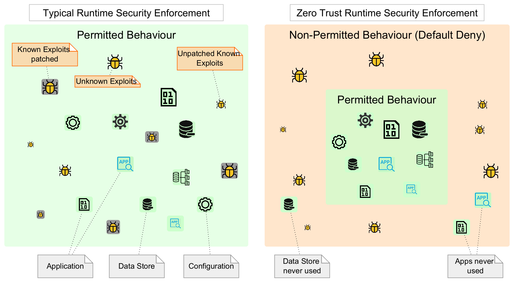

# Least Permissive Access (enforcing Zero Trust Posture)

KubeArmor helps organizations enforce a zero trust posture within their Kubernetes clusters. It allows users to define an allow-based policy that allows specific operations, and denies or audits all other operations. This helps to ensure that only authorized activities are allowed within the cluster, and that any deviations from the expected behavior are denied and flagged for further investigation.

By implementing a zero trust posture with KubeArmor, organizations can increase their security posture and reduce the risk of unauthorized access or activity within their Kubernetes clusters. This can help to protect sensitive data, prevent system breaches, and maintain the integrity of the cluster.

KubeArmor supports allow-based policies which results in specific actions to be allowed and denying/auditing everything else. For example, a specific pod/container might only invoke a set of binaries at runtime. As part of allow-based rules you can specify the set of processes that are allowed and everything else is either audited or denied based on the [default security posture](default_posture.md).



## Allow execution of only specific processes within the pod

1. Install the nginx deployment using
	* `kubectl create deployment nginx --image=nginx`.
2. Set the default security posture to default-deny.
	* `kubectl annotate ns default kubearmor-file-posture=block --overwrite`
3. Apply the following policy:

```
cat <<EOF | kubectl apply -f -
apiVersion: security.kubearmor.com/v1
kind: KubeArmorPolicy
metadata:
  name: only-allow-nginx-exec
spec:
  selector:
    matchLabels:
      app: nginx
  file:
    matchDirectories:
    - dir: /
      recursive: true  
  process:
    matchPaths:
    - path: /usr/sbin/nginx
    - path: /bin/bash
  action:
    Allow
EOF
```
Observe that the policy contains Allow action. Once there is any KubeArmor policy having Allow action then the pods enter least permissive mode, allowing only explicitly allowed operations.

> Note: Use kubectl port-forward $POD --address 0.0.0.0 8080:80 to access nginx and you can see that the nginx web access still works normally.

Lets try to execute some other processes:

```
kubectl exec -it $POD -- bash -c "chroot"
```

This would be permission denied.

## Challenges with maintaining Zero Trust Security Posture

Achieving Zero Trust Security Posture is difficult. However, the more difficult part is to maintain the Zero Trust posture across application updates. There is also a risk of application downtime if the security posture is not correctly identified. While KubeArmor provides a way to enforce Zero Trust Security Posture, identifying the policies/rules for achieving this is non-trivial and requires that you keep the policies in dry-run mode (or default audit mode) before using the default-deny mode.

KubeArmor provides framework so as to smoothen the journey to Zero Trust posture. For e.g., it is possible to set dry-run/audit mode at the namespace level by [configuring security posture](default_posture.md). Thus, you can have different namespaces in different default security posture modes (default-deny vs default-audit). Users can switch to default-deny mode once they are comfortable (i.e., they do not see any alerts) with the settings.
