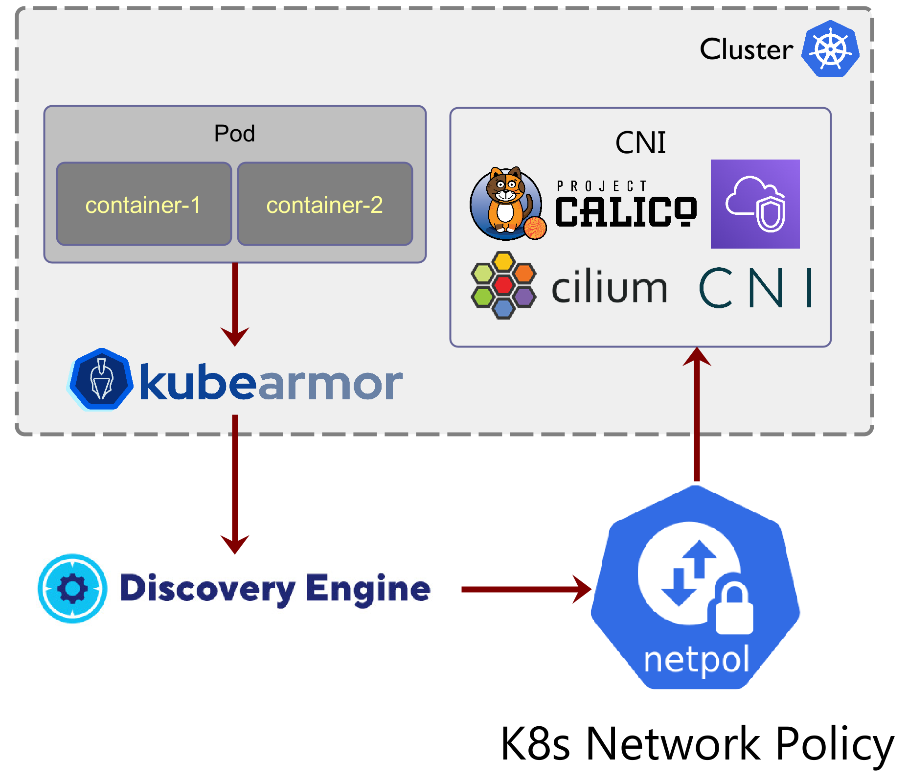

# Network Segmentation using KubeArmor

In Kubernetes, the [network policy resource](https://kubernetes.io/docs/concepts/services-networking/network-policies/) is a set of network traffic rules that are applied to a group of pods in a Kubernetes cluster. The network policy specifies how a pod is allowed to communicate with others. Network policy controllers (running as pods in the Kubernetes cluster) convert the requirements and restrictions of the network policies that are retrieved from the Kubernetes API into the network infrastructure.

KubeArmor has visibility into the network connections made into or from the pods. It has visibility across socket(), bind(), connect(), accept() calls. KubeArmor along with the [discovery-engine](https://github.com/kubearmor/discovery-engine/) could now auto-generate [k8s network policy](https://kubernetes.io/docs/concepts/services-networking/network-policies/) which are enforceable using most of the k8s CNIs (Container Network Interface). Note that the discovered policies use k8s abstractions for identifying services, deployments, and pods such as k8s labels, namespaces.

This release allows kubearmor and discovery-engine to do automatic network microsegmentation by detecting the network connections and creating appropriate network policies based on it. These auto-generated network policies are enforceable using any CNI that supports k8s network policy namely, Cilium, Calico, AWS VPC CNI, Weave.



## Generating network policies

Pre-requisites:
1. Install KubeArmor
	* `curl -sfL http://get.kubearmor.io/ | sudo sh -s -- -b /usr/local/bin && karmor install`
2. Install [Discovery-engine](https://github.com/kubearmor/discovery-engine)
	* `kubectl apply -f https://raw.githubusercontent.com/kubearmor/discovery-engine/dev/deployments/k8s/deployment.yaml`
3. Next you install the workload. If the workload is already installed, then the behavior will be shown based on the new system events only.
4. Get the application summary
	* `karmor discover -n NAMESPACE`

## Sample generated network policies

```
❯ karmor discover -n dvwa -f yaml -p NetworkPolicy
```

```yaml
apiVersion: networking.k8s.io/v1
kind: NetworkPolicy
metadata:
  name: autopol-ingress-igpxzbfksonhbya
  namespace: dvwa
spec:
  ingress:
  - from:
    - podSelector:
        matchLabels:
          app: dvwa-web
          tier: frontend
    ports:
    - port: 3306
      protocol: TCP
  podSelector:
    matchLabels:
      app: dvwa-mysql
      tier: backend
  policyTypes:
  - Ingress
---
apiVersion: networking.k8s.io/v1
kind: NetworkPolicy
metadata:
  name: autopol-egress-wjvlkuprwuwgera
  namespace: dvwa
spec:
  egress:
  - ports:
    - protocol: UDP
  - ports:
    - port: 3306
      protocol: TCP
    to:
    - podSelector:
        matchLabels:
          app: dvwa-mysql
          tier: backend
  podSelector:
    matchLabels:
      app: dvwa-web
      tier: frontend
  policyTypes:
  - Egress
---
```

Highlights of network segmentation:
* Ability to generate k8s network policies without depending on the CNI.
* No inserting of iptables rules required at the host level. System call information is used to discover the policies.
* Generated k8s network policies are enforceable using any CNI that supports k8s network policies.

## FAQ: I use open source Calico, will I still be able to do network segmentation and apply discovered network policies?

Yes. Open source Calico does not provide visibility into network flows, however, KubeArmor leverages system call information to derive generic network policies that can be applied using open source Calico CNI.

