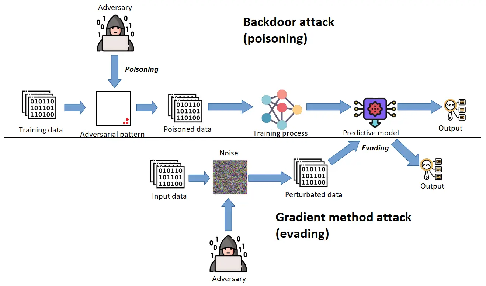
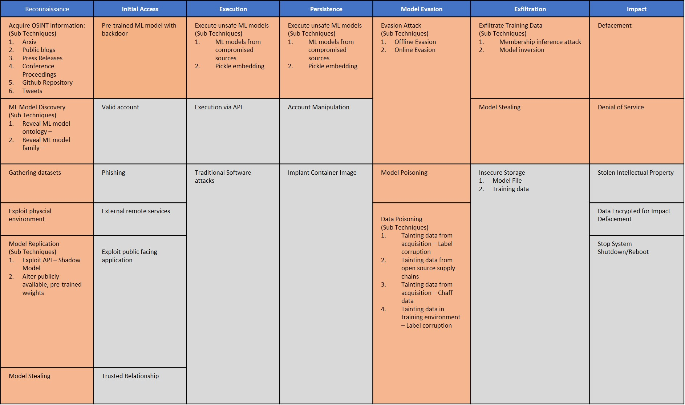

# **ModelArmor Use Case: Adversarial Attacks on Deep Learning Models**

Adversarial attacks exploit vulnerabilities in AI systems by subtly altering input data to mislead the model into incorrect predictions or decisions. These perturbations are often imperceptible to humans but can significantly degrade the system's performance.

## **Types of Adversarial Attacks**

1. **By Model Access:**
   - **White-box Attacks**: Complete knowledge of the model, including architecture and training data.
   - **Black-box Attacks**: No information about the model; the attacker probes responses to craft inputs.
2. **By Target Objective:**
   - **Non-targeted Attacks**: Push input to any incorrect class.
   - **Targeted Attacks**: Force input into a specific class.

## **Attack Phases**

1. **Training Phase Attacks:**
   - **Data Poisoning**: Injects malicious data into the training set, altering model behavior.
   - **Backdoor Attacks**: Embeds triggers in training data that activate specific responses during inference.
2. **Inference Phase Attacks:**
   - **Model Evasion**: Gradually perturbs input to skew predictions (e.g., targeted misclassification).
   - **Membership Inference**: Exploits model outputs to infer sensitive training data (e.g., credit card numbers).

## **Observations on Model Robustness**

Highly accurate models often exhibit reduced robustness against adversarial perturbations, creating a tradeoff between accuracy and security. For instance, Chen et al. found that better-performing models tend to be more sensitive to adversarial inputs.

## **Defense Strategies**

1. **Pre-analysis:** Test models for prompt injection vulnerabilities using techniques like fuzzing.
2. Input Sanitation:
   - **Validation**: Enforce strict input rules (e.g., character and data type checks).
   - **Filtering**: Strip malicious scripts or fragments.
   - **Encoding**: Convert special characters to safe representations.
3. Secure Practices for Model Deployment:
   - Restrict model permissions.
   - Regularly update libraries to patch vulnerabilities.
   - Detect injection attempts with specialized tooling.

## **Case Study: Pickle Injection Vulnerability**

Python's `pickle` module allows serialization and deserialization but lacks security checks. Attackers can exploit this to execute arbitrary code using crafted payloads. The module’s inherent insecurity makes it risky to use with untrusted inputs.

**Mitigation:**

- Avoid using `pickle` with untrusted sources.
- Use secure serialization libraries like `json` or `protobuf`.

## **Relevant Resources**

- [Adversarial Attacks on Deep Learning Models](https://arxiv.org/pdf/2308.14367)
- [How to Protect ML Models Against Adversarial Attacks](https://arxiv.org/pdf/2308.14367)
- [Weaponizing ML Models with Ransomware](https://arxiv.org/pdf/2308.14367)

---
