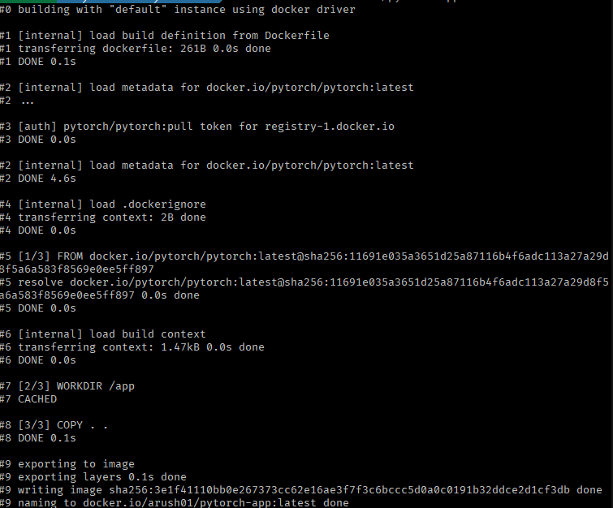
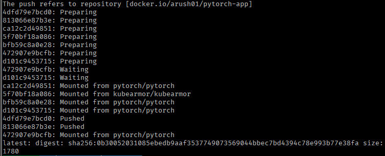
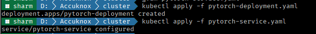
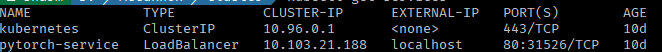
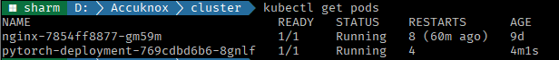
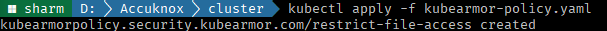

# **ModelArmor Use Case: Deploying a PyTorch Application with KubeArmor**

This guide demonstrates how to deploy a PyTorch application on Kubernetes and enhance its security using **KubeArmor** policies.

## Steps to Deploy

1. **Python Script**: Create a simple PyTorch training script (`app.py`) to train a neural network model:

   ```python
   import torch
   import torch.nn as nn
   import torch.optim as optim

   class SimpleNet(nn.Module):
       def __init__(self):
           super(SimpleNet, self).__init__()
           self.fc1 = nn.Linear(10, 50)
           self.fc2 = nn.Linear(50, 1)

       def forward(self, x):
           x = torch.relu(self.fc1(x))
           x = self.fc2(x)
           return x

   # Training process
   input_data = torch.randn(100, 10)
   target_data = torch.randn(100, 1)
   model = SimpleNet()
   criterion = nn.MSELoss()
   optimizer = optim.SGD(model.parameters(), lr=0.01)

   for epoch in range(100):
       optimizer.zero_grad()
       output = model(input_data)
       loss = criterion(output, target_data)
       loss.backward()
       optimizer.step()
       if (epoch + 1) % 10 == 0:
           print(f'Epoch [{epoch+1}/100], Loss: {loss.item():.4f}')

   print("Training complete")
   ```

2. **Dockerize the Application**: Use the following `Dockerfile` to containerize the script:

   ```dockerfile
   FROM pytorch/pytorch:latest
   WORKDIR /app
   COPY . .
   CMD ["python", "app.py"]
   ```

3. **Kubernetes Deployment**: Define the deployment configuration in `pytorch-deployment.yaml`:

   ```yaml
   apiVersion: apps/v1
   kind: Deployment
   metadata:
     name: pytorch-deployment
     labels:
       app: pytorch
   spec:
     replicas: 1
     selector:
       matchLabels:
         app: pytorch
     template:
       metadata:
         labels:
           app: pytorch
       spec:
         containers:
           - name: pytorch-container
             image: yourusername/pytorch-app:latest
             ports:
               - containerPort: 5000
   ```

4. **Service Configuration**: Expose the deployment using a LoadBalancer with `pytorch-service.yaml`:

   ```yaml
   apiVersion: v1
   kind: Service
   metadata:
     name: pytorch-service
   spec:
     selector:
       app: pytorch
     ports:
       - protocol: TCP
         port: 80
         targetPort: 5000
     type: LoadBalancer
   ```

5. **Build and Push Docker Image**:

   ```bash
   docker build -t yourusername/pytorch-app:latest .
   docker push yourusername/pytorch-app:latest
   ```





6. **Deploy on Kubernetes**:

```bash
kubectl apply -f pytorch-deployment.yaml
kubectl apply -f pytorch-service.yaml
```



`kubectl get deployments`


`kubectl get services`



`kubectl get pods`



7. **Implement KubeArmor Policy**: Secure the deployment by applying the following policy in `kubearmor-policy.yaml`:

   ```yaml
   apiVersion: security.kubearmor.com/v1
   kind: KubeArmorPolicy
   metadata:
     name: restrict-file-access
     namespace: default
   spec:
     selector:
       matchLabels:
         app: pytorch
     process:
       matchPaths:
         - path: /etc/shadow
           action: Block
         - path: /etc/passwd
           action: Block
     file:
       matchDirectories:
         - dir: /etc/
           recursive: true
           action: Audit
     action: Block
   ```

   Apply the policy:

   ```bash
   kubectl apply -f kubearmor-policy.yaml
   ```



## Key Takeaways

- This setup demonstrates how to deploy a PyTorch application using Kubernetes.
- KubeArmor enhances security by blocking unauthorized access to sensitive system files.
- The workflow includes containerization, deployment, service exposure, and runtime security enforcement.
