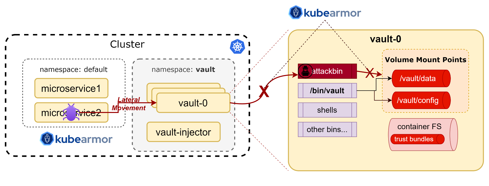

# HashiCorp Vault Hardening
HashiCorp Vault helps organizations reduce the risk of breaches and data exposure with identity-based security automation and encryption as a service. When HashiCorp Vault is deployed in the Kubernetes cluster, Customer secrets are kept in a persistent volume mounted in a vault-* stateful sets/pods

Usually on /bin/vault accesses this volume mount points to get the secrets stored. If any ransomware attacker gets access to these volume mount points then the secrets can be accessed by them.


**Ransomware Attacks on HashiCorp Vault:**

If any ransomware attacker tries to compromise the security of the pod and gets access to the vault pod, they can do a command injection and encrypt the secrets stored in the Volume mount points. Then the organizations have to pay millions of dollars to get back their secrets decrypted. This will be a major challenge that organizations want to protect.


**KubeArmor Protection:**

AccuKnox CNCF sandbox open-source project KubeArmor can prevent this type of attack even before it happens. KubeArmor uses the eBPF for observability and LSMs Like AppArmor, SELinux, and BPF-LSM for policy enforcement. Using the eBPF, KubeArmor monitors the workload default Security Posture and also gets the file, process, and network access that are happening in the pod.



Based on the default Security Posture of the workload, policies will be auto-generated with the help of Compliance frameworks like MITRE, NIST, and PCI DSS. Using KubeArmor we can apply policies to restrict malicious activities like remote code execution and command injection at the time of the attack. KubeArmor gives inline remediation so that attack is prevented at the runtime as and when it happens.

**Steps to prevent the attack:**

We can protect the vault application using KubeArmor with the help of the following policy

```sh
apiVersion: security.kubearmor.com/v1
kind: KubeArmorPolicy
metadata:
  name: ksp-vault-protect
  namespace: vault
spec:
  severity: 7
  selector:
    matchLabels:
      app.kubernetes.io/name: vault
      component: server
  file:
    matchDirectories:
      - dir: /vault/
        recursive: true
        action: Block
      - dir: /
        recursive: true
      - dir: /vault/
        recursive: true
        fromSource:
          - path: /bin/vault
  process:
    matchPaths:
    - path: /bin/busybox
    - path: /bin/vault
  action: Allow
```
The above KubeArmor policy

+ Allows only /bin/vault process to access /vault/ folder.

+ Allows execution of specific processes like

    + /bin/vault

    + /bin/vault-tool

**Before Applying policy:**

Before Applying the kubeArmor Policy any ransomware attacker who gains access to the shell or bash of the Vault can able to access the vault folder to get secret details.

```sh
@LAPTOP-9Q1ERBHE:~$ kubectl exec -it vault-0 -- sh
/ $ cd vault
/vault $ ls
config  data    file    logs
/vault $ cd data
/vault/data $ ls
core        logical     lost+found  sys
/vault/data $ cd core
/vault/data/core $ ls
_audit                  _local-audit            _mounts                 hsm
_auth                   _local-auth             _seal-config            new
_index-header-hmac-key  _local-mounts           _shamir-kek             versions
_keyring                _master                 cluster                 wrapping
/vault/data/core $ cat _local-mounts
{"Value":"AAAAAQJGUtoj8FDM88HKcWRHWy8r21q3jpv/flbuLyE92dKf4hxII8eI2YxFz2HAdqlhhu+h+XyC5MaL6mORxGZqzbZD0PcZr+Py9IYFw1q32Rn7WqgpoOwT28A0tmvNsErl3b2mp1VMDDqI4ELBM63iR/9pY44csG0WLn0fOr/O0+Xz/x3/+8X4h15FbpXimV5MMXP3AyFq26Op1KNfk7lPPK+kt2V4fRQSUucXbS/O2lTs4Fm3olHEbG/4PeifbT3HUXB+b03vSHcJWFALW5WqFsXiVAasW8eW7VpwC6kR4rNEDJlHldWMfgdsd7BHIwifLH7A+6OWdzy0Mh+aZb22nIWoeSo7YEf6z+7UwesopSDp/6zoSMYL0mjRsi2kGIneGbFQ/ynitLJw26FXUEtXHotpjUFOE3PhADyacybBQw0skBG4Zdcg2uCmiw=="}
/vault/data/core $
```

**Applying Policy:** 

we can apply the kubeArmor policy using the following command


@LAPTOP-9Q1ERBHE:~$ kubectl apply -f vault.yaml
kubearmorpolicy.security.kubearmor.com/ksp-vault-protect created
 

**After Applying Policy:** 

Now if try to access the  Volume mount point vault using the shell or bash of the vault pod the access will be denied as the KubeArmor policy denies the permission.

```sh
@LAPTOP-9Q1ERBHE:~$ kubectl exec -it vault-0 -- sh
/ $ cd vault
/vault $ cd data
/vault/data $ cd core
/vault/data/core $ cat _local-mounts
cat: can't open '_local-mounts': Permission denied
```

**Karmor logs:** 

```sh
== Alert / 2023-06-09 05:44:57.080955 ==
ClusterName: default
HostName: aks-agentpool-16128849-vmss000000
NamespaceName: default
PodName: vault-0
Labels: app.kubernetes.io/name=vault,component=server,helm.sh/chart=vault-0.24.1,statefulset.kubernetes.io/pod-name=vault-0,app.kubernetes.io/instance=vault
ContainerName: vault
ContainerID: 775fb27125ee8d9e2f34d6731fbf3bf677a1038f79fe8134856337612007d9ae
ContainerImage: docker.io/hashicorp/vault:1.13.1@sha256:b888abc3fc0529550d4a6c87884419e86b8cb736fe556e3e717a6bc50888b3b8
Type: MatchedPolicy
PolicyName: DefaultPosture
Source: /bin/cat _local-mounts
Resource: _local-mounts
Operation: File
Action: Block
Data: syscall=SYS_OPEN flags=O_RDONLY|O_LARGEFILE
Enforcer: eBPF Monitor
Result: Permission denied
HostPID: 1.89539e+06
HostPPID: 1.893654e+06
PID: 3.048504e+06
PPID: 3.048273e+06
ParentProcessName: /bin/busybox
ProcessName: /bin/busybox
```
This will save the Volume mount of the HashiCorp Vault to be accessed by any attacker and also it prevents the vault application from remote code execution.
