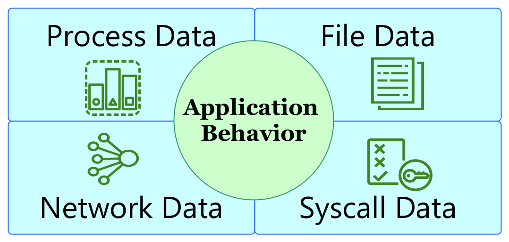
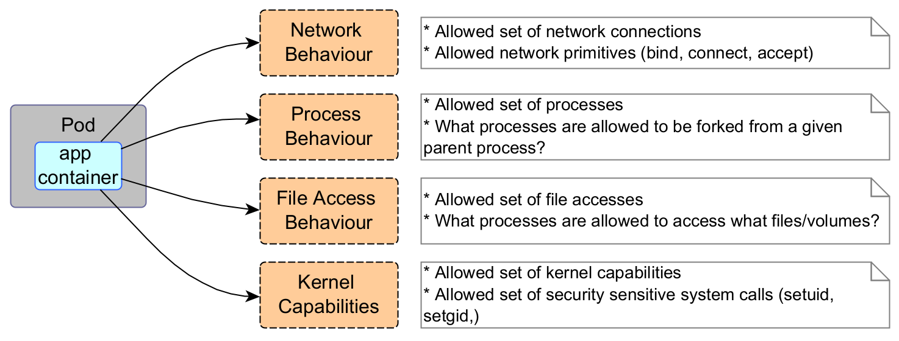

# Application Behavior/Summary

KubeArmor has visibility into systems and application behavior. KubeArmor
summarizes/aggregates the information and provides a user-friendly view to
figure out the application behavior.



## What application behavior is shown?



* *Process data*: 
	* What are the processes executing in the pods?
	* What processes are executing through which parent processes?
* *File data*: 
	* What are the file system accesses made by different processes?
* *Network Accesses*:
	* What are the Ingress/Egress connections from the pod?
	* What server binds are done in the pod?

## How to get the application behavior?

```
karmor logs -n default --json --logFilter all --operation process
```
Get visibility into process executions in `default` namespace.

```json
{
  "Timestamp": 1686491023,
  "UpdatedTime": "2023-06-11T13:43:43.289380Z",
  "ClusterName": "default",
  "HostName": "ip-172-31-24-142",              
  "NamespaceName": "default",                  
  "PodName": "nginx-8f458dc5b-fl42t",
  "Labels": "app=nginx",                                                                       
  "ContainerID": "8762eafc25a35ab90089f79703b86659989e8e547c2c029fb60f55d884355000",           
  "ContainerName": "nginx",            
  "ContainerImage": "docker.io/library/nginx:latest@sha256:af296b188c7b7df99ba960ca614439c99cb7cf252ed7bbc23e90cfda59092305",
  "ParentProcessName": "/x86_64-bottlerocket-linux-gnu/sys-root/usr/bin/runc",                 
  "ProcessName": "/bin/sh",
  "HostPPID": 3488352,                         
  "HostPID": 3488357,                          
  "PPID": 3488352,                             
  "PID": 832,                                  
  "Type": "ContainerLog",
  "Source": "/x86_64-bottlerocket-linux-gnu/sys-root/usr/bin/runc",                            
  "Operation": "Process",
  "Resource": "/bin/sh -c cat /run/secrets/kubernetes.io/serviceaccount/token",                
  "Data": "syscall=SYS_EXECVE",
  "Result": "Passed"                           
}                                              
{                                              
  "Timestamp": 1686491023,
  "UpdatedTime": "2023-06-11T13:43:43.291471Z",
  "ClusterName": "default",
  "HostName": "ip-172-31-24-142",
  "NamespaceName": "default",
  "PodName": "nginx-8f458dc5b-fl42t",
  "Labels": "app=nginx",
  "ContainerID": "8762eafc25a35ab90089f79703b86659989e8e547c2c029fb60f55d884355000",           
  "ContainerName": "nginx",
  "ContainerImage": "docker.io/library/nginx:latest@sha256:af296b188c7b7df99ba960ca614439c99cb7cf252ed7bbc23e90cfda59092305",
  "ParentProcessName": "/bin/dash",
  "ProcessName": "/bin/cat",
  "HostPPID": 3488357,                         
  "HostPID": 3488363,                          
  "PPID": 832,                                 
  "PID": 838,                                  
  "Type": "ContainerLog",
  "Source": "/bin/dash",
  "Operation": "Process",
  "Resource": "/bin/cat /run/secrets/kubernetes.io/serviceaccount/token",                      
  "Data": "syscall=SYS_EXECVE",
  "Result": "Passed"                           
}
```

