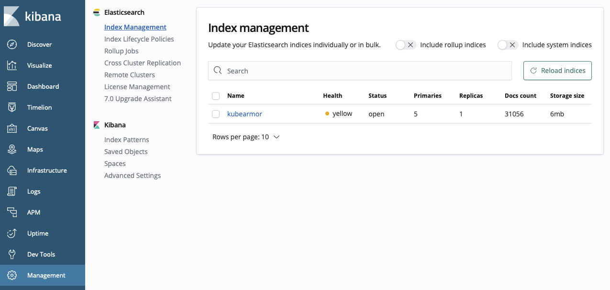
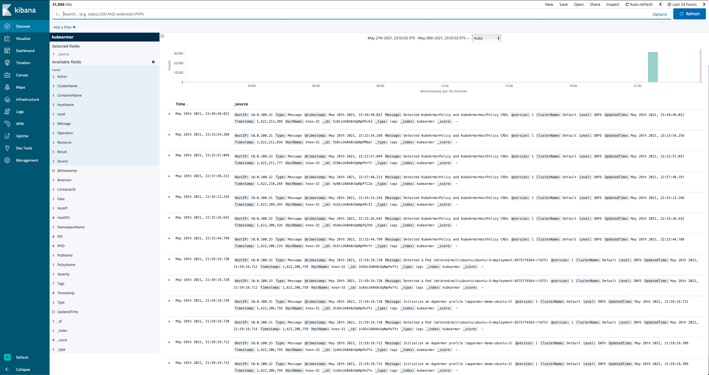
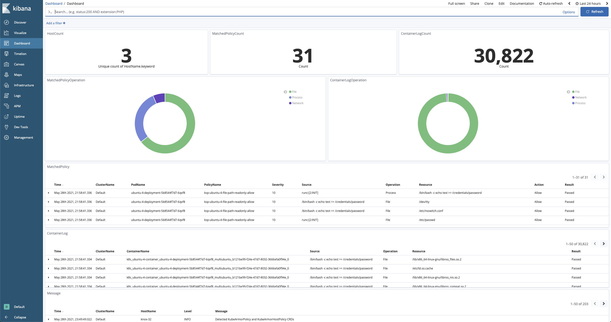

# Integration with ELK

KubeArmor provides a dashboard by integrating with Logstash + Elasticsearch + Kibana.

For this, KubeArmor, KafkaClient, and Kafka should be deployed.  
If you didn't set up KubeArmor's Kafka Client and the Kafka system, first follow the steps described in [KafkaClient Deployment](../KafkaClient/README.md).

If those are ready, you can deploy ELK now.

```
$ cd KafkaClient/deployments/ELK
(ELK) $ kubectl apply -f elasticsearch.yaml
(ELK) $ kubectl apply -f kibana.yaml
(ELK) $ kubectl apply -f logstash.yaml
```

It takes a couple of minutes. Wait for the completed deployments of those services.

# Kibana UI

Using your browser, you can access the Kibana UI.

```
http://[the IP address of one of the cluster nodes]:30561
```

If you just set up the ELK environment, wait until you see 'kubearmor' in [Management] - [Index Management].

If there is no log in KubeArmor, nothing might be shown in the Index Management. In that case, you can run KubeArmor's test script to generate some messages, alerts, and system logs.

```
$ cd tests
(tests) $ ./test-scenarios-in-runtime.sh
```



After you see 'kubearmor' in the Index Management, check the logs in [Discover].



Now, feel free to make your own dashboard.

