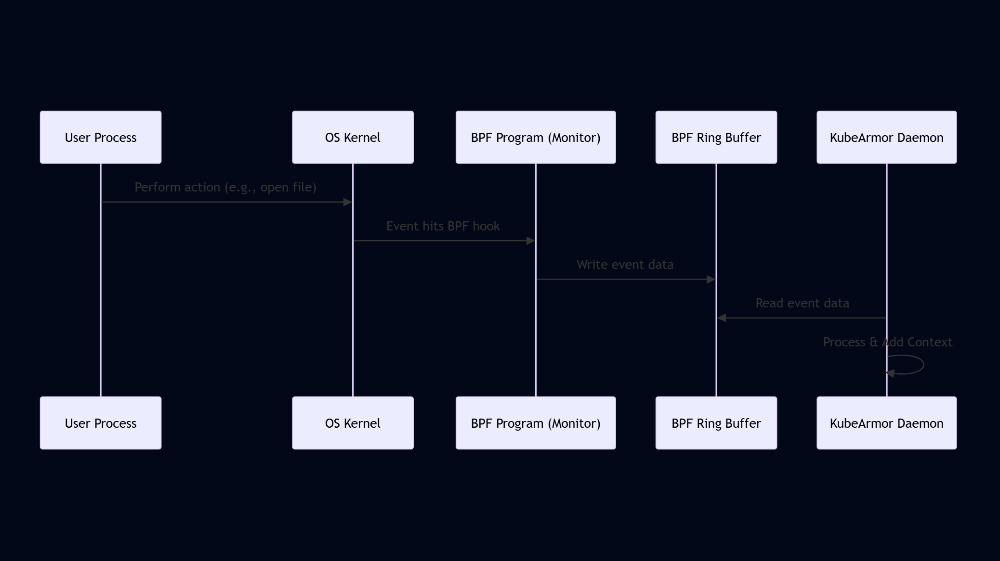
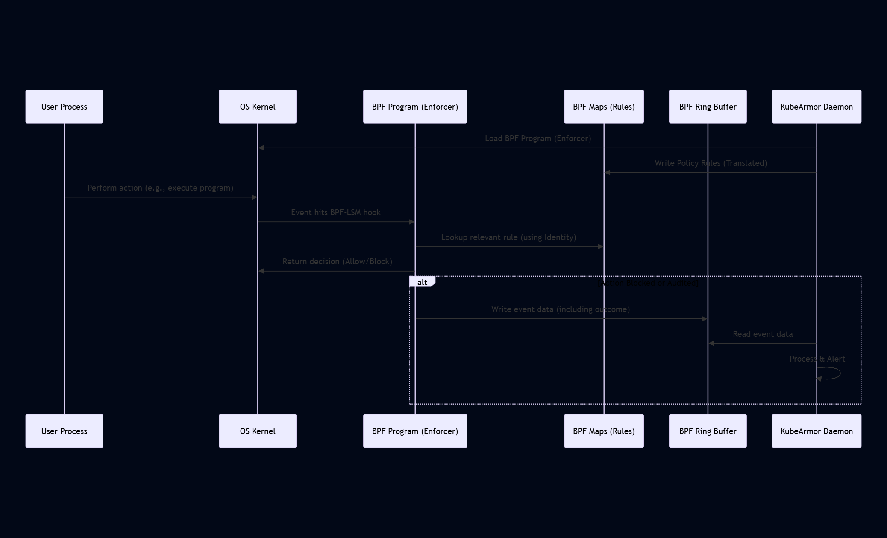

# Chapter 5: BPF (eBPF)

Welcome back to the KubeArmor tutorial! In the previous chapter, we explored the **System Monitor**, KubeArmor's eyes and ears inside the operating system, responsible for observing runtime events like file accesses, process executions, and network connections. We learned that the System Monitor uses a powerful kernel technology called **eBPF** to achieve this deep visibility with low overhead.

In this chapter, we'll take a closer look at **BPF (Extended Berkeley Packet Filter)**, or **eBPF** as it's more commonly known today. This technology isn't just used by the System Monitor; it's also a key enforcer type available to the Runtime Enforcer component in the form of BPF-LSM. Understanding eBPF is crucial to appreciating how KubeArmor works at a fundamental level within the Linux kernel.

## What is BPF (eBPF)?

Imagine the Linux kernel as the central operating system managing everything on your computer or server. Traditionally, if you wanted to add new monitoring, security, or networking features deep inside the kernel, you had to write C code, compile it as a kernel module, and load it. This is risky because bugs in kernel modules can crash the entire system.

**eBPF** provides a safer, more flexible way to extend kernel functionality. Think of it as a miniature, highly efficient virtual machine running _inside_ the kernel. It allows you to write small programs that can be loaded into the kernel and attached to specific "hooks" (points where interesting events happen).

Here's the magic:

- **Safe:** eBPF programs are verified by a kernel component called the "verifier" before they are loaded. The verifier ensures the program won't crash the kernel, hang, or access unauthorized memory.
- **Performant:** eBPF programs run directly in the kernel's execution context when an event hits their hook. They are compiled into native machine code for the processor using a "Just-In-Time" (JIT) compiler, making them very fast.
- **Flexible:** They can be attached to various hooks for monitoring or enforcement, including system calls, network events, tracepoints, and even Linux Security Module (LSM) hooks.
- **Data Sharing:** eBPF programs can interact with user-space programs (like the KubeArmor Daemon) and other eBPF programs using shared data structures called **BPF Maps**.

## Why KubeArmor Uses BPF (eBPF)

KubeArmor needs to operate deep within the operating system to provide effective runtime security for containers and nodes. It needs to:

1.  **See Everything:** Monitor low-level system calls and kernel events across different container namespaces (Container/Node Identity).
2.  **Act Decisively:** Enforce security policies by blocking forbidden actions _before_ they can harm the system.
3.  **Do it Efficiently:** Minimize the performance impact on your applications.

eBPF is the perfect technology for this:

- **Deep Visibility:** By attaching eBPF programs to kernel hooks, KubeArmor's System Monitor gets high-fidelity data about system activities as they happen.
- **High-Performance Enforcement:** When used as a Runtime Enforcer via BPF-LSM, eBPF programs can quickly check policies against events directly within the kernel, blocking actions instantly without the need to switch back and forth between kernel and user space for every decision.
- **Low Overhead:** eBPF's efficiency means it adds minimal latency to system calls compared to older kernel security mechanisms or relying purely on user-space monitoring.
- **Kernel Safety:** KubeArmor can extend kernel behavior for security without the risks associated with traditional kernel modules.

## BPF in Action: Monitoring and Enforcement

Let's look at how BPF powers both sides of KubeArmor's runtime protection:

### 1. BPF for Monitoring (The System Monitor)

As we saw in Chapter 4, the System Monitor observes events. This is primarily done using eBPF.

- **How it works:** Small eBPF programs are attached to kernel hooks related to file, process, network, etc., events. When an event triggers a hook, the eBPF program runs. It collects relevant data (like the path, process ID, Namespace IDs) and writes this data into a special shared memory area called a **BPF Ring Buffer**.
- **Getting Data to KubeArmor:** The KubeArmor Daemon (KubeArmor Daemon) in user space continuously reads events from this BPF Ring Buffer.
- **Context:** The daemon uses the Namespace IDs from the event data to correlate it with the specific container or node (Container/Node Identity) before processing and sending the alert via the Log Feeder.

Simplified view of monitoring data flow:



This shows the efficient flow: the kernel triggers a BPF program, which quickly logs data to a buffer that KubeArmor reads asynchronously.

Let's revisit a simplified code concept for the BPF monitoring program side (C code compiled to BPF):

```c
// Simplified BPF C code for monitoring (part of system_monitor.c)

struct event {
  u64 ts;
  u32 pid_id; // PID Namespace ID
  u32 mnt_id; // Mount Namespace ID
  u32 event_id; // Type of event
  char comm[16]; // Process name
  char path[256]; // File path or network info
};

// Define a BPF map of type RINGBUF for sending events to user space
struct {
  __uint(type, BPF_MAP_TYPE_RINGBUF);
  __uint(max_entries, 1 << 24);
} kubearmor_events SEC(".maps"); // This name is referenced in Go code

SEC("kprobe/sys_enter_openat") // Attach to the openat syscall entry
int kprobe__sys_enter_openat(struct pt_regs *ctx) {
  struct event *task_info;

  // Reserve space in the ring buffer
  task_info = bpf_ringbuf_reserve(&kubearmor_events, sizeof(*task_info), 0);
  if (!task_info)
    return 0; // Could not reserve space, drop event

  // Populate the event data
  task_info->ts = bpf_ktime_get_ns();
  struct task_struct *task = (struct task_struct *)bpf_get_current_task();
  task_info->pid_id = get_task_pid_ns_id(task); // Helper to get NS ID
  task_info->mnt_id = get_task_mnt_ns_id(task); // Helper to get NS ID
  task_info->event_id = 1; // Example: 1 for file open
  bpf_get_current_comm(&task_info->comm, sizeof(task_info->comm));

  // Get path argument (simplified greatly)
  // Note: Real BPF code needs careful handling of user space pointers
  const char *pathname = (const char *)PT_REGS_PARM2(ctx);
  bpf_probe_read_str(task_info->path, sizeof(task_info->path), pathname);

  // Submit the event to the ring buffer
  bpf_ringbuf_submit(task_info, 0);
  return 0;
}
```

**Explanation:**

- `struct event`: Defines the structure of the data sent for each event.
- `kubearmor_events`: Defines a BPF map of type `RINGBUF`. This is the channel for kernel -> user space communication.
- `SEC("kprobe/sys_enter_openat")`: Specifies where this program attaches - at the entry of the `openat` system call.
- `bpf_ringbuf_reserve`: Allocates space in the ring buffer for a new event.
- `bpf_ktime_get_ns`, `bpf_get_current_task`, `bpf_get_current_comm`, `bpf_probe_read_str`: BPF helper functions used to get data from the kernel context (timestamp, task info, command name, string from user space).
- `bpf_ringbuf_submit`: Sends the prepared event data to the ring buffer.

On the Go side, KubeArmor's System Monitor uses the `cilium/ebpf` library to load this BPF object file and read from the `kubearmor_events` map (the ring buffer).

```go
// Simplified Go code for reading BPF events (part of systemMonitor.go)

// systemMonitor Structure (relevant parts)
type SystemMonitor struct {
    // ... other fields ...
    SyscallPerfMap *perf.Reader // Represents the connection to the ring buffer
    // ... other fields ...
}

// Function to load BPF objects and start reading
func (mon *SystemMonitor) StartBPFMonitoring() error {
    // Load the compiled BPF code (.o file)
    objs := &monitorObjects{} // monitorObjects corresponds to maps and programs in the BPF .o file
    if err := loadMonitorObjects(objs, nil); err != nil {
        return fmt.Errorf("failed to load BPF objects: %w", err)
    }
    // mon.bpfObjects = objs // Store loaded objects (simplified)

    // Open the BPF ring buffer map for reading
    // "kubearmor_events" matches the map name in the BPF C code
    rd, err := perf.NewReader(objs.KubearmorEvents, os.Getpagesize())
    if err != nil {
        objs.Close() // Clean up loaded objects
        return fmt.Errorf("failed to create BPF ring buffer reader: %w", err)
    }
    mon.SyscallPerfMap = rd // Store the reader

    // Start a goroutine to read events from the buffer
    go mon.readEvents()

    // ... Attach BPF programs to hooks (simplified out) ...

    return nil
}

// Goroutine function to read events
func (mon *SystemMonitor) readEvents() {
    for {
        record, err := mon.SyscallPerfMap.Read() // Read a raw event from the kernel
        if err != nil {
            // ... error handling, check if reader was closed ...
            return
        }

        // Process the raw event data (parse bytes, add context)
        // As shown in Chapter 4 context:
        // dataBuff := bytes.NewBuffer(record.RawSample)
        // ctx, err := readContextFromBuff(dataBuff) // Parses struct event
        // ... lookup containerID using ctx.PidID, ctx.MntID ...
        // ... format and send event for logging ...
    }
}
```

**Explanation:**

- `loadMonitorObjects`: Loads the compiled BPF program and map definitions from the `.o` file.
- `perf.NewReader(objs.KubearmorEvents, ...)`: Opens a reader for the specific BPF map named `kubearmor_events` defined in the BPF code. This map is configured as a ring buffer.
- `mon.SyscallPerfMap.Read()`: Blocks until an event is available in the ring buffer, then reads the raw bytes sent by the BPF program.
- The rest of the `readEvents` function (simplified out, but hinted at in Chapter 4 context) involves parsing these bytes back into a struct, looking up the container/node identity, and processing the event.

This demonstrates how BPF allows a low-overhead kernel component (the BPF program writing to the ring buffer) and a user-space component (KubeArmor Daemon reading from the buffer) to communicate efficiently.

### 2. BPF for Enforcement (BPF-LSM Enforcer)

When KubeArmor is configured to use the BPF-LSM Runtime Enforcer, BPF programs are used not just for monitoring, but for making enforcement decisions _in the kernel_.

- **How it works:** BPF programs are attached to Linux Security Module (LSM) hooks. These hooks are specifically designed points in the kernel where security decisions are made (e.g., before a file is opened, before a program is executed, before a capability is used).
- **Policy Rules in BPF Maps:** KubeArmor translates its Security Policies into a format optimized for quick lookup and stores these rules in **BPF Maps**. There might be nested maps where an outer map is keyed by Namespace IDs (Container/Node Identity) and inner maps store rules specific to paths, processes, etc., for that workload.
- **Decision Making:** When an event triggers a BPF-LSM hook, the attached eBPF program runs. It uses the current process's Namespace IDs to look up the relevant policy rules in the BPF maps. Based on the rule found (or the default posture if no specific rule matches), the BPF program returns a value to the kernel indicating whether the action should be allowed (0) or blocked (`-EPERM`, which is kernel speak for "Permission denied").
- **Event Reporting:** Even when an action is blocked, the BPF-LSM program (or a separate monitoring BPF program) will often still send an event to the ring buffer so KubeArmor can log the blocked attempt.

Simplified view of BPF-LSM enforcement flow:



This diagram shows the pre-configuration step (KubeArmor loading the program and rules) and then the fast, kernel-internal decision path when an event occurs.

Let's revisit a simplified BPF C code concept for enforcement (part of enforcer.bpf.c):

```c
// Simplified BPF C code for enforcement (part of enforcer.bpf.c)

// Outer map: PidNS+MntNS -> reference to inner map (simplified to u32 for demo)
struct outer_key {
  u32 pid_ns;
  u32 mnt_ns;
};
struct {
  __uint(type, BPF_MAP_TYPE_HASH_OF_MAPS); // Or HASH, simplified
  __uint(max_entries, 256);
  __type(key, struct outer_key);
  __type(value, u32); // In reality, this points to an inner map
  __uint(pinning, LIBBPF_PIN_BY_NAME);
} kubearmor_containers SEC(".maps"); // Matches map name in Go code

// Inner map (concept): Path -> Rule
struct data_t {
  u8 processmask; // Flags like RULE_EXEC, RULE_DENY
};
// Inner maps are created/managed by KubeArmor in user space

SEC("lsm/bprm_check_security") // Attach to LSM hook for program execution
int BPF_PROG(enforce_proc, struct linux_binprm *bprm, int ret) {
  struct task_struct *t = (struct task_struct *)bpf_get_current_task();
  struct outer_key okey;
  get_outer_key(&okey, t); // Helper to get PidNS+MntNS

  // Look up the container's rules map using Namespace IDs
  u32 *inner_map_fd = bpf_map_lookup_elem(&kubearmor_containers, &okey);

  if (!inner_map_fd) {
    return ret; // No rules for this container, allow by default
  }

  // Get the program's path (simplified)
  struct path f_path = BPF_CORE_READ(bprm->file, f_path);
  char path[256];
  // Simplified path reading logic...
  bpf_probe_read_str(path, sizeof(path), /* path pointer */);

  // Look up the rule for this path in the inner map (conceptually)
  // struct data_t *rule = bpf_map_lookup_elem(inner_map_fd, &path); // Conceptually

  struct data_t *rule = /* Simplified: simulate lookup */ NULL; // Replace with actual map lookup

  // Decision logic based on rule and event type (BPF_CORE_READ bprm->file access mode)
  if (rule && (rule->processmask & RULE_EXEC)) {
      if (rule->processmask & RULE_DENY) {
          // Match found and action is DENY, block the execution
          // Report event (simplified out)
          return -EPERM; // Block
      }
      // Match found and action is ALLOW (or AUDIT), allow execution
      // Report event (if AUDIT) (simplified out)
      return ret; // Allow
  }

  // No specific DENY rule matched. Check default posture (simplified)
  u32 default_posture = /* Look up default posture in another map */ 0; // 0 for Allow

  if (default_posture == BLOCK_POSTURE) {
      // Default is BLOCK, block the execution
      // Report event (simplified out)
      return -EPERM; // Block
  }

  return ret; // Default is ALLOW or no default, allow
}
```

**Explanation:**

- `struct outer_key`: Defines the key structure for the outer map (`kubearmor_containers`), using `pid_ns` and `mnt_ns` from the process's identity.
- `kubearmor_containers`: A BPF map storing references to other maps (or rule data directly in simpler cases), allowing rules to be organized per container/namespace.
- `SEC("lsm/bprm_check_security")`: Attaches this program to the LSM hook that is called before a new program is executed.
- `BPF_PROG(...)`: Macro defining the BPF program function.
- `get_outer_key`: Helper function to get the Namespace IDs for the current task.
- `bpf_map_lookup_elem(&kubearmor_containers, &okey)`: Looks up the map (or data) associated with the current process's namespace IDs.
- The core logic involves reading event data (like the program path), looking up the corresponding rule in the BPF maps, and returning `0` to allow or `-EPERM` to block, based on the rule's `action` flag (`RULE_DENY`).
- Events are also reported to the ring buffer (`kubearmor_events`) for logging, similar to the monitoring path.

On the Go side, the BPF-LSM Runtime Enforcer component loads these programs and, crucially, populates the BPF Maps with the translated policies.

```go
// Simplified Go code for loading BPF enforcement objects and populating maps (part of bpflsm/enforcer.go)

type BPFEnforcer struct {
    // ... other fields ...
    objs enforcerObjects // Holds loaded BPF programs and maps
    // ... other fields ...
}

// NewBPFEnforcer Function (simplified)
func NewBPFEnforcer(...) (*BPFEnforcer, error) {
    be := &BPFEnforcer{}

    // Load the compiled BPF code (.o file) containing programs and map definitions
    objs := enforcerObjects{} // enforcerObjects corresponds to maps and programs in the BPF .o file
    if err := loadEnforcerObjects(&objs, nil); err != nil {
        return nil, fmt.Errorf("failed to load BPF objects: %w", err)
    }
    be.objs = objs // Store loaded objects

    // Attach programs to LSM hooks
    // The AttachLSM call links the BPF program to the kernel hook
    // be.objs.EnforceProc refers to the BPF program defined with SEC("lsm/bprm_check_security")
    link, err := link.AttachLSM(link.LSMOptions{Program: objs.EnforceProc})
    if err != nil {
        objs.Close()
        return nil, fmt.Errorf("failed to attach BPF program to LSM hook: %w", err)
    }
    // be.links = append(be.links, link) // Store link to manage it later (simplified)

    // Get references to the BPF maps defined in the C code
    // "kubearmor_containers" matches the map name in the BPF C code
    be.BPFContainerMap = objs.KubearmorContainers

    // ... Attach other programs (file, network, capabilities) ...
    // ... Setup ring buffer for alerts (like in monitoring) ...

    return be, nil
}

// AddContainerPolicies Function (simplified - conceptual)
func (be *BPFEnforcer) AddContainerPolicies(containerID string, pidns, mntns uint32, policies []tp.SecurityPolicy) error {
    // Translate KubeArmor policies (tp.SecurityPolicy) into a format
    // suitable for BPF map lookup (e.g., map of paths -> rule flags)
    // translatedRules := translatePoliciesToBPFRules(policies)

    // Create or get a reference to an inner map for this container (using BPF_MAP_TYPE_HASH_OF_MAPS)
    // The key for the outer map is the container's Namespace IDs
    outerKey := struct{ PidNS, MntNS uint32 }{pidns, mntns}

    // Conceptually:
    // innerMap, err := bpf.CreateMap(...) // Create inner map if it doesn't exist
    // err = be.BPFContainerMap.Update(outerKey, uint32(innerMap.FD()), ebpf.UpdateAny) // Link outer key to inner map FD

    // Populate the inner map with the translated rules
    // for path, ruleFlags := range translatedRules {
    //     ruleData := struct{ ProcessMask, FileMask uint8 }{...} // Map ruleFlags to data_t
    //     err = innerMap.Update(path, ruleData, ebpf.UpdateAny)
    // }

    // Simplified Update (directly indicating container exists with rules)
    containerMapValue := uint32(1) // Placeholder value
    if err := be.BPFContainerMap.Update(outerKey, containerMapValue, ebpf.UpdateAny); err != nil {
         return fmt.Errorf("failed to update BPF container map: %w", err)
    }


    be.Logger.Printf("Loaded BPF-LSM policies for container %s (pidns:%d, mntns:%d)", containerID, pidns, mntns)
    return nil
}
```

**Explanation:**

- `loadEnforcerObjects`: Loads the compiled BPF enforcement code.
- `link.AttachLSM`: Attaches a specific BPF program (`objs.EnforceProc`) to a named kernel LSM hook (`lsm/bprm_check_security`).
- `be.BPFContainerMap = objs.KubearmorContainers`: Gets a handle (reference) to the BPF map defined in the C code. This handle allows the Go program to interact with the map in the kernel.
- `AddContainerPolicies`: This conceptual function shows how KubeArmor translates high-level policies into a kernel-friendly format (e.g., flags like `RULE_DENY`, `RULE_EXEC`) and uses `BPFContainerMap.Update` to populate the maps. The Namespace IDs (`pidns`, `mntns`) are used as keys to ensure policies are applied to the correct container context.

This illustrates how KubeArmor uses user-space code to set up the BPF environment in the kernel, loading programs and populating maps. Once this is done, the BPF programs handle enforcement decisions directly within the kernel when events occur.

## BPF Components Overview

BPF technology involves several key components:

| Component        | Description                                                                 | Where it runs                                       | KubeArmor Usage                                                         |
| :--------------- | :-------------------------------------------------------------------------- | :-------------------------------------------------- | :---------------------------------------------------------------------- |
| **BPF Programs** | Small, safe programs written in a C-like language, compiled to BPF bytecode | Kernel                                              | Monitor events, Enforce policies at hooks                               |
| **BPF Hooks**    | Specific points in the kernel where BPF programs can be attached            | Kernel                                              | Entry/exit of syscalls, tracepoints, LSM hooks                          |
| **BPF Maps**     | Efficient key-value data structures for sharing data                        | Kernel (accessed by both kernel BPF and user space) | Store policy rules, Store event data (ring buffer), Store identity info |
| **BPF Verifier** | Kernel component that checks BPF programs for safety before loading         | Kernel                                              | Ensures KubeArmor's BPF programs are safe                               |
| **BPF JIT**      | Compiles BPF bytecode to native machine code for performance                | Kernel                                              | Makes KubeArmor's BPF operations fast                                   |
| **BPF Loader**   | User-space library/tool to compile C code, load programs/maps into kernel   | User Space                                          | KubeArmor Daemon uses `cilium/ebpf` library as loader                   |

## Conclusion

In this chapter, you've taken a deeper dive into BPF (eBPF), the powerful kernel technology that forms the backbone of KubeArmor's runtime security capabilities. You learned how eBPF enables KubeArmor to run small, safe, high-performance programs inside the kernel for both observing system events (System Monitor) and actively enforcing security policies at low level hooks (Runtime Enforcer via BPF-LSM). You saw how BPF Maps are used to share data and store policy rules efficiently in the kernel.

Understanding BPF highlights KubeArmor's modern, efficient approach to container and node security. In the next chapter, we'll bring together all the components we've discussed by looking at the central orchestrator on each node
