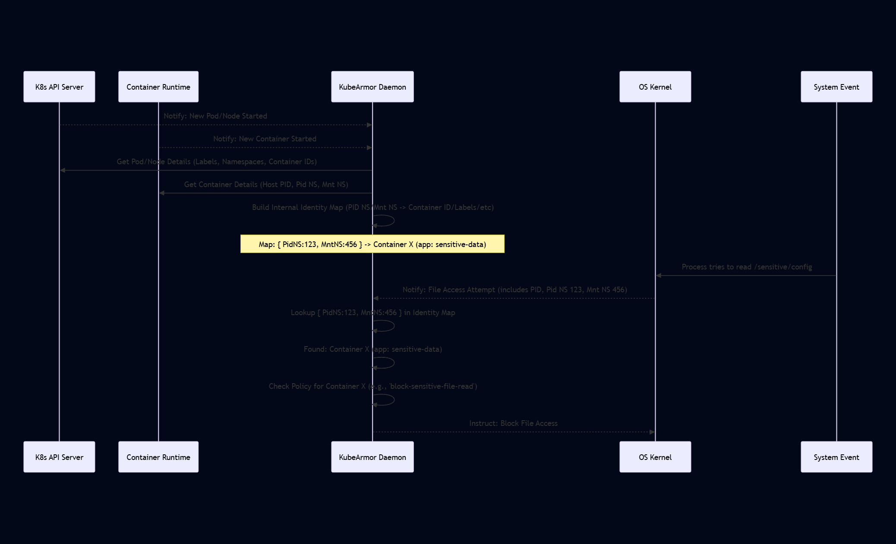

# Chapter 2: Container/Node Identity

Welcome back to the KubeArmor tutorial! In the previous chapter, we learned about KubeArmor's Security Policies (KSP, HSP, CSP) and how they define rules for what applications and processes are allowed or forbidden to do. We saw that these policies use **selectors** (like labels and namespaces) to tell KubeArmor _which_ containers, pods, or nodes they should apply to.

But how does KubeArmor know _which_ policy to apply when something actually happens, like a process trying to access a file? When an event occurs deep within the operating system (like a process accessing `/etc/shadow`), the system doesn't just say "a pod with label `app=my-web-app` did this". It provides low-level details like Process IDs (PID), Parent Process IDs (PPID), and Namespace IDs (like PID Namespace and Mount Namespace).

This is where the concept of **Container/Node Identity** comes in.

## What is Container/Node Identity?

Think of Container/Node Identity as KubeArmor's way of answering the question: "**Who** is doing this?".

When a system event happens on a node – maybe a process starts, a file is opened, or a network connection is attempted – KubeArmor intercepts this event. The event data includes technical details about the process that triggered it. KubeArmor needs to take these technical details and figure out if the process belongs to:

1.  A specific **Container** (which might be part of a Kubernetes Pod or a standalone Docker container).
2.  Or, the **Node** itself (the underlying Linux operating system, potentially running processes outside of containers).

Once KubeArmor knows _who_ is performing the action (the specific container or node), it can then look up the relevant security policies that apply to that identity and decide whether to allow, audit, or block the action.

## Why is Identity Important? A Simple Use Case

Imagine you have a KubeArmorPolicy (KSP) that says: "**Block** any attempt by containers with the label `app: sensitive-data` to read the file `/sensitive/config`.":

```yaml
# simplified KSP
apiVersion: security.kubearmor.com/v1
kind: KubeArmorPolicy
metadata:
  name: block-sensitive-file-read
  namespace: default
spec:
  selector:
    matchLabels:
      app: sensitive-data # Policy applies to containers/pods with this label
  file:
    matchPaths:
      - path: /sensitive/config # Specific file to protect
        readOnly: true # Protect against writes too, but let's focus on read
  action: Block # If read is attempted, block it
```

Now, suppose a process inside one of your containers tries to open `/sensitive/config`.

- **Without Identity:** KubeArmor might see an event like "Process with PID 1234 and Mount Namespace ID 5678 tried to read /sensitive/config". Without knowing _which container_ PID 1234 and MNT NS 5678 belong to, KubeArmor can't tell if this process is running in a container labeled `app: sensitive-data`. It wouldn't know which policy applies!
- **With Identity:** KubeArmor sees the event, looks up PID 1234 and MNT NS 5678 in its internal identity map, and discovers "Ah, that PID and Namespace belong to Container ID `abc123def456...` which is part of Pod `my-sensitive-pod-xyz` in namespace `default`, and that pod has the label `app: sensitive-data`." Now it knows this event originated from a workload targeted by the `block-sensitive-file-read` policy. It can then apply the `Block` action.

So, identifying the workload responsible for a system event is fundamental to enforcing policies correctly.

## How KubeArmor Identifies Workloads

KubeArmor runs as a DaemonSet on each node in your Kubernetes cluster (or directly on a standalone Linux server). This daemon is responsible for monitoring system activity on that specific node. To connect these low-level events to higher-level workload identities (like Pods or Nodes), KubeArmor does a few things:

1.  **Watching Kubernetes (for K8s environments):** The KubeArmor daemon watches the Kubernetes API Server for events related to Pods and Nodes. When a new Pod starts, KubeArmor gets its details:
    - Pod Name
    - Namespace Name
    - Labels (this is key for policy selectors!)
    - Container details (Container IDs, Image names)
    - Node Name where the Pod is scheduled.
      KubeArmor stores this information.
2.  **Interacting with Container Runtimes:** KubeArmor talks to the container runtime (like Docker or containerd) running on the node. It uses the Container ID (obtained from Kubernetes or by watching runtime events) to get more low-level details:
    - Container PID (the process ID of the main process inside the container as seen from the _host_ OS).
    - Container Namespace IDs (specifically the PID Namespace ID and Mount Namespace ID). These IDs are crucial because system events are often reported with these namespace identifiers.
3.  **Monitoring Host Processes:** KubeArmor also monitors processes running directly on the host node (outside of containers).

KubeArmor builds and maintains an internal map that links these low-level identifiers (like PID Namespace ID + Mount Namespace ID) to the corresponding higher-level identities (Container ID, Pod Name, Namespace, Node Name, Labels).

Let's visualize how this identity mapping happens and is used:



This diagram shows the two main phases:

1.  **Identity Discovery:** KubeArmor actively gathers information from Kubernetes and the container runtime to build its understanding of which system identifiers belong to which workloads.
2.  **Event Correlation:** When a system event occurs, KubeArmor uses the identifiers from the event (like Namespace IDs) to quickly look up the corresponding workload identity in its map.

## Looking at the Code (Simplified)

The KubeArmor code interacts with Kubernetes and Docker/containerd to get this identity information.

For Kubernetes environments, KubeArmor's `k8sHandler` watches for Pod and Node events:

```go
// KubeArmor/core/k8sHandler.go (Simplified)

// WatchK8sPods Function
func (kh *K8sHandler) WatchK8sPods(nodeName string) *http.Response {
	// ... code to build API request URL ...
	// The URL includes '?watch=true' to get a stream of events
	URL := "https://" + kh.K8sHost + ":" + kh.K8sPort + "/api/v1/pods?watch=true"

	// ... code to make HTTP request to K8s API server ...
	// Returns a response stream where KubeArmor reads events
	resp, err := kh.WatchClient.Do(req)
	if err != nil {
		return nil // Handle error
	}
	return resp
}

// ... similar functions exist to watch Nodes and Policies ...
```

This snippet shows that KubeArmor isn't passively waiting; it actively _watches_ the Kubernetes API for changes using standard Kubernetes watch mechanisms. When a Pod is added, updated, or deleted, KubeArmor receives an event and updates its internal state.

For Docker (and similar logic exists for containerd), KubeArmor's `dockerHandler` can inspect running containers to get detailed information:

```go
// KubeArmor/core/dockerHandler.go (Simplified)

// GetContainerInfo Function
func (dh *DockerHandler) GetContainerInfo(containerID string, OwnerInfo map[string]tp.PodOwner) (tp.Container, error) {
	if dh.DockerClient == nil {
		return tp.Container{}, errors.New("no docker client")
	}

	// Ask the Docker daemon for details about a specific container ID
	inspect, err := dh.DockerClient.ContainerInspect(context.Background(), containerID)
	if err != nil {
		return tp.Container{}, err // Handle error
	}

	container := tp.Container{}
	container.ContainerID = inspect.ID
	container.ContainerName = strings.TrimLeft(inspect.Name, "/")

	// Get Kubernetes specific labels if available (e.g., for Pod name, namespace)
	containerLabels := inspect.Config.Labels
	if val, ok := containerLabels["io.kubernetes.pod.namespace"]; ok {
		container.NamespaceName = val
	}
	if val, ok := containerLabels["io.kubernetes.pod.name"]; ok {
		container.EndPointName = val // In KubeArmor types, EndPoint often refers to a Pod or standalone Container
	}
    // ... get other details like image, apparmor profile, privileged status ...

	// Get the *host* PID of the container's main process
	pid := strconv.Itoa(inspect.State.Pid)

	// Read /proc/<host-pid>/ns/pid and /proc/<host-pid>/ns/mnt to get Namespace IDs
	if data, err := os.Readlink(filepath.Join(cfg.GlobalCfg.ProcFsMount, pid, "/ns/pid")); err == nil {
		fmt.Sscanf(data, "pid:[%d]\n", &container.PidNS)
	}
	if data, err := os.Readlink(filepath.Join(cfg.GlobalCfg.ProcFsMount, pid, "/ns/mnt")); err == nil {
		fmt.Sscanf(data, "mnt:[%d]\n", &container.MntNS)
	}

    // ... store labels, etc. ...

	return container, nil
}
```

This function is critical. It takes a `containerID` and retrieves its associated Namespace IDs (`PidNS`, `MntNS`) by reading special files in the `/proc` filesystem on the host, which link the host PID to the namespaces it belongs to. It also retrieves labels and other useful information directly from the container runtime's inspection data.

This collected identity information is stored internally. For example, the `SystemMonitor` component maintains a map (`NsMap`) to quickly look up a workload based on Namespace IDs:

```go
// KubeArmor/monitor/processTree.go (Simplified)

// NsKey Structure (used as map key)
type NsKey struct {
	PidNS uint32
	MntNS uint32
}

// LookupContainerID Function
// This function is used when an event comes in with PidNS and MntNS
func (mon *SystemMonitor) LookupContainerID(pidns, mntns uint32) string {
	key := NsKey{PidNS: pidns, MntNS: mntns}

	mon.NsMapLock.RLock() // Use read lock for looking up
	defer mon.NsMapLock.RUnlock()

	if val, ok := mon.NsMap[key]; ok {
		// If the key (Namespace IDs) is in the map, return the ContainerID
		return val
	}

	// Return empty string if not found (might be a host process)
	return ""
}

// AddContainerIDToNsMap Function
// This function is called when KubeArmor discovers a new container
func (mon *SystemMonitor) AddContainerIDToNsMap(containerID string, namespace string, pidns, mntns uint32) {
	key := NsKey{PidNS: pidns, MntNS: mntns}

	mon.NsMapLock.Lock() // Use write lock for modifying the map
	defer mon.NsMapLock.Unlock()

	// Store the mapping: Namespace IDs -> Container ID
	mon.NsMap[key] = containerID

    // ... also updates other maps related to namespaces and policies ...
}
```

These functions from `processTree.go` show how KubeArmor builds and uses the core identity mapping: it stores the relationship between Namespace IDs (found in system events) and the Container ID, allowing it to quickly identify which container generated an event.

## Identity Types Summary

KubeArmor primarily identifies workloads using the following:

| Workload Type | Key Identifiers Monitored/Used                                                  | Source of Information             |
| :------------ | :------------------------------------------------------------------------------ | :-------------------------------- |
| **Container** | Container ID, PID Namespace ID, Mount Namespace ID, Pod Name, Namespace, Labels | Kubernetes API, Container Runtime |
| **Node**      | Node Name, Node Labels, Operating System Info                                   | Kubernetes API, Host OS APIs      |

This allows KubeArmor to apply the correct security policies, whether they are KSPs (targeting Containers/Pods based on labels/namespaces) or HSPs (targeting Nodes based on node labels).

## Conclusion

Understanding Container/Node Identity is key to grasping how KubeArmor works. It's the crucial step where KubeArmor translates low-level system events into the context of your application workloads (containers in pods) or your infrastructure (nodes). By maintaining a map of system identifiers to workload identities, KubeArmor can accurately determine which policies apply to a given event and enforce your desired security posture.

In the next chapter, we'll look at the component that takes this identified event and the relevant policy and makes the decision to allow, audit, or block the action.
