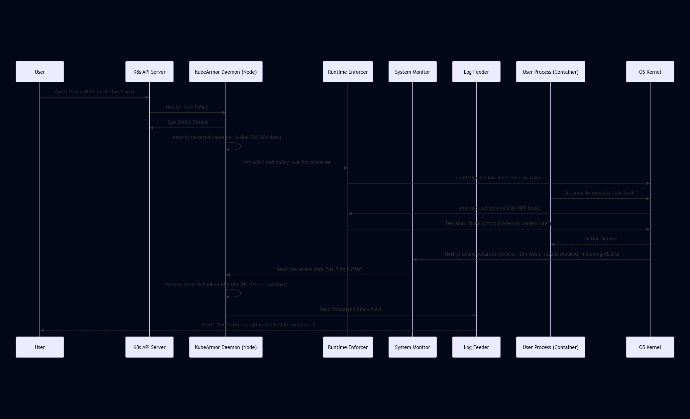

# Chapter 6: KubeArmor Daemon

Welcome back to the KubeArmor tutorial! In our journey so far, we've explored the key components that make KubeArmor work:

- Security Policies: Your rulebooks for security.
- Container/Node Identity: How KubeArmor knows _who_ is doing something.
- Runtime Enforcer: The component that translates policies into kernel rules and blocks forbidden actions.
- System Monitor: KubeArmor's eyes and ears, observing system events.
- BPF (eBPF): The powerful kernel technology powering much of the monitoring and enforcement.

In this chapter, we'll look at the **KubeArmor Daemon**. If the other components are like specialized tools or senses, the KubeArmor Daemon is the **central brain and orchestrator** that lives on each node. It brings all these pieces together, allowing KubeArmor to function as a unified security system.

## What is the KubeArmor Daemon?

The KubeArmor Daemon is the main program that runs on every node (Linux server) where you want KubeArmor to provide security. When you install KubeArmor, you typically deploy it as a DaemonSet in Kubernetes, ensuring one KubeArmor Daemon pod runs on each of your worker nodes. If you're using KubeArmor outside of Kubernetes (on a standalone Linux server or VM), the daemon runs directly as a system service.

Think of the KubeArmor Daemon as the **manager** for that specific node. Its responsibilities include:

- **Starting and stopping** all the other KubeArmor components (System Monitor, Runtime Enforcer, Log Feeder).
- **Communicating** with external systems like the Kubernetes API server or the container runtime (Docker, containerd, CRI-O) to get information about running workloads and policies.
- **Building and maintaining** the internal mapping for Container/Node Identity.
- **Fetching and processing** Security Policies (KSP, HSP, CSP) that apply to the workloads on its node.
- **Instructing** the Runtime Enforcer on which policies to load and enforce for specific containers and the host.
- **Receiving** security events and raw data from the System Monitor.
- **Adding context** (like identity) to raw events received from the monitor.
- **Forwarding** processed logs and alerts to the Log Feeder for external consumption.
- **Handling configuration changes** and responding to shutdown signals.

Without the Daemon, the individual components couldn't work together effectively to provide end-to-end security.

## Why is the Daemon Needed? A Coordinated Use Case

Let's trace the journey of a security policy and a system event, highlighting the Daemon's role.

Imagine you want to protect a specific container, say a database pod with label `app: my-database`, by blocking it from executing the `/bin/bash` command. You create a KubeArmor Policy (KSP) like this:

```yaml
# Simplified KSP
apiVersion: security.kubearmor.com/v1
kind: KubeArmorPolicy
metadata:
  name: block-bash-in-db
  namespace: default
spec:
  selector:
    matchLabels:
      app: my-database
  process:
    matchPaths:
      - path: /bin/bash
  action: Block
```

And let's say later, a process inside that database container actually attempts to run `/bin/bash`.

Here's how the KubeArmor Daemon on the node hosting that database pod orchestrates the process:

1.  **Policy Discovery:** The KubeArmor Daemon, which is watching the Kubernetes API server, detects your new `block-bash-in-db` policy.
2.  **Identify Targets:** The Daemon processes the policy's `selector` (`app: my-database`). It checks its internal state (built by talking to the Kubernetes API and container runtime) to find which running containers/pods on _its_ node match this label. It identifies the specific database container.
3.  **Prepare Enforcement:** The Daemon takes the policy rule (`Block /bin/bash`) and tells its **Runtime Enforcer** component to load this rule specifically for the identified database container. The Enforcer translates this into the format needed by the underlying OS security module (AppArmor, SELinux, or BPF-LSM) and loads it into the kernel.
4.  **System Event:** A process inside the database container tries to execute `/bin/bash`.
5.  **Event Detection & Enforcement:** The OS kernel intercepts this action. If using BPF-LSM, the **Runtime Enforcer**'s BPF program checks the loaded policy rules (which the Daemon put there). It sees the rule to `Block` `/bin/bash` for this container's identity. The action is immediately blocked by the kernel.
6.  **Event Monitoring & Context:** Simultaneously, the **System Monitor**'s BPF programs also detect the `exec` attempt on `/bin/bash`. It collects details like the process ID, the attempted command, and the process's Namespace IDs. It sends this raw data to the Daemon (via a BPF ring buffer).
7.  **Event Processing:** The Daemon receives the raw event from the Monitor. It uses the Namespace IDs to look up the Container/Node Identity in its internal map, identifying that this event came from the database container (`app: my-database`). It sees the event includes an error code indicating it was blocked by the security module.
8.  **Log Generation:** The Daemon formats a detailed log/alert message containing all the information: the event type (process execution), the command (`/bin/bash`), the outcome (Blocked), and the workload identity (container ID, Pod Name, Namespace, Labels).
9.  **Log Forwarding:** The Daemon sends this formatted log message to its **Log Feeder** component, which then forwards it to your configured logging/monitoring system.



This diagram illustrates how the Daemon acts as the central point, integrating information flow and control between external systems (K8s, CRI), the low-level kernel components (Monitor, Enforcer), and the logging/alerting system.

## The Daemon Structure

Let's look at the core structure representing the KubeArmor Daemon in the code. It holds references to all the components it manages and the data it needs.

Referencing `KubeArmor/core/kubeArmor.go`:

```go
// KubeArmorDaemon Structure (Simplified)
type KubeArmorDaemon struct {
	// node information
	Node     tp.Node
	NodeLock *sync.RWMutex

	// flag
	K8sEnabled bool

	// K8s pods, containers, endpoints, owner info
	// These map identity details collected from K8s/CRI
	K8sPods     []tp.K8sPod
	K8sPodsLock *sync.RWMutex
	Containers     map[string]tp.Container
	ContainersLock *sync.RWMutex
	EndPoints     []tp.EndPoint
	EndPointsLock *sync.RWMutex
	OwnerInfo map[string]tp.PodOwner

	// Security policies watched from K8s API
	SecurityPolicies     []tp.SecurityPolicy
	SecurityPoliciesLock *sync.RWMutex
	HostSecurityPolicies     []tp.HostSecurityPolicy
	HostSecurityPoliciesLock *sync.RWMutex

	// logger component
	Logger *fd.Feeder

	// system monitor component
	SystemMonitor *mon.SystemMonitor

	// runtime enforcer component
	RuntimeEnforcer *efc.RuntimeEnforcer

	// Used for managing background goroutines
	WgDaemon sync.WaitGroup

	// ... other fields for health checks, state agent, etc. ...
}
```

**Explanation:**

- The `KubeArmorDaemon` struct contains fields like `Node` (details about the node it runs on), `K8sEnabled` (whether it's in a K8s cluster), and maps/slices to store information about `K8sPods`, `Containers`, `EndPoints`, and parsed `SecurityPolicies`. Locks (`*sync.RWMutex`) are used to safely access this shared data from multiple parts of the Daemon's logic.
- Crucially, it has pointers to the other main components: `Logger`, `SystemMonitor`, and `RuntimeEnforcer`. This shows that the Daemon _owns_ and interacts with instances of these components.
- `WgDaemon` is a `sync.WaitGroup` used to track background processes (goroutines) started by the Daemon, allowing for a clean shutdown.

## Daemon Lifecycle: Initialization and Management

When KubeArmor starts on a node, the `KubeArmor()` function in `KubeArmor/main.go` (which calls into `KubeArmor/core/kubeArmor.go`) initializes and runs the Daemon.

Here's a simplified look at the initialization steps within the `KubeArmor()` function:

```go
// KubeArmor Function (Simplified)
func KubeArmor() {
	// create a daemon instance
	dm := NewKubeArmorDaemon()
	// dm is our KubeArmorDaemon object on this node

	// ... Node info setup (whether in K8s or standalone) ...

	// initialize log feeder component
	if !dm.InitLogger() {
		// handle error and destroy daemon
		return
	}
	dm.Logger.Print("Initialized KubeArmor Logger")

	// Start logger's background process to serve feeds
	go dm.ServeLogFeeds()

	// ... StateAgent, Health Server initialization ...

	// initialize system monitor component
	if cfg.GlobalCfg.Policy || cfg.GlobalCfg.HostPolicy { // Only if policy/hostpolicy is enabled
		if !dm.InitSystemMonitor() {
			// handle error and destroy daemon
			return
		}
		dm.Logger.Print("Initialized KubeArmor Monitor")

		// Start system monitor's background processes to trace events
		go dm.MonitorSystemEvents()

		// initialize runtime enforcer component
		// It receives the SystemMonitor instance because the BPF enforcer
		// might need info from the monitor (like pin paths)
		if !dm.InitRuntimeEnforcer(dm.SystemMonitor.PinPath) {
			dm.Logger.Print("Disabled KubeArmor Enforcer since No LSM is enabled")
		} else {
			dm.Logger.Print("Initialized KubeArmor Enforcer")
		}

		// ... Presets initialization ...
	}

	// ... K8s/CRI specific watching for Pods/Containers/Policies ...

	// wait for a while (initialization sync)

	// ... Policy and Pod watching (K8s specific) ...

	// listen for interrupt signals to trigger shutdown
	sigChan := GetOSSigChannel()
	<-sigChan // This line blocks until a signal is received

	// destroy the daemon (calls Close methods on components)
	dm.DestroyKubeArmorDaemon()
}

// NewKubeArmorDaemon Function (Simplified)
func NewKubeArmorDaemon() *KubeArmorDaemon {
	dm := new(KubeArmorDaemon)
	// Initialize maps, slices, locks, and component pointers to nil/empty
	dm.NodeLock = new(sync.RWMutex)
	dm.K8sPodsLock = new(sync.RWMutex)
	dm.ContainersLock = new(sync.RWMutex)
	dm.EndPointsLock = new(sync.RWMutex)
	dm.SecurityPoliciesLock = new(sync.RWMutex)
	dm.HostSecurityPoliciesLock = new(sync.RWMutex)
	dm.DefaultPosturesLock = new(sync.Mutex)
	dm.ActivePidMapLock = new(sync.RWMutex)
	dm.MonitorLock = new(sync.RWMutex)

	dm.Containers = map[string]tp.Container{}
	dm.EndPoints = []tp.EndPoint{}
	dm.OwnerInfo = map[string]tp.PodOwner{}
	dm.DefaultPostures = map[string]tp.DefaultPosture{}
	dm.ActiveHostPidMap = map[string]tp.PidMap{}
	// Pointers to components (Logger, Monitor, Enforcer) are initially nil
	return dm
}

// InitSystemMonitor Function (Called by Daemon)
func (dm *KubeArmorDaemon) InitSystemMonitor() bool {
    // Create a new SystemMonitor instance, passing it data it needs
	dm.SystemMonitor = mon.NewSystemMonitor(
        &dm.Node, &dm.NodeLock, // Node info
        dm.Logger, // Reference to the logger
        &dm.Containers, &dm.ContainersLock, // Container identity info
        &dm.ActiveHostPidMap, &dm.ActivePidMapLock, // Host process identity info
        &dm.MonitorLock, // Monitor's own lock
    )
	if dm.SystemMonitor == nil {
		return false
	}

    // Initialize BPF inside the monitor
	if err := dm.SystemMonitor.InitBPF(); err != nil {
		return false
	}
	return true
}

// InitRuntimeEnforcer Function (Called by Daemon)
func (dm *KubeArmorDaemon) InitRuntimeEnforcer(pinpath string) bool {
    // Create a new RuntimeEnforcer instance, passing it data/references
	dm.RuntimeEnforcer = efc.NewRuntimeEnforcer(
        dm.Node, // Node info
        pinpath, // BPF pin path from the monitor
        dm.Logger, // Reference to the logger
        dm.SystemMonitor, // Reference to the monitor (for BPF integration needs)
    )
	return dm.RuntimeEnforcer != nil
}
```

**Explanation:**

- `NewKubeArmorDaemon` is like the constructor; it creates the Daemon object and initializes its basic fields and locks. Pointers to components like `Logger`, `SystemMonitor`, `RuntimeEnforcer` are initially zeroed.
- The main `KubeArmor()` function then _calls_ dedicated `Init...` methods on the `dm` object (like `dm.InitLogger()`, `dm.InitSystemMonitor()`, `dm.InitRuntimeEnforcer()`).
- These `Init...` methods are responsible for creating the actual instances of the other components using their respective `New...` functions (e.g., `mon.NewSystemMonitor()`) and assigning the returned object to the Daemon's pointer field (`dm.SystemMonitor = ...`). They pass necessary configuration and references (like the `Logger`) to the components they initialize.
- After initializing components, the Daemon starts goroutines (using `go dm.SomeFunction()`) for tasks that need to run continuously in the background, like serving logs, monitoring system events, or watching external APIs.
- The main flow then typically waits for a shutdown signal (`<-sigChan`).
- When a signal is received, `dm.DestroyKubeArmorDaemon()` is called, which in turn calls `Close...` methods on the components to shut them down gracefully.

This demonstrates the Daemon's role in the lifecycle: it's the entity that brings the other parts to life, wires them together by passing references, starts their operations, and orchestrates their shutdown.

## Daemon as the Information Hub

The Daemon isn't just starting components; it's managing the flow of information:

1.  **Policies In:** The Daemon actively watches the Kubernetes API (or receives updates in non-K8s mode) for changes to KubeArmor policies. When it gets a policy, it stores it in its `SecurityPolicies` or `HostSecurityPolicies` lists and notifies the Runtime Enforcer to update the kernel rules for affected workloads.
2.  **Identity Management:** The Daemon watches Pod/Container/Node events from Kubernetes and the container runtime. It populates internal structures (like the `Containers` map) which are then used by the System Monitor to correlate raw kernel events with workload identity (Container/Node Identity). While the `NsMap` itself might live in the Monitor (as seen in Chapter 4 context), the Daemon is responsible for gathering the initial K8s/CRI data needed to _populate_ that map.
3.  **Events Up:** The System Monitor constantly reads raw event data from the kernel (via BPF ring buffer). It performs the initial lookup using the Namespace IDs and passes the enriched events (likely via Go channels, as hinted in Chapter 4 code) back _to_ the Daemon or a component managed by the Daemon (like the logging pipeline within the Feeder).
4.  **Logs Out:** The Daemon (or its logging pipeline) takes these enriched events and passes them to the Log Feeder component. The Log Feeder is then responsible for sending these logs/alerts to the configured output destinations.

The Daemon acts as the central switchboard, ensuring that policies are delivered to the enforcement layer, that kernel events are enriched with workload context, and that meaningful security logs and alerts are generated and sent out.

## Daemon Responsibilities Summary

| Responsibility           | What it Does                                                                                         | Interacts With                                                        |
| :----------------------- | :--------------------------------------------------------------------------------------------------- | :-------------------------------------------------------------------- |
| **Component Management** | Starts, stops, and manages the lifecycle of Monitor, Enforcer, Logger.                               | System Monitor, Runtime Enforcer, Log Feeder                          |
| **External Comm.**       | Watches K8s API for policies & workload info; interacts with CRI.                                    | Kubernetes API Server, Container Runtimes (Docker, containerd, CRI-O) |
| **Identity Building**    | Gathers data (Labels, Namespaces, Container IDs, PIDs, NS IDs) to map low-level events to workloads. | Kubernetes API Server, Container Runtimes, OS Kernel (`/proc`)        |
| **Policy Processing**    | Fetches policies, identifies targeted workloads on its node.                                         | Kubernetes API Server, Internal state (Identity)                      |
| **Enforcement Orchest.** | Tells the Runtime Enforcer which policies to load for which workload.                                | Runtime Enforcer, Internal state (Identity, Policies)                 |
| **Event Reception**      | Receives raw or partially processed events from the Monitor.                                         | System Monitor (via channels/buffers)                                 |
| **Event Enrichment**     | Adds full workload identity and policy context to incoming events.                                   | System Monitor, Internal state (Identity, Policies)                   |
| **Logging/Alerting**     | Formats events into structured logs/alerts and passes them to the Log Feeder.                        | Log Feeder, Internal state (Enriched Events)                          |
| **Configuration/Signal** | Reads configuration, handles graceful shutdown requests.                                             | Configuration files/API, OS Signals                                   |

This table reinforces that the Daemon is the crucial integration layer on each node.

## Conclusion

In this chapter, you learned that the KubeArmor Daemon is the core process running on each node, serving as the central orchestrator for all other KubeArmor components. It's responsible for initializing, managing, and coordinating the System Monitor (eyes/ears), Runtime Enforcer (security guard), and Log Feeder (reporter). You saw how it interacts with Kubernetes and container runtimes to understand Container/Node Identity and fetch Security Policies, bringing all the pieces together to enforce your security posture and report violations.

Understanding the Daemon's central role is key to seeing how KubeArmor operates as a cohesive system on each node. In the final chapter, we'll focus on where all the security events observed by the Daemon and its components end up
