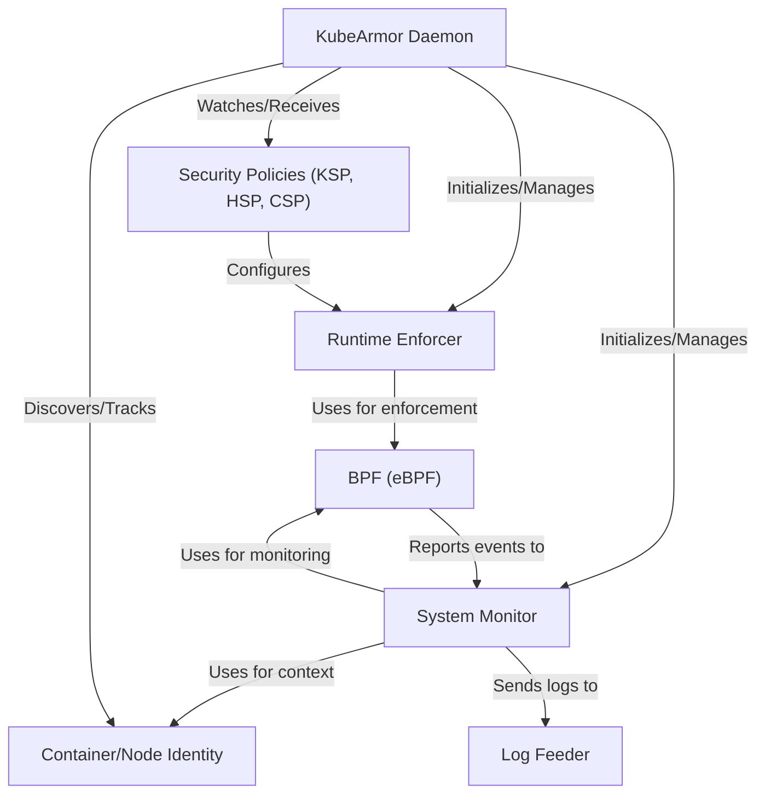

# Tutorial: KubeArmor

KubeArmor is a **runtime security enforcement system** for containers and nodes.
It uses _security policies_ (defined as Kubernetes Custom Resources like KSP, HSP, and CSP)
to define allowed, audited, or blocked actions for workloads.
The system _monitors system activity_ using kernel technologies such as eBPF
and enforces the defined policies by integrating with the underlying operating system's
security modules like AppArmor, SELinux, or BPF-LSM, sending security alerts
and telemetry through a log feeder.

## Visual Overview

