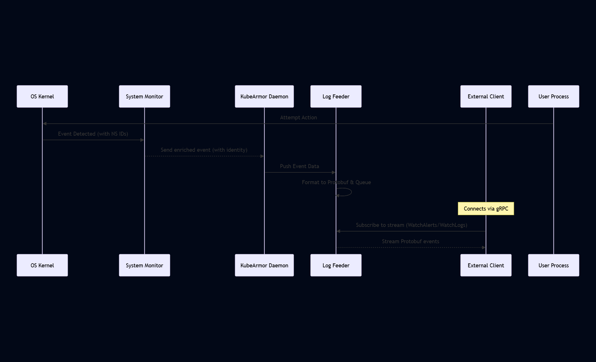

# Chapter 7: Log Feeder

Welcome back to the KubeArmor tutorial! In the previous chapters, we've learned how KubeArmor defines security rules using Security Policies, identifies workloads using Container/Node Identity, enforces policies with the Runtime Enforcer, and observes system activity with the System Monitor, all powered by the underlying BPF (eBPF) technology and orchestrated by the KubeArmor Daemon on each node.

We've discussed how KubeArmor can audit or block actions based on policies. But where do you actually _see_ the results of this monitoring and enforcement? How do you know when a policy was violated or when suspicious activity was detected?

This is where the **Log Feeder** comes in.

## What is the Log Feeder?

Think of the Log Feeder as KubeArmor's **reporting and alerting system**. Its primary job is to collect all the security-relevant events and telemetry that KubeArmor detects and make them available to you and other systems.

It receives structured information, including:

- **Security Alerts:** Notifications about actions that were audited or blocked because they violated a Security Policy.
- **System Logs:** Telemetry about system activities that KubeArmor is monitoring, even if no specific policy applies (e.g., process executions, file accesses, network connections, depending on visibility settings).
- **KubeArmor Messages:** Internal messages from the KubeArmor Daemon itself (useful for debugging and monitoring KubeArmor's status).

The Log Feeder formats this information into standardized messages (using **Protobuf**, a language-neutral, platform-neutral, extensible mechanism for serializing structured data) and sends it out over a **gRPC** interface. gRPC is a high-performance framework for inter-process communication.

This gRPC interface allows various clients to connect to the KubeArmor Daemon on each node and subscribe to streams of these security events in real-time. Tools like `karmor log` (part of the KubeArmor client tools) connect to this feeder to display events. External systems like Security Information and Event Management (SIEM) platforms can also integrate by writing clients that understand the KubeArmor gRPC format.

## Why is Log Feeding Important? Your Window into Security

You've deployed KubeArmor and applied policies. Now you need to answer questions like:

- Was that attempt to read `/etc/passwd` from the web server container actually blocked?
- Is any process on my host nodes trying to access sensitive files like `/root/.ssh`?
- Are my applications spawning unexpected shell processes, even if they aren't explicitly blocked by policy?
- Did KubeArmor successfully apply the policies I created?

The Log Feeder provides the answers by giving you a stream of events directly from KubeArmor:

- It reports when an action was **Blocked** by a specific policy, providing details about the workload and the attempted action.
- It reports when an action was **Audited**, showing you potentially suspicious behavior even if it wasn't severe enough to block.
- It reports general **System Events** (logs), giving you visibility into the normal or unusual behavior of processes, file accesses, and network connections on your nodes and within containers.

Without the Log Feeder, KubeArmor would be enforcing policies blindly from a monitoring perspective. You wouldn't have the necessary visibility to understand your security posture, detect attacks (even failed ones), or troubleshoot policy issues.

**Use Case Example:** You want to see every time someone tries to execute a shell (`/bin/sh`, `/bin/bash`) inside any of your containers. You might create an Audit Policy for this. The Log Feeder is how you'll receive the notifications for these audited events.

## How the Log Feeder Works (High-Level)

1.  **Event Source:** The System Monitor observes kernel events (process execution, file access, etc.). It enriches these events with Container/Node Identity and sends them to the KubeArmor Daemon. The Runtime Enforcer also contributes by confirming if an event was blocked or audited by policy.
2.  **Reception by Daemon:** The KubeArmor Daemon receives these enriched events.
3.  **Formatting (by Feeder):** The Daemon passes the event data to the Log Feeder component. The Feeder takes the structured event data and converts it into the predefined **Protobuf** message format (e.g., `Alert` or `Log` message types defined in `protobuf/kubearmor.proto`).
4.  **Queueing:** The Feeder manages internal queues or channels for different types of messages (Alerts, Logs, general KubeArmor Messages). It puts the newly formatted Protobuf message onto the appropriate queue/channel.
5.  **gRPC Server:** The Feeder runs a gRPC server on a specific port (default 32767).
6.  **Client Subscription:** External clients connect to this gRPC port and call specific gRPC methods (like `WatchAlerts` or `WatchLogs`) to subscribe to event streams.
7.  **Event Streaming:** When a client subscribes, the Feeder gets a handle to the client's connection. It then continuously reads messages from its internal queues/channels and streams them over the gRPC connection to the connected client.

Here's a simple sequence diagram showing the flow:



This shows how events flow from the kernel, up through the System Monitor and Daemon, are formatted by the Log Feeder, and then streamed out to any connected clients.

## Looking at the Code (Simplified)

The Log Feeder is implemented primarily in `KubeArmor/feeder/feeder.go` and `KubeArmor/feeder/logServer.go`, using definitions from `protobuf/kubearmor.proto` and the generated `protobuf/kubearmor_grpc.pb.go`.

First, let's look at the Protobuf message structures. These define the schema for the data that gets sent out.

Referencing `protobuf/kubearmor.proto`:

```protobuf
// Simplified Protobuf definition for an Alert message
message Alert {
  int64 Timestamp = 1;
  string UpdatedTime = 2;
  string ClusterName = 3;
  string HostName = 4;
  string NamespaceName = 5;
  Podowner Owner = 31; // Link to PodOwner struct
  string PodName = 6;
  string Labels = 29;

  string ContainerID = 7;
  string ContainerName = 8;
  string ContainerImage = 24;

  // Process details (host/container PIDs, names, UID)
  int32 HostPPID = 27;
  int32 HostPID = 9;
  int32 PPID = 10;
  int32 PID = 11;
  int32 UID = 12;
  string ParentProcessName = 25;
  string ProcessName = 26;

  // Policy/Enforcement details
  string PolicyName = 13;
  string Severity = 14;
  string Tags = 15; // Comma separated tags from policy
  repeated string ATags = 30; // Tags as a list

  string Message = 16; // High-level description
  string Type = 17; // e.g., MatchedPolicy, MatchedHostPolicy, SystemEvent
  string Source = 18; // e.g., /bin/bash
  string Operation = 19; // e.g., Process, File, Network
  string Resource = 20; // e.g., /etc/passwd, tcp://1.2.3.4:80
  string Data = 21; // Additional data if any
  string Enforcer = 28; // e.g., BPFLSM, AppArmor, eBPF Monitor
  string Action = 22; // e.g., Allow, Audit, Block
  string Result = 23; // e.g., Failed, Passed, Error

  // Context details
  string Cwd = 32; // Current working directory
  string TTY = 33; // TTY information

  // Throttling info (for alerts)
  int32 MaxAlertsPerSec = 34;
  int32 DroppingAlertsInterval = 35;

  ExecEvent ExecEvent = 36; // Link to ExecEvent struct

  // ... other fields
}

// Simplified Protobuf definition for a Log message (similar but fewer policy fields)
message Log {
  int64 Timestamp = 1;
  string UpdatedTime = 2;
  // ... similar identity/process fields as Alert ...
  string Type = 13; // e.g., ContainerLog, HostLog
  string Source = 14;
  string Operation = 15;
  string Resource = 16;
  string Data = 17;
  string Result = 18; // e.g., Success, Failed

  string Cwd = 25;
  string TTY = 26;

  ExecEvent ExecEvent = 27;
}

// Simplified definitions for nested structs
message Podowner {
  string Ref = 1;
  string Name = 2;
  string Namespace = 3;
}

message ExecEvent {
  string ExecID = 1;
  string ExecutableName = 2;
}
```

These Protobuf definitions specify the exact structure and data types for the messages KubeArmor will send, ensuring that clients know exactly what data to expect. The `.pb.go` and `_grpc.pb.go` files are automatically generated from this `.proto` file and provide the Go code for serializing/deserializing these messages and implementing the gRPC service.

Now, let's look at the Log Feeder implementation in Go.

Referencing `KubeArmor/feeder/feeder.go`:

```go
// NewFeeder Function (Simplified)
func NewFeeder(node *tp.Node, nodeLock **sync.RWMutex) *Feeder {
	fd := &Feeder{}

	// Initialize data structures to hold connection channels
	fd.EventStructs = &EventStructs{
		MsgStructs: make(map[string]EventStruct[pb.Message]),
		MsgLock:    sync.RWMutex{},
		AlertStructs: make(map[string]EventStruct[pb.Alert]),
		AlertLock:  sync.RWMutex{},
		LogStructs: make(map[string]EventStruct[pb.Log]),
		LogLock:    sync.RWMutex{},
	}

	// Configure and start the gRPC server
	fd.Port = fmt.Sprintf(":%s", cfg.GlobalCfg.GRPC) // Get port from config
	listener, err := net.Listen("tcp", fd.Port)
	if err != nil {
		kg.Errf("Failed to listen a port (%s, %s)", fd.Port, err.Error())
		return nil // Handle error
	}
	fd.Listener = listener

	// Create the gRPC server instance
	logService := &LogService{
		QueueSize:    1000, // Define queue size for client channels
		Running:      &fd.Running,
		EventStructs: fd.EventStructs, // Pass the connection store
	}
	fd.LogServer = grpc.NewServer(/* ... gRPC server options ... */)

	// Register the LogService implementation with the gRPC server
	pb.RegisterLogServiceServer(fd.LogServer, logService)

	// ... other initialization ...

	return fd
}

// ServeLogFeeds Function (Called by the Daemon)
func (fd *BaseFeeder) ServeLogFeeds() {
	fd.WgServer.Add(1)
	defer fd.WgServer.Done()

	// This line blocks forever, serving gRPC requests until Listener.Close() is called
	if err := fd.LogServer.Serve(fd.Listener); err != nil {
		kg.Print("Terminated the gRPC service")
	}
}

// PushLog Function (Called by the Daemon/System Monitor)
func (fd *Feeder) PushLog(log tp.Log) {
    // ... code to process the incoming internal log struct (tp.Log) ...

    // Convert the internal log struct (tp.Log) into the Protobuf Log or Alert struct (pb.Log/pb.Alert)
	// This involves mapping fields like ContainerID, ProcessName, Resource, Action, PolicyName etc.
    // The logic checks the type and fields to decide if it's an Alert or a general Log

	if log.Type == "MatchedPolicy" || log.Type == "MatchedHostPolicy" || log.Type == "SystemEvent" {
        // It's a security alert type of event
		pbAlert := pb.Alert{}
        // Copy fields from internal log struct to pbAlert struct
		pbAlert.Timestamp = log.Timestamp
        // ... copy other fields like ContainerID, PolicyName, Action, Resource ...

        // Broadcast the pbAlert to all connected clients watching alerts
		fd.EventStructs.AlertLock.Lock() // Lock for safe concurrent access
		defer fd.EventStructs.AlertLock.Unlock()
		for uid := range fd.EventStructs.AlertStructs {
			select {
			case fd.EventStructs.AlertStructs[uid].Broadcast <- &pbAlert: // Send to client's channel
			default:
                // If the client's channel is full, the message is dropped
				kg.Printf("alert channel busy, alert dropped.")
			}
		}
	} else {
        // It's a general system log type of event
		pbLog := pb.Log{}
		// Copy fields from internal log struct to pbLog struct
		pbLog.Timestamp = log.Timestamp
		// ... copy other fields like ContainerID, ProcessName, Resource ...

        // Broadcast the pbLog to all connected clients watching logs
		fd.EventStructs.LogLock.Lock() // Lock for safe concurrent access
		defer fd.EventStructs.LogLock.Unlock()
		for uid := range fd.EventStructs.LogStructs {
			select {
			case fd.EventStructs.LogStructs[uid].Broadcast <- &pbLog: // Send to client's channel
			default:
                // If the client's channel is full, the message is dropped
				kg.Printf("log channel busy, log dropped.")
			}
		}
	}
}
```

**Explanation:**

- `NewFeeder`: This function, called during Daemon initialization, sets up the data structures (`EventStructs`) to manage client connections, creates a network listener for the configured gRPC port, and creates and registers the gRPC server (`LogServer`). It passes a reference to `EventStructs` and other data to the `LogService` implementation.
- `ServeLogFeeds`: This function is run as a goroutine by the KubeArmor Daemon. It calls `LogServer.Serve()`, which makes the gRPC server start listening for incoming client connections and handling gRPC requests.
- `PushLog`: This method is called by the KubeArmor Daemon (specifically, the part that processes events from the System Monitor) whenever a new security event or log needs to be reported. It takes KubeArmor's internal `tp.Log` structure, converts it into the appropriate Protobuf message (`pb.Alert` or `pb.Log`), and then iterates through all registered client connections (stored in `EventStructs`) broadcasting the message to their respective Go channels (`Broadcast`). If a client isn't reading fast enough, the message might be dropped due to the channel buffer being full.

Now let's see the client-side handling logic within the Log Feeder's gRPC service implementation.

Referencing `KubeArmor/feeder/logServer.go`:

```go
// LogService Struct (Simplified)
type LogService struct {
	QueueSize    int // Max size of the channel buffer for each client
	EventStructs *EventStructs // Pointer to the feeder's connection store
	Running      *bool // Pointer to the feeder's running status
}

// WatchAlerts Function (Simplified - gRPC handler)
// This function is called by the gRPC server whenever a client calls the WatchAlerts RPC
func (ls *LogService) WatchAlerts(req *pb.RequestMessage, svr pb.LogService_WatchAlertsServer) error {
	// req contains client's request (e.g., filter options)
	// svr is the gRPC server stream to send messages back to the client

	// Add this client connection to the feeder's connection store
	// This creates a new Go channel for this specific client
	uid, conn := ls.EventStructs.AddAlertStruct(req.Filter, ls.QueueSize)
	kg.Printf("Added a new client (%s, %s) for WatchAlerts", uid, req.Filter)

	defer func() {
		// This code runs when the client disconnects or an error occurs
		close(conn) // Close the channel
		ls.EventStructs.RemoveAlertStruct(uid) // Remove from the store
		kg.Printf("Deleted the client (%s) for WatchAlerts", uid)
	}()

    // Loop continuously while KubeArmor is running and the client is connected
	for *ls.Running {
		select {
		case <-svr.Context().Done():
            // Client disconnected, exit the loop
			return nil
		case resp := <-conn:
            // A new pb.Alert message arrived on the client's channel (pushed by PushLog)
			if err := kl.HandleGRPCErrors(svr.Send(resp)); err != nil {
                // Failed to send to the client (e.g., network issue)
				kg.Warnf("Failed to send an alert=[%+v] err=[%s]", resp, err.Error())
				return err // Exit the loop with an error
			}
		}
	}

	return nil // KubeArmor is shutting down, exit gracefully
}

// WatchLogs Function (Simplified - gRPC handler, similar to WatchAlerts)
// This function is called by the gRPC server whenever a client calls the WatchLogs RPC
func (ls *LogService) WatchLogs(req *pb.RequestMessage, svr pb.LogService_WatchLogsServer) error {
    // ... Similar logic to WatchAlerts, but uses AddLogStruct, RemoveLogStruct,
    // and reads from the LogStructs' Broadcast channel to send pb.Log messages ...
    return nil // Simplified
}
```

**Explanation:**

- `LogService`: This struct is the concrete implementation of the gRPC service defined in `protobuf/kubearmor.proto`. It holds references to the feeder's state.
- `WatchAlerts`: This method is a gRPC _streaming RPC_ handler. When a client initiates a `WatchAlerts` call, this function is executed. It creates a dedicated Go channel (`conn`) for that client using `AddAlertStruct`. Then, it enters a `for` loop. Inside the loop, it waits for either the client to disconnect (`<-svr.Context().Done()`) or for a new `pb.Alert` message to appear on the client's dedicated channel (`<-conn`). When a message arrives, it sends it over the gRPC stream back to the client using `svr.Send(resp)`. This creates the real-time streaming behavior.
- `WatchLogs`: This method is similar to `WatchAlerts` but handles subscriptions for general system logs (`pb.Log` messages).

This shows how the Log Feeder's gRPC server manages multiple concurrent client connections, each with its own channel, ensuring that events pushed by `PushLog` are delivered to all interested subscribers efficiently.

## Connecting to the Log Feeder

The most common way to connect to the Log Feeder is using the `karmor` command-line tool provided with KubeArmor.

To watch security alerts:

```bash
karmor log --alert
```

To watch system logs:

```bash
karmor log --log
```

To watch both alerts and logs:

```bash
karmor log --alert --log
```

These commands are simply gRPC clients that connect to the KubeArmor Daemon's Log Feeder port on your nodes (or via the KubeArmor Relay service if configured) and call the `WatchAlerts` and `WatchLogs` gRPC methods.

You can also specify filters (e.g., by namespace or policy name) using `karmor log` options, which the Log Feeder's gRPC handlers can process (although the code snippets above show a simplified filter handling).

For integration with other systems, you would write a custom gRPC client application in your preferred language (Go, Python, Java, etc.) using the KubeArmor Protobuf definitions to connect to the feeder and consume the streams.

## Log Feeder Components Summary

| Component            | Description                                                                          | Located In                 | KubeArmor Role                                   |
| :------------------- | :----------------------------------------------------------------------------------- | :------------------------- | :----------------------------------------------- |
| **gRPC Server**      | Listens for incoming client connections and handles RPC calls.                       | `feeder/feeder.go`         | Exposes event streams to external clients.       |
| **LogService**       | Implementation of the gRPC service methods (`WatchAlerts`, `WatchLogs`).             | `feeder/logServer.go`      | Manages client connections and streams events.   |
| **EventStructs**     | Internal data structure (maps of channels) holding connections for each client type. | `feeder/feeder.go`         | Enables broadcasting events to multiple clients. |
| **Protobuf Defs**    | Define the structure of `Alert` and `Log` messages.                                  | `protobuf/kubearmor.proto` | Standardizes the output format.                  |
| **`PushLog` method** | Method on the `Feeder` called by the Daemon to send new events.                      | `feeder/feeder.go`         | Point of entry for events into the feeder.       |

## Conclusion

The Log Feeder is your essential window into KubeArmor's activity. By collecting enriched security events and telemetry from the System Monitor and Runtime Enforcer, formatting them using Protobuf, and streaming them over a gRPC interface, it provides real-time visibility into policy violations (alerts) and system behavior (logs). Tools like `karmor log` and integrations with SIEM systems rely on the Log Feeder to deliver crucial security insights from your KubeArmor-protected environment.

This chapter concludes our detailed look into the core components of KubeArmor! You now have a foundational understanding of how KubeArmor defines policies, identifies workloads, enforces rules, monitors system activity using eBPF, orchestrates these actions with the Daemon, and reports everything via the Log Feeder.

Thank you for following this tutorial series! We hope it has provided a clear and beginner-friendly introduction to the fascinating world of KubeArmor.
