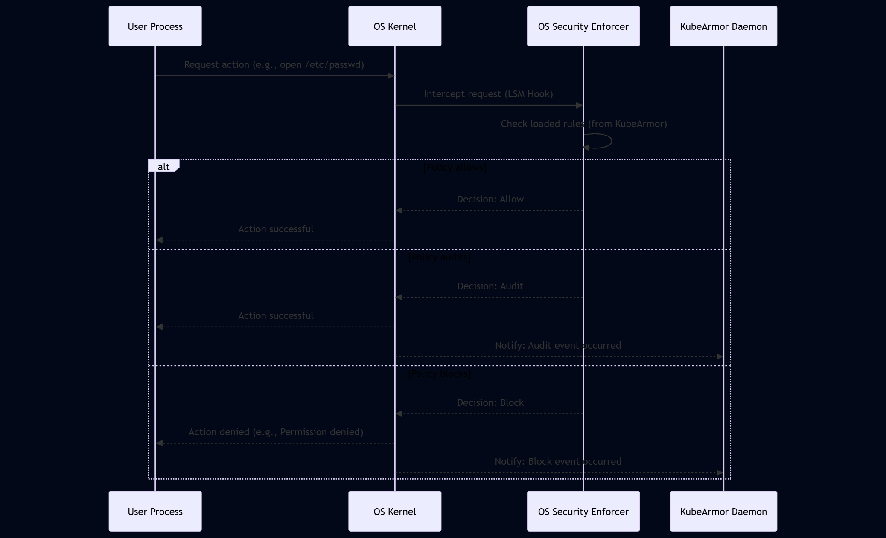

# Chapter 3: Runtime Enforcer

Welcome back! In the previous chapter, we learned how KubeArmor figures out **who** is performing an action on your system by understanding **Container/Node Identity**. We saw how it maps low-level system details like Namespace IDs to higher-level concepts like Pods, containers, and nodes, using information from the Kubernetes API and the container runtime.

Now that KubeArmor knows _who_ is doing something, it needs to decide if that action is allowed. This is the job of the **Runtime Enforcer**.

## What is the Runtime Enforcer?

Think of the Runtime Enforcer as the actual security guard positioned at the gates and doors of your system. It receives the security rules you defined in your Security Policies (KSP, HSP, CSP). But applications and the operating system don't directly understand KubeArmor policy YAML!

The Runtime Enforcer's main task is to translate these high-level KubeArmor rules into instructions that the underlying operating system's built-in security features can understand and enforce. These OS security features are powerful mechanisms within the Linux kernel designed to control what processes can and cannot do. Common examples include:

- **AppArmor:** Used by distributions like Ubuntu, Debian, and SLES. It uses security _profiles_ that define access controls for individual programs (processes).
- **SELinux:** Used by distributions like Fedora, CentOS/RHEL, and Alpine Linux. It uses a system of _labels_ and rules to control interactions between processes and system resources.
- **BPF-LSM:** A newer mechanism using eBPF programs attached to Linux Security Module (LSM) hooks to enforce security policies directly within the kernel.

When an application or process on your node or inside a container attempts to do something (like open a file, start a new process, or make a network connection), the Runtime Enforcer (via the configured OS security feature) steps in. It checks the translated rules that apply to the identified workload and tells the operating system whether to **Allow**, **Audit**, or **Block** the action.

## Why Do We Need a Runtime Enforcer? A Use Case Revisited

Let's go back to our example: preventing a web server container (with label `app: my-web-app`) from reading `/etc/passwd`.

In Chapter 1, we wrote a KubeArmor Policy for this:

```yaml
# simplified KSP
apiVersion: security.kubearmor.com/v1
kind: KubeArmorPolicy
metadata:
  name: block-etc-passwd-read
  namespace: default
spec:
  selector:
    matchLabels:
      app: my-web-app # Policy applies to containers/pods with this label
  file:
    matchPaths:
      - path: /etc/passwd # Specific file to protect
        # No readOnly specified means all access types are subject to 'action'
  action: Block # What to do if the rule is violated
```

In Chapter 2, we saw how KubeArmor's Container/Node Identity component identifies that a specific process trying to read `/etc/passwd` belongs to a container running a Pod with the label `app: my-web-app`.

Now, the Runtime Enforcer takes over:

1.  It knows the action is "read file `/etc/passwd`".
2.  It knows the actor is the container identified as having the label `app: my-web-app`.
3.  It looks up the applicable policies for this actor and action.
4.  It finds the `block-etc-passwd-read` policy, which says `action: Block` for `/etc/passwd`.
5.  The Runtime Enforcer, using the underlying OS security module, tells the Linux kernel to **Block** the read attempt.

The application trying to read the file will receive a "Permission denied" error, and the attempt will be stopped _before_ it can succeed.

## How KubeArmor Selects and Uses an Enforcer

KubeArmor is designed to be flexible and work on different Linux systems. It doesn't assume a specific OS security module is available. When KubeArmor starts on a node, it checks which security modules are enabled and supported on that particular system.

You can configure KubeArmor to prefer one enforcer over another using the `lsm.lsmOrder` configuration option. KubeArmor will try to initialize the enforcers in the specified order (`bpf`, `selinux`, `apparmor`) and use the first one that is available and successfully initialized. If none of the preferred ones are available, it falls back to any other supported, available LSM. If _no_ supported enforcer can be initialized, KubeArmor will run in a limited capacity (primarily for monitoring, not enforcement).

You can see KubeArmor selecting the LSM in the `NewRuntimeEnforcer` function (from `KubeArmor/enforcer/runtimeEnforcer.go`):

```go
// KubeArmor/enforcer/runtimeEnforcer.go (Simplified)

func NewRuntimeEnforcer(node tp.Node, pinpath string, logger *fd.Feeder, monitor *mon.SystemMonitor) *RuntimeEnforcer {
	// ... code to check available LSMs on the system ...

	// This selectLsm function tries to find and initialize the best available enforcer
	return selectLsm(re, cfg.GlobalCfg.LsmOrder, availablelsms, lsms, node, pinpath, logger, monitor)
}

// selectLsm Function (Simplified logic)
func selectLsm(re *RuntimeEnforcer, lsmOrder, availablelsms, supportedlsm []string, node tp.Node, pinpath string, logger *fd.Feeder, monitor *mon.SystemMonitor) *RuntimeEnforcer {
	// Try LSMs in preferred order first
	// If preferred fails or is not available, try others

	if kl.ContainsElement(supportedlsm, "bpf") && kl.ContainsElement(availablelsms, "bpf") {
		// Attempt to initialize BPFEnforcer
		re.bpfEnforcer, err = be.NewBPFEnforcer(...)
		if re.bpfEnforcer != nil {
			re.EnforcerType = "BPFLSM"
			// Success, return BPF enforcer
			return re
		}
		// BPF failed, try next...
	}

	if kl.ContainsElement(supportedlsm, "apparmor") && kl.ContainsElement(availablelsms, "apparmor") {
		// Attempt to initialize AppArmorEnforcer
		re.appArmorEnforcer = NewAppArmorEnforcer(...)
		if re.appArmorEnforcer != nil {
			re.EnforcerType = "AppArmor"
			// Success, return AppArmor enforcer
			return re
		}
		// AppArmor failed, try next...
	}

	if !kl.IsInK8sCluster() && kl.ContainsElement(supportedlsm, "selinux") && kl.ContainsElement(availablelsms, "selinux") {
		// Attempt to initialize SELinuxEnforcer (only for host policies outside K8s)
		re.seLinuxEnforcer = NewSELinuxEnforcer(...)
		if re.seLinuxEnforcer != nil {
			re.EnforcerType = "SELinux"
			// Success, return SELinux enforcer
			return re
		}
		// SELinux failed, try next...
	}

	// No supported/available enforcer found
	return nil
}

```

This snippet shows that KubeArmor checks for available LSMs (`lsms`) and attempts to initialize its corresponding enforcer module (`be.NewBPFEnforcer`, `NewAppArmorEnforcer`, `NewSELinuxEnforcer`) based on configuration and availability. The first one that succeeds becomes the active `EnforcerType`.

Once an enforcer is selected and initialized, the KubeArmor Daemon on the node loads the relevant policies for the workloads it is protecting and translates them into the specific rules required by the chosen enforcer.

## The Enforcement Process: Under the Hood

When KubeArmor needs to enforce a policy on a specific container or node, here's a simplified flow:

1.  **Policy Change/Discovery:** A KubeArmor Policy (KSP, HSP, or CSP) is applied or changed via the Kubernetes API. The KubeArmor Daemon on the relevant node detects this.
2.  **Identify Affected Workloads:** The daemon determines which specific containers or the host node are targeted by this policy change using the selectors and its internal Container/Node Identity mapping.
3.  **Translate Rules:** For each affected workload, the daemon takes the high-level policy rules (e.g., Block access to `/etc/passwd`) and translates them into the low-level format required by the _active_ Runtime Enforcer (AppArmor, SELinux, or BPF-LSM).
4.  **Load Rules into OS:** The daemon interacts with the operating system to load or update these translated rules. This might involve writing files, calling system utilities (`apparmor_parser`, `chcon`), or interacting with BPF system calls and maps.
5.  **OS Enforcer Takes Over:** The OS kernel's security module (now configured by KubeArmor) is now active.
6.  **Action Attempt:** A process within the protected workload attempts a specific action (e.g., opening `/etc/passwd`).
7.  **Interception:** The OS kernel intercepts this action using hooks provided by its security module.
8.  **Decision:** The security module checks the rules previously loaded by KubeArmor that apply to the process and resource involved. Based on the `action` (Allow, Audit, Block) defined in the KubeArmor policy (and translated into the module's format), the security module makes a decision.
9.  **Enforcement:**
    - If `Block`, the OS prevents the action and returns an error to the process.
    - If `Allow`, the OS permits the action.
    - If `Audit`, the OS permits the action but generates a log event.
10. **Event Notification (for Audit/Block):** (As we'll see in the next chapter), the OS kernel generates an event notification for blocked or audited actions, which KubeArmor then collects for logging and alerting.

Here's a simplified sequence diagram for the enforcement path after policies are loaded:



This diagram shows that the actual enforcement decision happens deep within the OS kernel, powered by the rules that KubeArmor translated and loaded. KubeArmor isn't in the critical path for _every_ action attempt; it pre-configures the kernel's security features to handle the enforcement directly.

## Looking at the Code: Translating and Loading

Let's see how KubeArmor interacts with the different OS enforcers.

**AppArmor Enforcer:**

AppArmor uses text-based profile files stored typically in `/etc/apparmor.d/`. KubeArmor translates its policies into rules written in AppArmor's profile language, saves them to a file, and then uses the `apparmor_parser` command-line tool to load or update these profiles in the kernel.

```go
// KubeArmor/enforcer/appArmorEnforcer.go (Simplified)

// UpdateAppArmorProfile Function
func (ae *AppArmorEnforcer) UpdateAppArmorProfile(endPoint tp.EndPoint, appArmorProfile string, securityPolicies []tp.SecurityPolicy) {
	// ... code to generate the AppArmor profile string based on KubeArmor policies ...
	// This involves iterating through securityPolicies and converting them to AppArmor rules

	newProfileContent := "## == Managed by KubeArmor == ##\n...\n" // generated content

	// Write the generated profile to a file
	newfile, err := os.Create(filepath.Clean("/etc/apparmor.d/" + appArmorProfile))
	// ... error handling ...
	_, err = newfile.WriteString(newProfileContent)
	// ... error handling and file closing ...

	// Load/reload the profile into the kernel using apparmor_parser
	if err := kl.RunCommandAndWaitWithErr("apparmor_parser", []string{"-r", "-W", "/etc/apparmor.d/" + appArmorProfile}); err != nil {
		// Log error if loading fails
		ae.Logger.Warnf("Unable to update ... (%s)", err.Error())
		return
	}

	ae.Logger.Printf("Updated security rule(s) to %s/%s", endPoint.EndPointName, appArmorProfile)
}
```

This snippet shows the key steps: generating the profile content, writing it to a file path based on the container/profile name, and then executing the `apparmor_parser` command with the `-r` (reload) and `-W` (wait) flags to apply the profile to the kernel.

**SELinux Enforcer:**

SELinux policy management is complex, often involving compiling policy modules and managing file contexts. KubeArmor's SELinux enforcer focuses primarily on basic host policy enforcement (in standalone mode, not typically in Kubernetes clusters using the default SELinux integration). It interacts with tools like `chcon` to set file security contexts based on policies.

```go
// KubeArmor/enforcer/SELinuxEnforcer.go (Simplified)

// UpdateSELinuxLabels Function
func (se *SELinuxEnforcer) UpdateSELinuxLabels(profilePath string) bool {
	// ... code to read translated policy rules from a file ...
	// The file contains rules like "SubjectLabel SubjectPath ObjectLabel ObjectPath ..."

	res := true
	// Iterate through rules from the profile file
	for _, line := range strings.Split(string(profile), "\n") {
		words := strings.Fields(line)
		if len(words) != 7 { continue }

		subjectLabel := words[0]
		subjectPath := words[1]
		objectLabel := words[2]
		objectPath := words[3]

		// Example: Change the label of a file/directory using chcon
		if subjectLabel == "-" { // Rule doesn't specify subject path label
			if err := kl.RunCommandAndWaitWithErr("chcon", []string{"-t", objectLabel, objectPath}); err != nil {
				// Log error if chcon fails
				se.Logger.Warnf("Unable to update the SELinux label (%s) of %s (%s)", objectLabel, objectPath, err.Error())
				res = false
			}
		} else { // Rule specifies both subject and object path labels
			if err := kl.RunCommandAndWaitWithErr("chcon", []string{"-t", subjectLabel, subjectPath}); err != nil {
				se.Logger.Warnf("Unable to update the SELinux label (%s) of %s (%s)", subjectLabel, subjectPath, err.Error())
				res = false
			}
			if err := kl.RunCommandAndWaitWithErr("chcon", []string{"-t", objectLabel, objectPath}); err != nil {
				se.Logger.Warnf("Unable to update the SELinux label (%s) of %s (%s)", objectLabel, objectPath, err.Error())
				res = false
			}
		}
		// ... handles directory and recursive options ...
	}
	return res
}
```

This snippet shows KubeArmor executing the `chcon` command to modify the SELinux security context (label) of files, which is a key way SELinux enforces access control.

**BPF-LSM Enforcer:**

The BPF-LSM enforcer works differently. Instead of writing text files and using external tools, it loads eBPF programs directly into the kernel and populates eBPF maps with rule data. When an event occurs, the eBPF program attached to the relevant LSM hook checks the rules stored in the map to make the enforcement decision.

```go
// KubeArmor/enforcer/bpflsm/enforcer.go (Simplified)

// NewBPFEnforcer instantiates a objects for setting up BPF LSM Enforcement
func NewBPFEnforcer(node tp.Node, pinpath string, logger *fd.Feeder, monitor *mon.SystemMonitor) (*BPFEnforcer, error) {
	// ... code to remove memory lock limits for BPF programs ...

	// Load the BPF programs and maps compiled from the C code
	if err := loadEnforcerObjects(&be.obj, &ebpf.CollectionOptions{
		Maps: ebpf.MapOptions{PinPath: pinpath},
	}); err != nil {
		// Handle loading errors
		be.Logger.Errf("error loading BPF LSM objects: %v", err)
		return be, err
	}

	// Attach BPF programs to LSM hooks
	// Example: Attach the 'EnforceProc' program to the 'security_bprm_check' LSM hook
	be.Probes[be.obj.EnforceProc.String()], err = link.AttachLSM(link.LSMOptions{Program: be.obj.EnforceProc})
	if err != nil {
		// Handle attachment errors
		be.Logger.Errf("opening lsm %s: %s", be.obj.EnforceProc.String(), err)
		return be, err
	}

    // ... similarly attach other BPF programs for file, network, capabilities, etc. ...

	// Get references to BPF maps (like the map storing rules per container)
	be.BPFContainerMap = be.obj.KubearmorContainers // Renamed from be.obj.Maps.KubearmorContainers

	// ... setup ring buffer for events (discussed in next chapter) ...

	return be, nil
}

// AddContainerIDToMap Function (Example of populating a map with rules)
func (be *BPFEnforcer) AddContainerIDToMap(containerID string, pidns, mntns uint32) {
	// ... code to get/generate rules for this container ...
	// rulesData := generateBPFRules(containerID, policies)

	// Look up or create the inner map for this container's rules
	containerMapKey := NsKey{PidNS: pidns, MntNS: mntns} // Uses namespace IDs as the key for the outer map

	// Update the BPF map with the container's rules or identity
	// This would typically involve creating/getting a reference to an inner map
	// and then populating that inner map with specific path -> rule mappings.
	// For simplification, let's assume a direct mapping for identity:
	containerMapValue := uint32(1) // Simplified: A value indicating the container is active

	if err := be.BPFContainerMap.Update(containerMapKey, containerMapValue, cle.UpdateAny); err != nil {
		be.Logger.Warnf("Error updating BPF map for container %s: %v", containerID, err)
	}
	// ... More complex logic would add rules to an inner map associated with this containerMapKey
}
```

This heavily simplified snippet shows how the BPF enforcer loads BPF programs and attaches them to kernel LSM hooks. It also hints at how container identity (Container/Node Identity) is used (via `pidns`, `mntns`) as a key to organize rules within BPF maps (`BPFContainerMap`), allowing the kernel's BPF program to quickly look up the relevant policy when an event occurs. The `AddContainerIDToMap` function, although simplified, demonstrates how KubeArmor populates these maps.

Each enforcer type requires specific logic within KubeArmor to translate policies and interact with the OS. The Runtime Enforcer component provides this abstraction layer, allowing KubeArmor policies to be enforced regardless of the underlying Linux security module, as long as it's supported.

## Policy Actions and the Enforcer

The `action` specified in your KubeArmor policy (Security Policies) directly maps to how the Runtime Enforcer instructs the OS:

- **Allow:** The translated rule explicitly permits the action. The OS security module will let the action proceed.
- **Audit:** The translated rule allows the action but is configured to generate a log event. The OS security module lets the action proceed and notifies the kernel's logging system.
- **Block:** The translated rule denies the action. The OS security module intercepts the action and prevents it from completing, typically returning an error to the application.

This allows you to use KubeArmor policies not just for strict enforcement but also for visibility and testing (`Audit`).

## Conclusion

The Runtime Enforcer is the critical piece that translates your human-readable KubeArmor policies into the low-level language understood by the operating system's security features (AppArmor, SELinux, BPF-LSM). It's responsible for loading these translated rules into the kernel, enabling the OS to intercept and enforce your desired security posture for containers and host processes based on their identity.

By selecting the appropriate enforcer for your system and dynamically updating its rules, KubeArmor ensures that your security policies are actively enforced at runtime. In the next chapter, we'll look at the other side of runtime security: observing system events, including those that were audited or blocked by the Runtime Enforcer.
