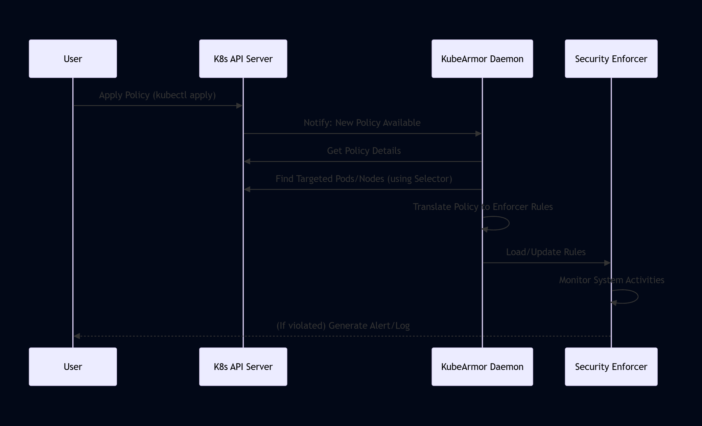

# Chapter 1: Security Policies (KSP, HSP, CSP)

Welcome to the KubeArmor tutorial! In this first chapter, we'll dive into one of the most fundamental concepts in KubeArmor: **Security Policies**. Think of these policies as the instruction manuals or rulebooks you give to KubeArmor, telling it exactly how applications and system processes should behave.

## What are Security Policies?

In any secure system, you need rules that define what is allowed and what isn't. In Kubernetes and Linux, these rules can get complicated, dealing with things like which files a program can access, which network connections it can make, or which powerful system features (capabilities) it's allowed to use.

KubeArmor simplifies this by letting you define these rules using clear, easy-to-understand **Security Policies**. You write these policies in a standard format that Kubernetes understands (YAML files, using something called Custom Resource Definitions or CRDs), and KubeArmor takes care of translating them into the low-level security configurations needed by the underlying system.

These policies are powerful because they allow you to specify security rules for different parts of your system:

1.  **KubeArmorPolicy (KSP):** For individual **Containers** or **Pods** running in your Kubernetes cluster.
2.  **KubeArmorHostPolicy (HSP):** For the **Nodes** (the underlying Linux servers) where your containers are running. This is useful for protecting the host system itself, or even applications running directly on the node outside of Kubernetes.
3.  **KubeArmorClusterPolicy (CSP):** For applying policies across **multiple Containers/Pods** based on namespaces or labels cluster-wide.

## Why Do We Need Security Policies?

Imagine you have a web server application running in a container. This application should only serve web pages and access its configuration files. It shouldn't be trying to access sensitive system files like `/etc/shadow` or connecting to unusual network addresses.

Without security policies, if your web server container gets compromised, an attacker might use it to access or modify sensitive data, or even try to attack other parts of your cluster or network.

KubeArmor policies help prevent this by enforcing the principle of **least privilege**. This means you only grant your applications and host processes the minimum permissions they need to function correctly.

**Use Case Example:** Let's say you have a simple application container that should _never_ be allowed to read the `/etc/passwd` file inside the container. We can use a KubeArmor Policy (KSP) to enforce this rule.

## Anatomy of a KubeArmor Policy

KubeArmor policies are defined as YAML files that follow a specific structure. This structure includes:

1.  **Metadata:** Basic information about the policy, like its `name`. For KSPs, you also specify the `namespace` it belongs to. HSPs and CSPs are cluster-scoped, meaning they don't belong to a specific namespace.
2.  **Selector:** This is how you tell KubeArmor _which_ containers, pods, or nodes the policy should apply to. You typically use Kubernetes labels for this.
3.  **Spec (Specification):** This is the core of the policy where you define the actual security rules (what actions are restricted) and the desired outcome (Allow, Audit, or Block).

Let's look at a simplified structure:

```yaml
apiVersion: security.kubearmor.com/v1
kind: KubeArmorPolicy # or KubeArmorHostPolicy, KubeArmorClusterPolicy
metadata:
  name: block-etc-passwd-read
  namespace: default # Only for KSP
spec:
  selector:
    # How to select the targets (pods for KSP, nodes for HSP, namespaces/labels for CSP)
    matchLabels:
      app: my-web-app # Apply this policy to pods with label app=my-web-app
  file: # Or 'process', 'network', 'capabilities', 'syscalls'
    matchPaths:
      - path: /etc/passwd
  action: Block # What to do if the rule is violated
```

**Explanation:**

- `apiVersion` and `kind`: Identify this document as a KubeArmor Policy object.
- `metadata`: Gives the policy a name (`block-etc-passwd-read`) and specifies the namespace (`default`) it lives in (for KSP).
- `spec`: Contains the security rules.
- `selector`: Uses `matchLabels` to say "apply this policy to any Pod in the `default` namespace that has the label `app: my-web-app`".
- `file`: This section defines rules related to file access.
- `matchPaths`: We want to match a specific file path.
- `- path: /etc/passwd`: The specific file we are interested in.
- `action: Block`: If any process inside the selected containers tries to access `/etc/passwd`, the action should be to `Block` that attempt.

This simple policy directly addresses our use case: preventing the web server (`app: my-web-app`) from reading `/etc/passwd`.

## Policy Types in Detail

Let's break down the three types:

| Policy Type            | Abbreviation | Scope                                   | Selector Type(s)                                          |
| :--------------------- | :----------- | :-------------------------------------- | :-------------------------------------------------------- |
| KubeArmorPolicy        | KSP          | Containers / Pods (Scoped by Namespace) | `matchLabels`, `matchExpressions`                         |
| KubeArmorHostPolicy    | HSP          | Nodes / Host OS                         | `nodeSelector` (`matchLabels`)                            |
| KubeArmorClusterPolicy | CSP          | Containers / Pods (Cluster-wide)        | `selector` (`matchExpressions` on `namespace` or `label`) |

**KubeArmorPolicy (KSP)**

- Applies to pods within a specific Kubernetes namespace.
- Uses `selector.matchLabels` or `selector.matchExpressions` to pick which pods the policy applies to, based on their labels.
- Example: Block `/bin/bash` execution in all pods within the `dev` namespace labeled `role=frontend`.

**KubeArmorHostPolicy (HSP)**

- Applies to the host operating system of the nodes in your cluster.
- Uses `nodeSelector.matchLabels` to pick which nodes the policy applies to, based on node labels.
- Example: Prevent the `/usr/bin/ssh` process on nodes labeled `node-role.kubernetes.io/worker` from accessing `/etc/shadow`.

**KubeArmorClusterPolicy (CSP)**

- Applies to pods across multiple namespaces or even the entire cluster.
- Uses `selector.matchExpressions` which can target namespaces (`key: namespace`) or labels (`key: label`) cluster-wide.
- Example: Audit all network connections made by pods in the `default` or `staging` namespaces. Or, block `/usr/bin/curl` execution in all pods across the cluster except those labeled `app=allowed-tools`.

These policies become Kubernetes Custom Resources when KubeArmor is installed. You can see their definitions in the KubeArmor source code under the `deployments/CRD` directory:

- [KubeArmorPolicy CRD](deployments/CRD/KubeArmorPolicy.yaml) (KSP)
- [KubeArmorHostPolicy CRD](deployments/CRD/KubeArmorHostPolicy.yaml) (HSP)
- [KubeArmorClusterPolicy CRD](deployments/CRD/KubeArmorClusterPolicy.yaml) (CSP)

And their corresponding Go type definitions are in [types/types.go](KubeArmor/types/types.go). You don't need to understand Go or CRD internals right now, just know that these files formally define the structure and rules for creating KubeArmor policies that Kubernetes understands.

## How KubeArmor Uses Policies (Under the Hood)

You've written a policy YAML file. What happens when you apply it to your Kubernetes cluster using `kubectl apply -f your-policy.yaml`?

1.  **Policy Creation:** You create the policy object in the Kubernetes API Server.
2.  **KubeArmor Watches:** The KubeArmor DaemonSet (a component running on each node) is constantly watching the Kubernetes API Server for KubeArmor policy objects (KSP, HSP, CSP).
3.  **Policy Discovery:** KubeArmor finds your new policy.
4.  **Target Identification:** KubeArmor evaluates the policy's `selector` (or `nodeSelector`) to figure out exactly _which_ pods/containers or nodes this policy applies to.
5.  **Translation:** For each targeted container or node, KubeArmor translates the high-level rules defined in the policy's `spec` (like "Block access to `/etc/passwd`") into configurations for the underlying security enforcer (which could be AppArmor, SELinux, or BPF, depending on your setup and KubeArmor's configuration - we'll talk more about these later).
6.  **Enforcement:** The security enforcer on that specific node is updated with the new low-level rules. Now, if a targeted process tries to do something forbidden by the policy, the enforcer steps in to `Allow`, `Audit`, or `Block` the action as specified.

Here's a simplified sequence:



This flow shows how KubeArmor acts as the bridge between your easy-to-write YAML policies and the complex, low-level security mechanisms of the operating system.

## Policy Actions: Allow, Audit, Block

Every rule in a KubeArmor policy (within the `spec` section) specifies an `action`. This tells KubeArmor what to do if the rule's condition is met.

- **Allow:** Explicitly permits the action. This is useful for creating "whitelist" policies where you only allow specific behaviors and implicitly block everything else.
- **Audit:** Does _not_ prevent the action but generates a security alert or log message when it happens. This is great for testing policies before enforcing them or for monitoring potentially suspicious activity without disrupting applications.
- **Block:** Prevents the action from happening and generates a security alert. This is for enforcing strict "blacklist" rules where you explicitly forbid certain dangerous behaviors.

Remember the "Note" mentioned in the provided policy specifications: For system call monitoring (`syscalls`), KubeArmor currently only supports the `Audit` action, regardless of what is specified in the policy YAML.

## Conclusion

In this chapter, you learned that KubeArmor Security Policies (KSP, HSP, CSP) are your rulebooks for defining security posture in your Kubernetes environment. You saw how they use Kubernetes concepts like labels and namespaces to target specific containers, pods, or nodes. You also got a peek at the basic structure of these policies, including the selector for targeting and the spec for defining rules and actions.

Understanding policies is the first step to using KubeArmor effectively to protect your workloads and infrastructure. In the next chapter, we'll explore how KubeArmor identifies the containers and nodes it is protecting, which is crucial for the policy engine to work correctly.
