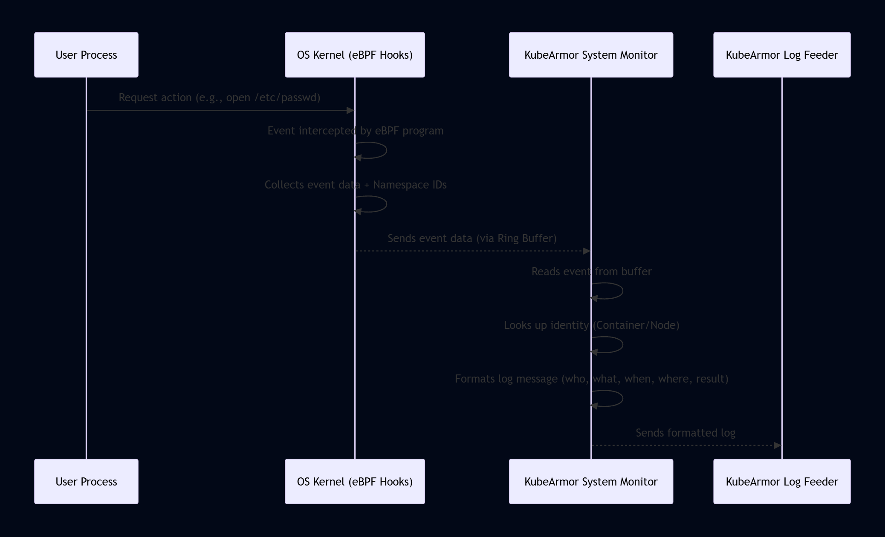

# Chapter 4: System Monitor

Welcome back to the KubeArmor tutorial! In the previous chapters, we've built up our understanding of how KubeArmor defines security rules using Security Policies, how it figures out **who** is performing actions using Container/Node Identity, and how it configures the underlying OS to actively **enforce** those rules using the Runtime Enforcer.

But even with policies and enforcement set up, KubeArmor needs to constantly know _what's happening_ inside your system. When a process starts, a file is accessed, or a network connection is attempted, KubeArmor needs to be aware of these events to either enforce a policy (via the Runtime Enforcer) or simply record the activity for auditing and visibility.

This is where the **System Monitor** comes in.

## What is the System Monitor?

Think of the System Monitor as KubeArmor's **eyes and ears** inside the operating system on each node. While the Runtime Enforcer acts as the security guard making decisions based on loaded rules, the System Monitor is the surveillance system and log recorder that detects _all_ the relevant activity.

Its main job is to:

1.  **Observe:** Watch for specific actions happening deep within the Linux kernel, like:
    - Processes starting or ending.
    - Files being opened, read, or written.
    - Network connections being made or accepted.
    - Changes to system privileges (capabilities).
2.  **Collect Data:** Gather detailed information about these events (which process, what file path, what network address, etc.).
3.  **Add Context:** Crucially, it correlates the low-level event data with the higher-level Container/Node Identity information KubeArmor maintains (like which container, pod, or node the event originated from).
4.  **Prepare for Logging and Processing:** Format this enriched event data so it can be sent for logging (via the Log Feeder) or used by other KubeArmor components.

The System Monitor uses advanced kernel technology, primarily **eBPF**, to achieve this low-overhead, deep visibility into system activities without requiring modifications to the applications or the kernel itself.

## Why is Monitoring Important? A Use Case Example

Let's revisit our web server example. We have a policy to Block the web server container (`app: my-web-app`) from reading `/etc/passwd`.

1.  You apply the Security Policy.
2.  KubeArmor's Runtime Enforcer translates this policy and loads a rule into the kernel's security module (say, BPF-LSM).
3.  An attacker compromises your web server and tries to read `/etc/passwd`.
4.  The OS kernel intercepts this attempt (via the BPF-LSM hook configured by the Runtime Enforcer).
5.  Based on the loaded rule, the Runtime Enforcer's BPF program **blocks** the action.

So, the enforcement worked! The read was prevented. But how do you know this happened? How do you know someone tried to access `/etc/passwd`?

This is where the **System Monitor** is essential. Even when an action is blocked by the Runtime Enforcer, the System Monitor is still observing that activity.

When the web server attempts to read `/etc/passwd`:

- The System Monitor's eBPF programs, also attached to kernel hooks, **detect** the file access attempt.
- It collects data: the process ID, the file path (`/etc/passwd`), the type of access (read).
- It adds context: it uses the process ID and Namespace IDs to look up in KubeArmor's internal map and identifies that this process belongs to the container with label `app: my-web-app`.
- It also sees that the Runtime Enforcer returned an error code indicating the action was blocked.
- The System Monitor bundles all this information (who, what, where, when, and the outcome - Blocked) and sends it to KubeArmor for logging.

Without the System Monitor, you would just have a failed system call ("Permission denied") from the application's perspective, but you wouldn't have the centralized, context-rich security alert generated by KubeArmor that tells you _which container_ specifically tried to read `/etc/passwd` and that it was _blocked by policy_.

The System Monitor provides the crucial visibility layer, even for actions that are successfully prevented by enforcement. It also provides visibility for actions that are simply Audited by policy, or even for actions that are Allowed but that you want to monitor.

## How the System Monitor Works (Under the Hood)

The System Monitor relies heavily on eBPF programs loaded into the Linux kernel. Here's a simplified flow:

1.  **Initialization:** When the KubeArmor Daemon starts on a node, its System Monitor component loads various eBPF programs into the kernel.
2.  **Hooking:** These eBPF programs attach to specific points (called "hooks") within the kernel where system events occur (e.g., just before a file open is processed, or when a new process is created).
3.  **Event Detection:** When a user application or system process performs an action (like `open("/etc/passwd")`), the kernel reaches the attached eBPF hook.
4.  **Data Collection (in Kernel):** The eBPF program at the hook executes. It can access information about the event directly from the kernel's memory (like the process structure, file path, network socket details). It also gets the process's Namespace IDs Container/Node Identity.
5.  **Event Reporting (Kernel to User Space):** The eBPF program packages the collected data (raw event + Namespace IDs) into a structure and sends it to the KubeArmor Daemon in user space using a highly efficient kernel mechanism, typically an eBPF **ring buffer**.
6.  **Data Reception (in KubeArmor Daemon):** The System Monitor component in the KubeArmor Daemon continuously reads from this ring buffer.
7.  **Context Enrichment:** For each incoming event, the System Monitor uses the Namespace IDs provided by the eBPF program to look up the corresponding Container ID, Pod Name, Namespace, and Labels in its internal identity map (the one built by the Container/Node Identity component). It also adds other relevant details like the process's current working directory and parent process.
8.  **Log/Alert Generation:** The System Monitor formats all this enriched information into a structured log or alert message.
9.  **Forwarding:** The formatted log is then sent to the Log Feeder component, which is responsible for sending it to your configured logging or alerting systems.

Here's a simple sequence diagram illustrating this:



This diagram shows how the eBPF programs in the kernel are the first point of contact for system events, collecting the initial data before sending it up to the KubeArmor Daemon for further processing, context addition, and logging.

## Looking at the Code (Simplified)

Let's look at tiny snippets from the KubeArmor source code to see hints of how this works.

The eBPF programs (written in C, compiled to BPF bytecode) define the structure of the event data they send to user space. In `KubeArmor/BPF/shared.h`, you can find structures like `event`:

```c
// KubeArmor/BPF/shared.h (Simplified)

typedef struct {
  u64 ts; // Timestamp

  u32 pid_id; // PID Namespace ID
  u32 mnt_id; // Mount Namespace ID

  // ... other process IDs (host/container) and UID ...

  u32 event_id; // Identifier for the type of event (e.g., file open, process exec)
  s64 retval;   // Return value of the syscall (useful for blocked actions)

  u8 comm[TASK_COMM_LEN]; // Process command name

  bufs_k data; // Structure potentially holding file path, source process path

  u64 exec_id; // Identifier for exec events
} event;

struct {
  __uint(type, BPF_MAP_TYPE_RINGBUF); // The type of map used for kernel-to-userspace communication
  __uint(max_entries, 1 << 24);
  __uint(pinning, LIBBPF_PIN_BY_NAME);
} kubearmor_events SEC(".maps"); // This is the ring buffer map
```

This shows the `event` structure containing key fields like timestamps, Namespace IDs (`pid_id`, `mnt_id`), the type of event (`event_id`), the syscall result (`retval`), the command name, and potentially file paths (`data`). It also defines the `kubearmor_events` map as a `BPF_MAP_TYPE_RINGBUF`, which is the mechanism used by eBPF programs in the kernel to efficiently send these `event` structures to the KubeArmor Daemon in user space.

On the KubeArmor Daemon side (in Go), the System Monitor component (`KubeArmor/monitor/systemMonitor.go`) reads from this ring buffer and processes the events.

```go
// KubeArmor/monitor/systemMonitor.go (Simplified)

// SystemMonitor Structure (partially shown)
type SystemMonitor struct {
    // ... other fields ...

    // system events
    SyscallChannel chan []byte // Channel to receive raw event data
    SyscallPerfMap *perf.Reader // Reads from the eBPF ring buffer

    // PidID + MntID -> container id map (from Container/Node Identity)
    NsMap map[NsKey]string
    NsMapLock *sync.RWMutex

    // context + args
    ContextChan chan ContextCombined // Channel to send processed events

	// ... other fields ...
}

// TraceSyscall Function (Simplified)
func (mon *SystemMonitor) TraceSyscall() {
	if mon.SyscallPerfMap != nil {
		// Goroutine to read from the perf buffer (ring buffer)
		go func() {
			for {
				record, err := mon.SyscallPerfMap.Read() // Read raw event data from the ring buffer
				if err != nil {
                    // ... error handling ...
					return
				}
				// Send raw data to the processing channel
				mon.SyscallChannel <- record.RawSample
			}
		}()
	} else {
        // ... log error ...
		return
	}

    // Goroutine to process events from the channel
	for {
		select {
		case <-StopChan:
			return // Exit when told to stop

		case dataRaw, valid := <-mon.SyscallChannel: // Receive raw event data
			if !valid {
				continue
			}

			// Read the raw data into the SyscallContext struct
			dataBuff := bytes.NewBuffer(dataRaw)
			ctx, err := readContextFromBuff(dataBuff) // Helper to parse raw bytes
			if err != nil {
                // ... handle parse error ...
				continue
			}

            // Get argument data (file path, network address, etc.)
			args, err := GetArgs(dataBuff, ctx.Argnum) // Helper to parse arguments
			if err != nil {
                // ... handle args error ...
				continue
			}

			containerID := ""
			if ctx.PidID != 0 && ctx.MntID != 0 {
                // Use Namespace IDs from the event to look up Container ID in NsMap
				containerID = mon.LookupContainerID(ctx.PidID, ctx.MntID) // This uses the map from Chapter 2 context
			}

            // If lookup failed and it's a container NS, maybe replay (simplified out)
            // If it's host (PidID/MntID 0) or lookup succeeded...

            // Push the combined context (with ContainerID) to another channel for logging/policy processing
			mon.ContextChan <- ContextCombined{ContainerID: containerID, ContextSys: ctx, ContextArgs: args}
		}
	}
}

// LookupContainerID Function (from monitor/processTree.go - shown in Chapter 2 context)
func (mon *SystemMonitor) LookupContainerID(pidns, mntns uint32) string {
    // ... implementation using NsMap map ...
    // This is where the correlation happens: Namespace IDs -> Container ID
}

// ContextCombined Structure (from monitor/systemMonitor.go)
type ContextCombined struct {
	ContainerID string // Added context from lookup
	ContextSys  SyscallContext // Raw data from eBPF
	ContextArgs []interface{} // Parsed arguments from raw data
}
```

This Go code shows:

1.  The `SyscallPerfMap` reading from the eBPF ring buffer in the kernel.
2.  Raw event data being sent to the `SyscallChannel`.
3.  A loop reading from `SyscallChannel`, parsing the raw bytes into a `SyscallContext` struct.
4.  Using `ctx.PidID` and `ctx.MntID` (Namespace IDs) to call `LookupContainerID` and get the `containerID`.
5.  Packaging the raw context (`ContextSys`), parsed arguments (`ContextArgs`), and the looked-up `ContainerID` into a `ContextCombined` struct.
6.  Sending the enriched `ContextCombined` event to the `ContextChan`.

This `ContextCombined` structure is the output of the System Monitor – it's the rich event data with identity context ready for the Log Feeder and other components.

## Types of Events Monitored

The System Monitor uses different eBPF programs attached to various kernel hooks to monitor different types of activities:

| Event Type     | Monitored Activities                                                                                                                                       | Primary Mechanism             |
| :------------- | :--------------------------------------------------------------------------------------------------------------------------------------------------------- | :---------------------------- |
| **Process**    | Process execution (`execve`, `execveat`), process exit (`do_exit`), privilege changes (`setuid`, `setgid`)                                                 | Tracepoints, Kprobes, BPF-LSM |
| **File**       | File open (`open`, `openat`), delete (`unlink`, `unlinkat`, `rmdir`), change owner (`chown`, `fchownat`)                                                   | Kprobes, Tracepoints, BPF-LSM |
| **Network**    | Socket creation (`socket`), connection attempts (`connect`), accepting connections (`accept`), binding addresses (`bind`), listening on sockets (`listen`) | Kprobes, Tracepoints, BPF-LSM |
| **Capability** | Use of privileged kernel features (capabilities)                                                                                                           | BPF-LSM, Kprobes              |
| **Syscall**    | General system call entry/exit for various calls                                                                                                           | Kprobes, Tracepoints          |

The specific hooks used might vary slightly depending on the kernel version and the chosen Runtime Enforcerconfiguration (AppArmor/SELinux use different integration points than pure BPF-LSM), but the goal is the same: intercept and report relevant system calls and kernel security hooks.

## System Monitor and Other Components

The System Monitor acts as a fundamental data source:

- It provides the event data that the Runtime Enforcer's BPF programs might check against loaded policies _in the kernel_ (BPF-LSM case). Note that enforcement happens _at the hook_ via the rules loaded by the Enforcer, but the Monitor still observes the event and its outcome.
- It uses the mappings maintained by the Container/Node Identity component to add context to raw events.
- It prepares and forwards structured event logs to the Log Feeder.

Essentially, the Monitor is the "observer" part of KubeArmor's runtime security. It sees everything, correlates it to your workloads, and reports it, enabling both enforcement (via the Enforcer's rules acting on these observed events) and visibility.

## Conclusion

In this chapter, you learned that the KubeArmor System Monitor is the component responsible for observing system events happening within the kernel. Using eBPF technology, it detects file access, process execution, network activity, and other critical operations. It enriches this raw data with Container/Node Identity context and prepares it for logging and analysis, providing essential visibility into your system's runtime behavior, regardless of whether an action was allowed, audited, or blocked by policy.

Understanding the System Monitor and its reliance on eBPF is key to appreciating KubeArmor's low-overhead, high-fidelity approach to runtime security. In the next chapter, we'll take a deeper dive into the technology that powers this monitoring (and the BPF-LSM enforcer)
